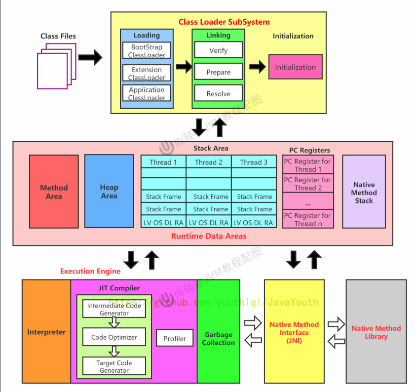
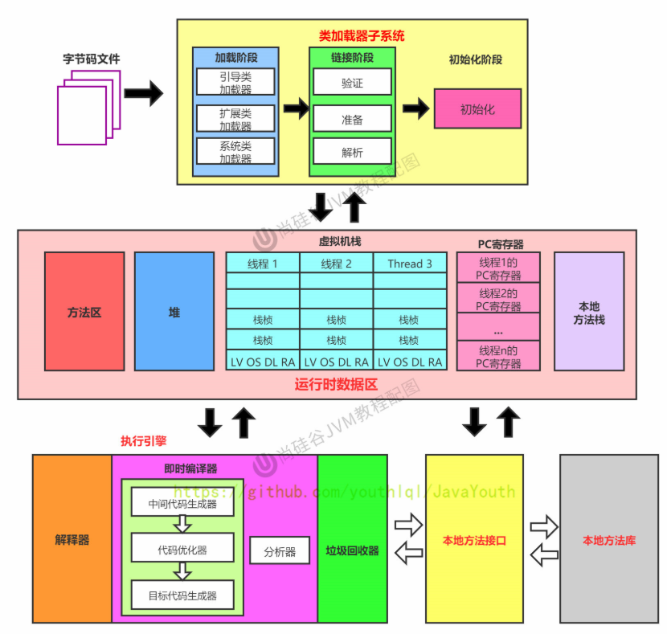
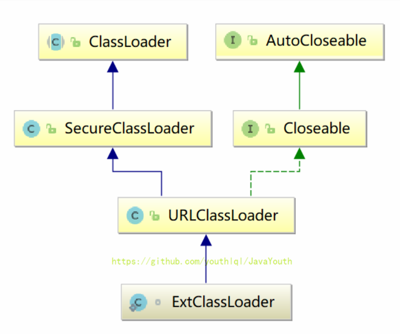
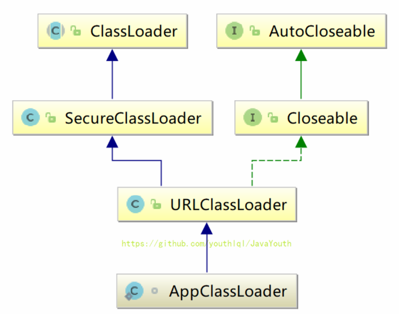
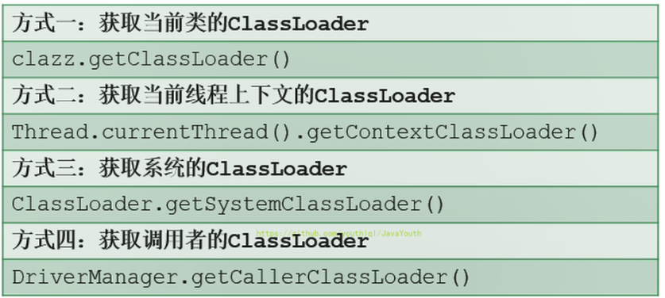
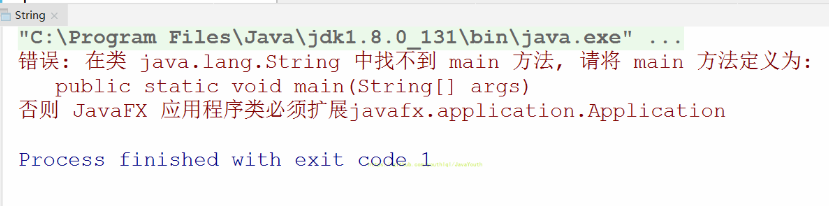

## 类加载子系统

### 内存结构概述

#### 简图


#### 详细图

英文版




中文版



注意：方法区只有HotSpot虚拟机有，J9，JRockit都没有


如果自己想手写一个Java虚拟机的话，主要考虑哪些结构呢？

1.  类加载器
2.  执行引擎

### 类加载器子系统

**类加载器子系统作用：**

1.  类加载器子系统负责从文件系统或者网络中加载Class文件，class文件在文件开头有特定的文件标识。

2.  ClassLoader只负责class文件的加载，至于它是否可以运行，则由Execution Engine决定。

3.  **加载的类信息存放于一块称为方法区的内存空间**。除了类的信息外，方法区中还会存放运行时常量池信息，可能还包括字符串字面量和数字常量（这部分常量信息是Class文件中常量池部分的内存映射）


### 类加载器ClassLoader角色

1.  class file（在下图中就是Car.class文件）存在于本地硬盘上，可以理解为设计师画在纸上的模板，而最终这个模板在执行的时候是要加载到JVM当中来根据这个文件实例化出n个一模一样的实例。
2.  class file加载到JVM中，被称为DNA元数据模板（在下图中就是内存中的Car Class），放在方法区。
3.  在.class文件–>JVM–>最终成为元数据模板，此过程就要一个运输工具（类装载器Class Loader），扮演一个快递员的角色。


### 类加载过程

#### 概述

```java
public class HelloLoader {

    public static void main(String[] args) {
        System.out.println("谢谢ClassLoader加载我....");
        System.out.println("你的大恩大德，我下辈子再报！");
    }
}
```


它的加载过程是怎么样的呢?

*   执行 main() 方法（静态方法）就需要先加载main方法所在类 HelloLoader
*   加载成功，则进行链接、初始化等操作。完成后调用 HelloLoader 类中的静态方法 main
*   加载失败则抛出异常


完整的流程图如下所示：


#### 加载阶段

**加载：**

1.  通过一个类的全限定名获取定义此类的二进制字节流

2.  将这个字节流所代表的静态存储结构转化为方法区的运行时数据结构

3.  **在内存中生成一个代表这个类的java.lang.Class对象**，作为方法区这个类的各种数据的访问入口

**加载class文件的方式：**

1.  从本地系统中直接加载
2.  通过网络获取，典型场景：Web Applet
3.  从zip压缩包中读取，成为日后jar、war格式的基础
4.  运行时计算生成，使用最多的是：动态代理技术
5.  由其他文件生成，典型场景：JSP应用从专有数据库中提取.class文件，比较少见
6.  从加密文件中获取，典型的防Class文件被反编译的保护措施


#### 链接阶段

链接分为三个子阶段：验证 -> 准备 -> 解析


##### 验证(Verify)

1.  目的在于确保Class文件的字节流中包含信息符合当前虚拟机要求，保证被加载类的正确性，不会危害虚拟机自身安全
2.  主要包括四种验证，文件格式验证，元数据验证，字节码验证，符号引用验证。


**举例**

使用 BinaryViewer软件查看字节码文件，其开头均为 CAFE BABE ，如果出现不合法的字节码文件，那么将会验证不通过。


##### 准备(Prepare)

1.  **为类变量（static变量）分配内存并且设置该类变量的默认初始值，即零值。类变量会分配在方法区中。**
2.  这里不包含用final修饰的static，因为final在编译的时候就会分配好了默认值，准备阶段会显式初始化
3.  注意：这里不会为实例变量分配初始化，类变量会分配在方法区中，而实例变量是会随着对象一起分配到Java堆中

**举例**

代码：变量a在准备阶段会赋初始值，但不是1，而是0，在初始化阶段会被赋值为 1

```java
public class HelloApp {
    private static int a = 1;//prepare：a = 0 ---> initial : a = 1


    public static void main(String[] args) {
        System.out.println(a);
    }
}
```


##### 解析(Resolve)

1.  **将常量池内的符号引用转换为直接引用的过程**
2.  事实上，解析操作往往会伴随着JVM在执行完初始化之后再执行
3.  符号引用就是一组符号来描述所引用的目标。符号引用的字面量形式明确定义在《java虚拟机规范》的class文件格式中。直接引用就是直接指向目标的指针、相对偏移量或一个间接定位到目标的句柄
4.  解析动作主要针对类或接口、字段、类方法、接口方法、方法类型等。对应常量池中的CONSTANT Class info、CONSTANT Fieldref info、CONSTANT Methodref info等
5.  **解析动作主要针对的是类或者接口、字段、类方法、方法类型、方法句柄和调用点限定符7类符号引用。**

**类或接口解析**

要把一个类或者接口的符号引用解析为直接引用，需要以下三个步骤：

1. 如果该符号引用不是一个数组类型，那么虚拟机将会把该符号代表的全限定名称传递给类加载器去加载这个类。这个过程由于涉及验证过程所以可能会触发其他相关类的加载
2. 如果该符号引用是一个数组类型，并且该数组的元素类型是对象。我们知道符号引用是存在方法区的常量池中的，该符号引用的描述符会类似”[java/lang/Integer”的形式，将会按照上面的规则进行加载数组元素类型，如果描述符如前面假设的形式，需要加载的元素类型就是java.lang.Integer ,接着由虚拟机将会生成一个代表此数组对象的直接引用
3. 如果上面的步骤都没有出现异常，那么该符号引用已经在虚拟机中产生了一个直接引用，但是在解析完成之前需要对符号引用进行验证，主要是确认当前调用这个符号引用的类是否具有访问权限，如果没有访问权限将抛出java.lang.IllegalAccess异常

**字段解析**

对字段的解析需要首先对其所属的类进行解析，因为字段是属于类的，只有在正确解析得到其类的正确的直接引用才能继续对字段的解析。对字段的解析主要包括以下几个步骤：

1. 如果该字段符号引用就包含了简单名称和字段描述符都与目标相匹配的字段，则返回这个字段的直接引用，解析结束
2. 否则，如果在该符号的类实现了接口，将会按照继承关系从下往上递归搜索各个接口和它的父接口，如果在接口中包含了简单名称和字段描述符都与目标相匹配的字段，那么久直接返回这个字段的直接引用，解析结束
3. 否则，如果该符号所在的类不是Object类的话，将会按照继承关系从下往上递归搜索其父类，如果在父类中包含了简单名称和字段描述符都相匹配的字段，那么直接返回这个字段的直接引用，解析结束
4. 否则，解析失败，抛出java.lang.NoSuchFieldError异常

如果最终返回了这个字段的直接引用，就进行权限验证，如果发现不具备对字段的访问权限，将抛出java.lang.IllegalAccessError异常

**类方法解析**

进行类方法的解析仍然需要先解析此类方法的类，在正确解析之后需要进行如下的步骤：

1. 类方法和接口方法的符号引用是分开的，所以如果在类方法表中发现class_index（类中方法的符号引用）的索引是一个接口，那么会抛出java.lang.IncompatibleClassChangeError的异常
2. 如果class_index的索引确实是一个类，那么在该类中查找是否有简单名称和描述符都与目标字段相匹配的方法，如果有的话就返回这个方法的直接引用，查找结束
3. 否则，在该类的父类中递归查找是否具有简单名称和描述符都与目标字段相匹配的字段，如果有，则直接返回这个字段的直接引用，查找结束
4. 否则，在这个类的接口以及它的父接口中递归查找，如果找到的话就说明这个方法是一个抽象类，查找结束，返回java.lang.AbstractMethodError异常
5. 否则，查找失败，抛出java.lang.NoSuchMethodError异常

如果最终返回了直接引用，还需要对该符号引用进行权限验证，如果没有访问权限，就抛出java.lang.IllegalAccessError异常

**接口方法解析**

同类方法解析一样，也需要先解析出该方法的类或者接口的符号引用，如果解析成功，就进行下面的解析工作：

1. 如果在接口方法表中发现class_index的索引是一个类而不是一个接口，那么也会抛出java.lang.IncompatibleClassChangeError的异常
2. 否则，在该接口方法的所属的接口中查找是否具有简单名称和描述符都与目标字段相匹配的方法，如果有的话就直接返回这个方法的直接引用。
3. 否则，在该接口以及其父接口中查找，直到Object类，如果找到则直接返回这个方法的直接引用
4. 否则，查找失败

接口的所有方法都是public，所以不存在访问权限问题。


#### 初始化阶段

##### clinit()

1.  初始化阶段就是执行类构造器方法`<clinit>()`的过程
2.  `<clinit>()`不同于类的构造器。（关联：构造器是虚拟机视角下的`<init>()`）
3.  此方法不需定义，是javac编译器自动收集类中的所有**类变量**的赋值动作和静态代码块中的语句合并而来。也就是说，当我们代码中包含static变量的时候，就会有clinit方法
4.  `<clinit>()`方法中的指令按语句在源文件中出现的顺序执行。**静态代码块中可以对之后定义的变量进行赋值，但不能访问。**
5.  若该类具有父类，JVM会保证子类的`<clinit>()`执行前，父类的`<clinit>()`已经执行完毕
6.  虚拟机必须保证一个类的`<clinit>()`方法在多线程下被同步加锁


##### 类的初始化时机

1. 创建类的实例
2. 访问某个类或接口的静态变量，或者对该静态变量赋值
3. 调用类的静态方法
4. 反射（比如：Class.forName(“com.atguigu.Test”)）
5. 初始化一个类的子类
6. Java虚拟机启动时被标明为启动类的类
7. JDK7开始提供的动态语言支持：java.lang.invoke.MethodHandle实例的解析结果REF_getStatic、REF putStatic、REF_invokeStatic句柄对应的类没有初始化，则初始化

除了以上七种情况，其他使用Java类的方式都被看作是对类的被动使用，都不会导致类的初始化，即不会执行初始化阶段（不会调用 clinit() 方法和 init() 方法）


#### 初始化时机和ConstantValue⭐

1. **实例变量**：在实例化时在构造器里赋值的。
2. **static修饰的类属性**和**static+final修饰除了没有直接赋值的String类型或者基本数据类型，或者其他引用类型变量(即没有ConstantValue)**：在类加载的准备阶段赋初值，初始化阶段赋值。
3. **static+final修饰的直接赋值的String类型或者基本数据类型(也就是static+ConstantValue)**：JVM规范建议在初始化阶段赋值，但是HotSpot VM直接在准备阶段就赋值了(因此clinit方法中没有赋值代码)。

**ConstantValue属性的作用是通知虚拟机自动为静态变量赋值，用final修饰不是在构造方法赋值(即直接赋值)的String类型或者基本类型成员变量，会带有ConstantValue属性。但只有被static关键字修饰的类变量才可以使用这项属性。**

```java
public static int age = 1;  //没有ConstantValue，在类加载的准备阶段赋初值，初始化阶段赋值。
public final int num = 5;  //有ConstantValue，但因为不是static，这项属性会被JVM忽略。实际上是在构造器里赋值的。
public final int num_2;  //没有ConstantValue，在构造器里赋值。
public static final int number = 2;  //有ConstantValue,static+final修饰的直接赋值String类型或者基本类型常量，JVM规范建议在初始化阶段赋值，但是HotSpot VM直接在准备阶段就赋值了(因此clinit方法中没有赋值代码)。
public static final int number_2; //没有ConstantValue，static+final修饰的没有直接赋值String类型或者基本类型常量，在类加载的准备阶段赋初值，初始化阶段赋值。
public static final ThreadLocal<Integer> o2 = new ThreadLocal<Integer>(); //没有ConstantValue，static+final修饰的其他引用类型常量，在类加载的准备阶段赋初值，初始化阶段赋值。
```

字节码：

```java
public static int age;
    descriptor: I
    flags: ACC_PUBLIC, ACC_STATIC

public final int num;
    descriptor: I
    flags: ACC_PUBLIC, ACC_FINAL
    ConstantValue: int 5

  public final int num_2;
    descriptor: I
    flags: ACC_PUBLIC, ACC_FINAL

  public static final int number;
    descriptor: I
    flags: ACC_PUBLIC, ACC_STATIC, ACC_FINAL
    ConstantValue: int 2

  public static final int number_2;
    descriptor: I
    flags: ACC_PUBLIC, ACC_STATIC, ACC_FINAL

  public static final java.lang.ThreadLocal<java.lang.Integer> o2;
    descriptor: Ljava/lang/ThreadLocal;
    flags: ACC_PUBLIC, ACC_STATIC, ACC_FINAL
    Signature: #60                          // Ljava/lang/ThreadLocal<Ljava/lang/Integer;>;
```

> 具体代码和字节码看字节码部分。

### 类加载器的分类

#### 概述


1. JVM严格来讲支持两种类型的类加载器 。分别为引导类加载器（Bootstrap ClassLoader）和自定义类加载器（User-Defined ClassLoader）

2. 从概念上来讲，自定义类加载器一般指的是程序中由开发人员自定义的一类类加载器，但是Java虚拟机规范却没有这么定义，而是**将所有派生于抽象类ClassLoader的类加载器都划分为自定义类加载器**

3. 无论类加载器的类型如何划分，在程序中我们最常见的类加载器始终只有3个，如下所示

   


**ExtClassLoader**



**AppClassLoader**




```java
public class ClassLoaderTest {
    public static void main(String[] args) {

        //获取系统类加载器
        ClassLoader systemClassLoader = ClassLoader.getSystemClassLoader();
        System.out.println(systemClassLoader);//sun.misc.Launcher$AppClassLoader@18b4aac2

        //获取其上层：扩展类加载器
        ClassLoader extClassLoader = systemClassLoader.getParent();
        System.out.println(extClassLoader);//sun.misc.Launcher$ExtClassLoader@1540e19d

        //获取其上层：获取不到引导类加载器
        ClassLoader bootstrapClassLoader = extClassLoader.getParent();
        System.out.println(bootstrapClassLoader);//null

        //对于用户自定义类来说：默认使用系统类加载器进行加载
        ClassLoader classLoader = ClassLoaderTest.class.getClassLoader();
        System.out.println(classLoader);//sun.misc.Launcher$AppClassLoader@18b4aac2

        //String类使用引导类加载器进行加载的。---> Java的核心类库都是使用引导类加载器进行加载的。
        ClassLoader classLoader1 = String.class.getClassLoader();
        System.out.println(classLoader1);//null


    }
}
```


*   我们尝试获取引导类加载器，获取到的值为 null ，这并不代表引导类加载器不存在，**因为引导类加载器右 C/C++ 语言，我们获取不到**
*   两次获取系统类加载器的值都相同：sun.misc.Launcher$AppClassLoader@18b4aac2 ，这说明**系统类加载器是全局唯一的**


#### 启动类加载器

> **启动类加载器（引导类加载器，Bootstrap ClassLoader）**

1.  这个类加载使用C/C++语言实现的，嵌套在JVM内部
2.  并不继承自java.lang.ClassLoader，没有父加载器
3.  加载扩展类和应用程序类加载器，并作为他们的父类加载器
4.  它用来加载Java的核心库（JAVA_HOME/jre/lib/rt.jar、resources.jar或sun.boot.class.path路径下的内容），用于提供JVM自身需要的类
5.  出于安全考虑，Bootstrap启动类加载器只加载包名为java、javax、sun等开头的类


#### 扩展类加载器

> **扩展类加载器（Extension ClassLoader）**

1.  Java语言编写，由sun.misc.Launcher$ExtClassLoader实现
2.  派生于ClassLoader类,父类加载器为启动类加载器
4.  从java.ext.dirs系统属性所指定的目录中加载类库，或从JDK的安装目录的jre/lib/ext子目录（扩展目录）下加载类库。如果用户创建的JAR放在此目录下，也会自动由扩展类加载器加载


#### 系统类加载器

> **应用程序类加载器（也称为系统类加载器，AppClassLoader）**

1.  Java语言编写，由sun.misc.LaunchersAppClassLoader实现
2.  派生于ClassLoader类,父类加载器为扩展类加载器
4.  它负责加载环境变量classpath或系统属性java.class.path指定路径下的类库
5.  该类加载是程序中默认的类加载器，一般来说，Java应用的类都是由它来完成加载
6.  通过classLoader.getSystemclassLoader()方法可以获取到该类加载器


```java
public class ClassLoaderTest1 {
    public static void main(String[] args) {
        System.out.println("**********启动类加载器**************");
        //获取BootstrapClassLoader能够加载的api的路径
        URL[] urLs = sun.misc.Launcher.getBootstrapClassPath().getURLs();
        for (URL element : urLs) {
            System.out.println(element.toExternalForm());
        }
        //从上面的路径中随意选择一个类,来看看他的类加载器是什么:引导类加载器
        ClassLoader classLoader = Provider.class.getClassLoader();
        System.out.println(classLoader);

        System.out.println("***********扩展类加载器*************");
        String extDirs = System.getProperty("java.ext.dirs");
        for (String path : extDirs.split(";")) {
            System.out.println(path);
        }

        //从上面的路径中随意选择一个类,来看看他的类加载器是什么:扩展类加载器
        ClassLoader classLoader1 = CurveDB.class.getClassLoader();
        System.out.println(classLoader1);//sun.misc.Launcher$ExtClassLoader@1540e19d

    }
}

```


**输出结果**

```java
**********启动类加载器**************
file:/C:/Program%20Files/Java/jdk1.8.0_131/jre/lib/resources.jar
file:/C:/Program%20Files/Java/jdk1.8.0_131/jre/lib/rt.jar
file:/C:/Program%20Files/Java/jdk1.8.0_131/jre/lib/sunrsasign.jar
file:/C:/Program%20Files/Java/jdk1.8.0_131/jre/lib/jsse.jar
file:/C:/Program%20Files/Java/jdk1.8.0_131/jre/lib/jce.jar
file:/C:/Program%20Files/Java/jdk1.8.0_131/jre/lib/charsets.jar
file:/C:/Program%20Files/Java/jdk1.8.0_131/jre/lib/jfr.jar
file:/C:/Program%20Files/Java/jdk1.8.0_131/jre/classes
null
***********扩展类加载器*************
C:\Program Files\Java\jdk1.8.0_131\jre\lib\ext
C:\Windows\Sun\Java\lib\ext
sun.misc.Launcher$ExtClassLoader@29453f44
```


#### 用户自定义类加载器

在Java的日常应用程序开发中，类的加载几 乎是由上述3种类加载器相互配合执行的，在必要时，我们还可以自定义类加载器，来定制类的加载方式。那为什么还需要自定义类加载器？

1.  隔离加载类（比如说我假设现在Spring框架，和RocketMQ有包名路径完全一样的类，类名也一样，这个时候类就冲突了。不过一般的主流框架和中间件都会自定义类加载器，实现不同的框架，中间价之间是隔离的）
2.  修改类加载的方式
3.  扩展加载源（还可以考虑从数据库中加载类，路由器等等不同的地方）
4.  防止源码泄漏（对字节码文件进行解密，自己用的时候通过自定义类加载器来对其进行解密）


**实现方式：**

2.  在JDK1.2之前，在自定义类加载器时，总会去**继承ClassLoader类并重写loadClass()方法**，从而实现自定义的类加载类，但是在JDK1.2之后已不再建议用户去覆盖loadClass()方法，而是建议把自定义的类加载逻辑写在**findclass()**方法中
3.  在编写自定义类加载器时，如果没有太过于复杂的需求，可以直接继承**URIClassLoader类，这样就可以避免自己去编写findclass()方法及其获取字节码流的方式**，使自定义类加载器编写更加简洁。

**代码示例**

```java
public class CustomClassLoader extends ClassLoader {
    @Override
    protected Class<?> findClass(String name) throws ClassNotFoundException {

        try {
            byte[] result = getClassFromCustomPath(name);
            if (result == null) {
                throw new FileNotFoundException();
            } else {
                //defineClass和findClass搭配使用
                return defineClass(name, result, 0, result.length);
            }
        } catch (FileNotFoundException e) {
            e.printStackTrace();
        }

        throw new ClassNotFoundException(name);
    }
	//自定义流的获取方式
    private byte[] getClassFromCustomPath(String name) {
        //从自定义路径中加载指定类:细节略
        //如果指定路径的字节码文件进行了加密，则需要在此方法中进行解密操作。
        return null;
    }

    public static void main(String[] args) {
        CustomClassLoader customClassLoader = new CustomClassLoader();
        try {
            Class<?> clazz = Class.forName("One", true, customClassLoader);
            Object obj = clazz.newInstance();
            System.out.println(obj.getClass().getClassLoader());
        } catch (Exception e) {
            e.printStackTrace();
        }
    }
}
```


#### ClassLoader

> **ClassLoader 类介绍**

ClassLoader类，它是一个抽象类，其后所有的类加载器都继承自ClassLoader（不包括启动类加载器）


sun.misc.Launcher 它是一个java虚拟机的入口应用


获取classLoader




```java
public class ClassLoaderTest2 {
    public static void main(String[] args) {
        try {
            //1.
            ClassLoader classLoader = Class.forName("java.lang.String").getClassLoader();
            System.out.println(classLoader);
            //2.
            ClassLoader classLoader1 = Thread.currentThread().getContextClassLoader();
            System.out.println(classLoader1);

            //3.
            ClassLoader classLoader2 = ClassLoader.getSystemClassLoader().getParent();
            System.out.println(classLoader2);

        } catch (ClassNotFoundException e) {
            e.printStackTrace();
        }
    }
}

```

输出结果：

```
null
sun.misc.Launcher$AppClassLoader@18b4aac2
sun.misc.Launcher$ExtClassLoader@1540e19d

Process finished with exit code 0
```


### 双亲委派机制

#### 双亲委派机制原理

Java虚拟机对class文件采用的是**按需加载**的方式，也就是说当需要使用该类时才会将它的class文件加载到内存生成class对象。而且加载某个类的class文件时，Java虚拟机采用的是双亲委派模式，即把请求交由父类处理，它是一种任务委派模式

1.  如果一个类加载器收到了类加载请求，它并不会自己先去加载，而是把这个请求委托给父类的加载器去执行；
2.  如果父类加载器还存在其父类加载器，则进一步向上委托，依次递归，请求最终将到达顶层的启动类加载器；
3.  如果父类加载器可以完成类加载任务，就成功返回，倘若父类加载器无法完成此加载任务，则抛出异常**ClassNotFoundException**，子加载器才会尝试自己去加载
4.  如果子类加载器能加载，则加载此类，若无法加载，继续向下委派。


#### 双亲委派机制代码演示

##### 举例1

1、我们自己建立一个 java.lang.String 类，写上 static 代码块

```java
public class String {
    //
    static{
        System.out.println("我是自定义的String类的静态代码块");
    }
}
```


2、在另外的程序中加载 String 类，看看加载的 String 类是 JDK 自带的 String 类，还是我们自己编写的 String 类

```java
public class StringTest {

    public static void main(String[] args) {
        java.lang.String str = new java.lang.String();
        System.out.println("hello,atguigu.com");

        StringTest test = new StringTest();
        System.out.println(test.getClass().getClassLoader());
    }
}
```

输出结果：

```
hello,atguigu.com
sun.misc.Launcher$AppClassLoader@18b4aac2
```


程序并没有输出我们静态代码块中的内容，可见仍然加载的是 JDK 自带的 String 类。


把刚刚的类改一下

```java
package java.lang;
public class String {
    //
    static{
        System.out.println("我是自定义的String类的静态代码块");
    }
    //错误: 在类 java.lang.String 中找不到 main 方法
    public static void main(String[] args) {
        System.out.println("hello,String");
    }
}
```



由于双亲委派机制一直找父类，所以最后找到了Bootstrap ClassLoader，Bootstrap ClassLoader找到的是 JDK 自带的 String 类，在那个String类中并没有 main() 方法，所以就报了上面的错误。


##### 举例2

```java
package java.lang;


public class ShkStart {

    public static void main(String[] args) {
        System.out.println("hello!");
    }
}
```

输出结果：

```java
java.lang.SecurityException: Prohibited package name: java.lang
	at java.lang.ClassLoader.preDefineClass(ClassLoader.java:662)
	at java.lang.ClassLoader.defineClass(ClassLoader.java:761)
	at java.security.SecureClassLoader.defineClass(SecureClassLoader.java:142)
	at java.net.URLClassLoader.defineClass(URLClassLoader.java:467)
	at java.net.URLClassLoader.access$100(URLClassLoader.java:73)
	at java.net.URLClassLoader$1.run(URLClassLoader.java:368)
	at java.net.URLClassLoader$1.run(URLClassLoader.java:362)
	at java.security.AccessController.doPrivileged(Native Method)
	at java.net.URLClassLoader.findClass(URLClassLoader.java:361)
	at java.lang.ClassLoader.loadClass(ClassLoader.java:424)
	at sun.misc.Launcher$AppClassLoader.loadClass(Launcher.java:335)
	at java.lang.ClassLoader.loadClass(ClassLoader.java:357)
	at sun.launcher.LauncherHelper.checkAndLoadMain(LauncherHelper.java:495)
Error: A JNI error has occurred, please check your installation and try again
Exception in thread "main" 
Process finished with exit code 1
```

即使类名没有重复，也禁止使用java.lang这种包名。这是一种保护机制


##### 举例3

当我们加载jdbc.jar 用于实现数据库连接的时候

1. 我们现在程序中需要用到SPI接口，而SPI接口属于rt.jar包中Java核心api
2. 然后使用双清委派机制，引导类加载器把rt.jar包加载进来，而rt.jar包中的SPI存在一些接口，接口我们就需要具体的实现类了
3. 具体的实现类就涉及到了某些第三方的jar包了，比如我们加载SPI的实现类jdbc.jar包【首先我们需要知道的是 jdbc.jar是基于SPI接口进行实现的】
4. 第三方的jar包中的类属于系统类加载器来加载
5. 从这里面就可以看到SPI核心接口由引导类加载器来加载，SPI具体实现类由系统类加载器来加载


#### 双亲委派机制优势

通过上面的例子，我们可以知道，双亲机制可以

1. **避免类的重复加载**

2. 保护程序安全，**防止核心API被随意篡改**

   - 自定义java.lang.String 没有被加载，启动类加载器会加载java的String
   - 自定义java.lang.ShkStart加载报错：阻止创建 java.lang开头的类

   

### 沙箱安全机制

1.  自定义String类时：在加载自定义String类的时候会率先使用引导类加载器加载，而引导类加载器在加载的过程中会先加载jdk自带的文件（rt.jar包中java.lang.String.class），报错信息说没有main方法，就是因为加载的是rt.jar包中的String类。
2.  这样可以保证对java核心源代码的保护，这就是沙箱安全机制。


### 对类加载器的引用

1.  JVM必须知道一个类型是由启动加载器加载的还是由用户类加载器加载的
2.  **如果一个类型是由用户类加载器加载的，那么JVM会将这个类加载器的一个引用作为类型信息的一部分保存在方法区中**
3.  当解析一个类型到另一个类型的引用的时候，JVM需要保证这两个类型的类加载器是相同的（后面讲）


### 如何判断两个class对象是否相同？

在JVM中表示两个class对象是否为同一个类存在两个必要条件：

1.  类的全限定名相同
2.  **加载这个类的ClassLoader（指ClassLoader实例对象）必须相同**

**同一个class文件,被不同的classloader加载，这两个类对象也不相同。**

**只有同一个命名空间中的类才可以相互访问，并且一个类加载器的命名空间由该加载器以及所有父加载器所加载的类构成。**

- 子加载器所加载的类能访问父加载器所加载的类
- 父加载器所加载的类不能访问子加载器所加载的类

