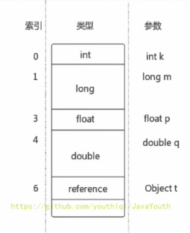
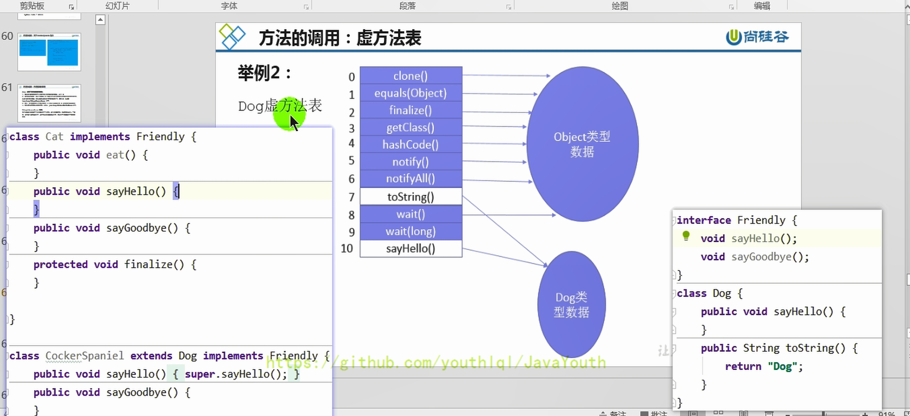
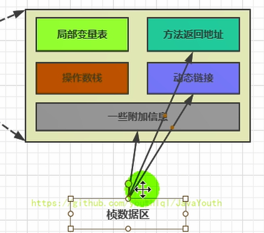

运行时数据区及线程
-----------------

### 运行时数据区结构概述

本节主要讲的是运行时数据区，也就是下图这部分，它是在类加载完成后的阶段


当我们通过前面的：类的加载 --> 验证 --> 准备 --> 解析 --\> 初始化，这几个阶段完成后，就会用到执行引擎对我们的类进行使用，同时执行引擎将会使用到我们运行时数据区


**Runtime类**：

**每个JVM只有一个Runtime实例**。即为运行时环境，相当于内存结构的中间的那个框框：运行时环境。


### JVM 线程

1. **在Hotspot JVM里，每个线程都与操作系统的本地线程直接映射**

   当一个Java线程准备好执行以后，此时一个操作系统的本地线程也同时创建。Java线程执行终止后，本地线程也会回收

2. 线程独有：独立包括程序计数器、栈、本地方法栈

   线程间共享：堆、堆外内存（永久代或元空间、代码缓存）

3. 这些主要的后台系统线程在Hotspot JVM里主要是以下几个：
   1. **虚拟机线程**：这种线程的操作是需要JVM达到安全点才会出现。这些操作必须在不同的线程中发生的原因是他们都需要JVM达到安全点，这样堆才不会变化。这种线程的执行类型括"stop-the-world"的垃圾收集，线程栈收集，线程挂起以及偏向锁撤销
   2. **周期任务线程**：这种线程是时间周期事件的体现（比如中断），他们一般用于周期性操作的调度执行
   3. **GC线程**：这种线程对在JVM里不同种类的垃圾收集行为提供了支持
   4. **编译线程**：这种线程在运行时会将字节码编译成到本地代码
   5. **信号调度线程**：这种线程接收信号并发送给JVM，在它内部通过调用适当的方法进行处理


程序计数器(PC寄存器)
-----------

### PC寄存器介绍

> 官方文档网址：https://docs.oracle.com/javase/specs/jvms/se8/html/index.html


1.  PC寄存器用来存储指向下一条指令的地址，并由执行引擎读取下一条指令，并执行该指令。如果是在执行native方法，PC寄存器的值为**undefned**。
2.  它是一块很小的内存空间，是运行速度最快的存储区域，是**唯一没有**内存溢出的区域。
3.  每个线程都有它自己的程序计数器，是线程私有的，生命周期与线程的生命周期保持一致。
4.  它是**程序控制流**的指示器，分支、循环、跳转、异常处理、线程恢复等基础功能都需要依赖这个计数器来完成。
5.  字节码解释器工作时就是通过改变这个计数器的值来选取下一条需要执行的字节码指令。


### 举例

```java
public class PCRegisterTest {

    public static void main(String[] args) {
        int i = 10;
        int j = 20;
        int k = i + j;

        String s = "abc";
        System.out.println(i);
        System.out.println(k);

    }
}
```

查看字节码

> 看字节码的方法：https://blog.csdn.net/21aspnet/article/details/88351875

```java
Classfile /F:/IDEAWorkSpaceSourceCode/JVMDemo/out/production/chapter04/com/atguigu/java/PCRegisterTest.class
  Last modified 2020-11-2; size 675 bytes
  MD5 checksum 53b3ef104479ec9e9b7ce5319e5881d3
  Compiled from "PCRegisterTest.java"
public class com.atguigu.java.PCRegisterTest
  minor version: 0
  major version: 52
  flags: ACC_PUBLIC, ACC_SUPER
Constant pool:
   #1 = Methodref          #6.#26         // java/lang/Object."<init>":()V
   #2 = String             #27            // abc
   #3 = Fieldref           #28.#29        // java/lang/System.out:Ljava/io/PrintStream;
   #4 = Methodref          #30.#31        // java/io/PrintStream.println:(I)V
   #5 = Class              #32            // com/atguigu/java/PCRegisterTest
   #6 = Class              #33            // java/lang/Object
   #7 = Utf8               <init>
   #8 = Utf8               ()V
   #9 = Utf8               Code
  #10 = Utf8               LineNumberTable
  #11 = Utf8               LocalVariableTable
  #12 = Utf8               this
  #13 = Utf8               Lcom/atguigu/java/PCRegisterTest;
  #14 = Utf8               main
  #15 = Utf8               ([Ljava/lang/String;)V
  #16 = Utf8               args
  #17 = Utf8               [Ljava/lang/String;
  #18 = Utf8               i
  #19 = Utf8               I
  #20 = Utf8               j
  #21 = Utf8               k
  #22 = Utf8               s
  #23 = Utf8               Ljava/lang/String;
  #24 = Utf8               SourceFile
  #25 = Utf8               PCRegisterTest.java
  #26 = NameAndType        #7:#8          // "<init>":()V
  #27 = Utf8               abc
  #28 = Class              #34            // java/lang/System
  #29 = NameAndType        #35:#36        // out:Ljava/io/PrintStream;
  #30 = Class              #37            // java/io/PrintStream
  #31 = NameAndType        #38:#39        // println:(I)V
  #32 = Utf8               com/atguigu/java/PCRegisterTest
  #33 = Utf8               java/lang/Object
  #34 = Utf8               java/lang/System
  #35 = Utf8               out
  #36 = Utf8               Ljava/io/PrintStream;
  #37 = Utf8               java/io/PrintStream
  #38 = Utf8               println
  #39 = Utf8               (I)V
{
  public com.atguigu.java.PCRegisterTest();
    descriptor: ()V
    flags: ACC_PUBLIC
    Code:
      stack=1, locals=1, args_size=1
         0: aload_0
         1: invokespecial #1                  // Method java/lang/Object."<init>":()V
         4: return
      LineNumberTable:
        line 7: 0
      LocalVariableTable:
        Start  Length  Slot  Name   Signature
            0       5     0  this   Lcom/atguigu/java/PCRegisterTest;

  public static void main(java.lang.String[]);
    descriptor: ([Ljava/lang/String;)V
    flags: ACC_PUBLIC, ACC_STATIC
    Code:
      stack=2, locals=5, args_size=1
         0: bipush        10
         2: istore_1
         3: bipush        20
         5: istore_2
         6: iload_1
         7: iload_2
         8: iadd
         9: istore_3
        10: ldc           #2                  // String abc
        12: astore        4
        14: getstatic     #3                  // Field java/lang/System.out:Ljava/io/PrintStream;
        17: iload_1
        18: invokevirtual #4                  // Method java/io/PrintStream.println:(I)V
        21: getstatic     #3                  // Field java/lang/System.out:Ljava/io/PrintStream;
        24: iload_3
        25: invokevirtual #4                  // Method java/io/PrintStream.println:(I)V
        28: return
      LineNumberTable:
        line 10: 0
        line 11: 3
        line 12: 6
        line 14: 10
        line 15: 14
        line 16: 21
        line 18: 28
      LocalVariableTable:
        Start  Length  Slot  Name   Signature
            0      29     0  args   [Ljava/lang/String;
            3      26     1     i   I
            6      23     2     j   I
           10      19     3     k   I
           14      15     4     s   Ljava/lang/String;
}
SourceFile: "PCRegisterTest.java"
```


*   左边的数字代表**指令地址（指令偏移）**，即 PC 寄存器中可能存储的值，然后执行引擎读取 PC 寄存器中的值，并执行该指令


### 两个面试题

**使用PC寄存器存储字节码指令地址有什么用呢？**或者问**为什么使用 PC 寄存器来记录当前线程的执行地址呢？**

1.  因为CPU需要不停的切换各个线程，这时候切换回来以后，就得知道接着从哪开始继续执行
  
2.  JVM的字节码解释器就需要通过改变PC寄存器的值来明确下一条应该执行什么样的字节码指令


**PC寄存器为什么被设定为私有的？**

1.  我们都知道所谓的多线程在一个特定的时间段内只会执行其中某一个线程的方法，CPU会不停地做任务切换，这样必然导致经常中断或恢复，如何保证分毫无差呢？**为了能够准确地记录各个线程正在执行的当前字节码指令地址，最好的办法自然是为每一个线程都分配一个PC寄存器**，这样一来各个线程之间便可以进行独立计算，从而不会出现相互干扰的情况。
2.  由于CPU时间片轮限制，众多线程在并发执行过程中，任何一个确定的时刻，一个处理器或者多核处理器中的一个内核，只会执行某个线程中的一条指令。
3.  这样必然导致经常中断或恢复，如何保证分毫无差呢？每个线程在创建后，都会产生自己的程序计数器和栈帧，程序计数器在各个线程之间互不影响。


虚拟机栈
----------

### 简介

#### 虚拟机栈的出现背景

1.  由于跨平台性的设计，Java的指令都是根据栈来设计的。不同平台CPU架构不同，所以不能设计为基于寄存器的【如果设计成基于寄存器的，耦合度高，性能会有所提升，因为可以对具体的CPU架构进行优化，但是跨平台性大大降低】。
2.  优点是跨平台，指令集小，编译器容易实现，缺点是性能下降，实现同样的功能需要更多的指令。


#### 内存中的栈与堆

1. 首先栈是运行时的单位，而堆是存储的单位。

2. 即：栈解决程序的运行问题，即程序如何执行，或者说如何处理数据。

   堆解决的是数据存储的问题，即数据怎么放，放哪里


#### 虚拟机栈基本介绍⭐

Java虚拟机栈（Java Virtual Machine  Stack），早期也叫Java栈。

- 每个线程在创建时都会创建一个虚拟机栈，是线程私有的。
- 栈的生命周期和线程一致，也就是线程结束了，该虚拟机栈也销毁了。
- 其内部保存一个个的栈帧（Stack Frame），**每个栈帧对应着一次的Java方法调用**，存储了局部变量表，操作数栈，动态链接，方法出口等信息，执行引擎运行的所有字节码指令只针对当前栈帧进行操作，当方法执行结束return或者抛出未捕获异常时就会弹出当前栈帧。
- 栈不需要GC，但是可能存在OOM和栈溢出。


#### 虚拟机栈的异常

**面试题：栈中可能出现的异常？**

- Java 虚拟机规范允许Java栈的大小是动态的或者是固定不变的。

  - 如果采用固定大小的Java虚拟机栈，那每一个线程的Java虚拟机栈容量可以在线程创建的时候独立选定。如果线程请求分配的栈容量超过Java虚拟机栈允许的最大容量，Java虚拟机将会抛出一个**StackoverflowError** 异常。

  - 如果Java虚拟机栈可以动态扩展，并且在尝试扩展的时候无法申请到足够的内存，或者在创建新的线程时没有足够的内存去创建对应的虚拟机栈，那Java虚拟机将会抛出一个 **OutofMemoryError** 异常。


#### 设置栈内存大小

> 多去官方文档看看：https://docs.oracle.com/en/java/javase/11/tools/java.html#GUID-3B1CE181-CD30-4178-9602-230B800D4FAE
>

我们可以使用参数 **-Xss** 选项来设置线程的最大栈空间，栈的大小直接决定了函数调用的最大可达深度。

> Sets the thread stack size (in bytes). Append the letter `k` or `K` to indicate KB, `m` or `M` to indicate MB, and `g` or `G` to indicate GB. The default value depends on the platform:
>
> * Linux/x64 (64-bit): 1024 KB
> * macOS (64-bit): 1024 KB
> * Oracle Solaris/x64 (64-bit): 1024 KB
> * Windows: The default value depends on virtual memory


The following examples set the thread stack size to 1024 KB in different units:

```java
-Xss1m
-Xss1024k
-Xss1048576
```

举例：

```java
public class StackErrorTest {
    private static int count = 1;
    public static void main(String[] args) {
        System.out.println(count);
        count++;
        main(args);
    }
}
```

**没设置参数前**

部分输出结果：

```java
11404
11405
11406
Exception in thread "main" java.lang.StackOverflowError
	at sun.nio.cs.UTF_8$Encoder.encodeLoop(UTF_8.java:691)
```

说明栈在11406这个深度溢出了


**设置栈参数之后**


部分输出结果

```java
2474
2475
2476
Exception in thread "main" java.lang.StackOverflowError
	at sun.nio.cs.UTF_8.updatePositions(UTF_8.java:77)
```

说明参数起作用了


### 栈帧

1.  每个线程都有自己的栈，栈中的数据都是以**栈帧**（Stack Frame）的格式存在
2.  在这个线程上正在执行的每个方法都各自对应一个栈帧（Stack Frame）。
3.  存储了局部变量表，操作数栈，动态链接(指向运行时常量池的方法引用)，方法出口(方法正常退出或者异常退出的定义)和其他信息。
4.  执行引擎运行的所有字节码指令只针对当前栈帧进行操作。


### 方法字节码详解

```java
public static void main(String[] args) throws FileNotFoundException {
    LocalVariablesTest test = new LocalVariablesTest();
    int num = 10;
    test.test1();

    try {
        Thread.sleep(100);
    } catch (InterruptedException e) {
        e.printStackTrace();
    }
    new FileInputStream("");
}
```


```java
public static void main(java.lang.String[]) throws java.io.FileNotFoundException;
    descriptor: ([Ljava/lang/String;)V
    flags: ACC_PUBLIC, ACC_STATIC
    Code:
      stack=3, locals=4, args_size=1
         0: new           #1                  // class com/atguigu/java/chapter05/LocalVariablesTest
         3: dup
         4: invokespecial #2                  // Method "<init>":()V
         7: astore_1
         8: bipush        10
        10: istore_2
        11: aload_1
        12: invokevirtual #3                  // Method test1:()V
        15: ldc2_w        #4                  // long 100l
        18: invokestatic  #6                  // Method java/lang/Thread.sleep:(J)V
        21: goto          29
        24: astore_3
        25: aload_3
        26: invokevirtual #8                  // Method java/lang/InterruptedException.printStackTrace:()V
        29: new           #9                  // class java/io/FileInputStream
        32: dup
        33: ldc           #10                 // String
        35: invokespecial #11                 // Method java/io/FileInputStream."<init>":(Ljava/lang/String;)V
        38: pop
        39: return
      Exception table:
         from    to  target type
            15    21    24   Class java/lang/InterruptedException
      LineNumberTable:
        line 11: 0
        line 12: 8
        line 13: 11
        line 16: 15
        line 19: 21
        line 17: 24
        line 18: 25
        line 20: 29
        line 21: 39
      LocalVariableTable:
        Start  Length  Slot  Name   Signature
           25       4     3     e   Ljava/lang/InterruptedException;
            0      40     0  args   [Ljava/lang/String;
            8      32     1  test   Lcom/atguigu/java/chapter05/LocalVariablesTest;
           11      29     2   num   I
      StackMapTable: number_of_entries = 2
        frame_type = 255 /* full_frame */
          offset_delta = 24
          locals = [ class "[Ljava/lang/String;", class com/atguigu/java/chapter05/LocalVariablesTest, int ]
          stack = [ class java/lang/InterruptedException ]
        frame_type = 4 /* same */
    Exceptions:
      throws java.io.FileNotFoundException
```

1. **descriptor**: ([Ljava/lang/String;)V：([Ljava/lang/String;)表示方法的参数，V表示返回值为void
2. **flags**: ACC_PUBLIC, ACC_STATIC：方法的访问标志
3. **code属性**:
   - stack=2, locals=4, args_size=1：操作数栈大小，局部变量表大小(不一定为变量个数)，方法参数的个数(若为构造方法或实例方法，会隐含一个this变量，+1)
   - **attribute_info** ：方法体内容。0,1,...29为字节码行号(指令地址)，invokespecial #2    等为操作指令
   - **Exception table**：对应每个try-catch。当字节码在第from到to行之间出现了类型为type或其子类的异常，则转到target行继续运行
   - **LineNumberTable**：代码行号和字节码行号的对应关系
   - **LocalVariableTable**：局部变量表。start为当前变量在字节码中生命周期的起始位置，length为作用域长度，slot为这个变量在局部变量表中的槽位（槽位可复用），name就是变量名，Signature表示局部变量类型描述。**若为构造或实例方法，会隐含一个this变量，slot为0**
   - **StackMapTable**：包含多个栈映射帧，每个帧代表了一个字节码偏移量，用于表示执行到该字节码时局部变量表和操作数栈的验证类型。 在字节码验证阶段，新类型检查验证器会通过检查目标方法的局部变量和操作数栈所需要的类型来确定一段字节码指令是否符合逻辑约束。
4. **Exceptions属性**：对应每个throws


**栈运行原理：**

1.  JVM直接对Java栈的操作只有两个，就是对栈帧的**压栈和出栈**，遵循先进后出（后进先出）原则
  
2.  在一条活动线程中，一个时间点上，只会有一个活动的栈帧。即只有当前正在执行的方法的栈帧（栈顶栈帧）是有效的。这个栈帧被称为**当前栈帧（Current Frame）**，与当前栈帧相对应的方法就是**当前方法（Current Method）**，定义这个方法的类就是**当前类（Current Class）**

3.  执行引擎运行的所有字节码指令只针对当前栈帧进行操作。
  
4.  如果在该方法中调用了其他方法，对应的新的栈帧会被创建出来，放在栈的顶端，成为新的当前帧。


1.  **不同线程中所包含的栈帧是不允许存在相互引用的**，即不可能在一个栈帧之中引用另外一个线程的栈帧。
2.  如果当前方法调用了其他方法，方法返回之际，当前栈帧会传回此方法的执行结果给前一个栈帧，接着，虚拟机会丢弃当前栈帧，使得前一个栈帧重新成为当前栈帧。
3.  Java方法有两种返回函数的方式。
    - 一种是正常的函数返回，使用return指令。
    - 另一种是方法执行中出现未捕获处理的异常，以抛出异常的方式结束。
    - 但不管使用哪种方式，都会导致栈帧被弹出。


### 局部变量表

#### 介绍

1.  局部变量表也被称之为局部变量数组或本地变量表 
2.  **每一个栈帧都有一个局部变量表，定义为一个数字数组，主要用于存储方法参数和定义在方法体内的局部变量**，这些数据类型包括各类基本数据类型、对象引用（reference），以及returnAddress返回值类型。
3.  **局部变量表所需的容量大小是在编译期确定下来的**，并保存在方法的Code属性的**locals**数据项中。在方法运行期间是不会改变局部变量表的大小的。
4.  **局部变量表中的变量只在当前方法调用中有效**。
    *   在方法执行时，虚拟机通过使用局部变量表完成参数值到参数变量列表的传递过程。
    *   当方法调用结束后，随着方法栈帧的销毁，局部变量表也会随之销毁。
5.  由于局部变量表是建立在线程的栈上，是线程的私有数据，因此**不存在数据安全问题**
6.  **局部变量表不存在系统初始化的过程**，这意味着一旦定义了局部变量则必须人为的初始化，否则无法使用。
7.  局部变量表中的变量也是重要的**垃圾回收根节点**，只要被局部变量表中直接或间接引用的对象都不会被回收。


#### Slot

1. 参数值的存放总是从局部变量数组索引 0 的位置开始，到数组长度-1的索引结束。

2. 局部变量表，**最基本的存储单元是Slot（变量槽）**，局部变量表中存放编译期可知的各种基本数据类型（8种），引用类型（reference），returnAddress类型的变量。

3.  在局部变量表里，**32位以内的类型只占用一个slot**（包括returnAddress类型），**64位的类型占用两个slot**（1ong和double）。
    - byte、short、char在储存前被转换为int，boolean也被转换为int，0表示false，非0表示true
    - long和double则占据两个slot
    
4. **若为构造或实例方法，会隐含一个this变量，slot为0**。this 不存在与 static 方法的局部变量表中，所以无法调用

5. JVM会为局部变量表中的**每一个Slot都分配一个访问索引**，通过`load_index`即可成功访问到局部变量表中指定的局部变量值。

6. 当一个实例方法被调用的时候，参数和局部变量将会**按照顺序通过进栈指令进栈，再通过store_index指令存储到局部变量表中的指定slot上**。。(进栈指令：const，bipush，sipush，ldc)

7. **栈帧中的局部变量表中的slot是可以重用的**，如果一个局部变量过了其作用域，那么在其作用域之后申明新的局部变量变就很有可能会复用过期局部变量的槽位，从而达到节省资源的目的。

   




slot重用：

```java
    public void test4() {
        int a = 0;
        {
            int b = 0;
            b = a + 1;
        }
        //变量c使用之前已经销毁的变量b占据的slot的位置
        int c = a + 1;
    }
```

局部变量 c 重用了局部变量 b 的 slot 位置。并且locals也为3。

<center></center>


#### 成员变量vs局部变量

成员变量：在使用前，都经历过默认初始化赋值

- 静态变量：在类加载时，链接阶段的准备阶段给类变量默认赋值，初始化阶段给类变量显式赋值。

- 实例变量：随着对象的创建，会在堆空间中分配实例变量空间，并进行默认赋值

局部变量：在使用前，必须要进行显式赋值的！否则，编译不通过。因为**局部变量表不存在系统初始化的过程**，这意味着一旦定义了局部变量则必须人为的初始化，否则无法使用。


### 操作数栈

#### 介绍

1.  每一个独立的栈帧除了包含局部变量表以外，还包含一个后进先出（Last - In - First -Out）的 操作数栈，也可以称之为**表达式栈**（Expression Stack）
2.  操作数栈，在方法执行过程中，**根据字节码指令，往栈中写入数据或提取数据**，即入栈（push）和 出栈（pop）
    - 某些字节码指令将值压入操作数栈，其余的字节码指令将操作数取出栈。使用它们后再把结果压入栈，
      - 比如：执行复制、交换、求和等操作


1. **每一个栈帧都有一个操作数栈，用数组来实现，** **主要用于计算过程中变量临时的存储空间，以及保存计算过程的中间结果**。

2. **栈的大小在编译器确定下来**，并保存在方法的Code属性的**stack**数据项中。

3. 栈中的任何一个元素都是可以任意的Java数据类型

   *   **32bit数据类型占用的栈容量为1**
   *   **64bit数据类型占用的栈容量为2** 

4. **操作数栈中元素的数据类型必须与字节码指令的序列严格匹配**，这由编译器在编译器期间进行验证，同时在类加载过程中的类检验阶段的数据流分析阶段要再次验证。

   eg:iadd指令用于整数加法，栈顶两个元素必须为int类型。

5. **如果被调用的方法带有返回值的话，其返回值将会被压入当前栈帧的操作数栈中，再返回，被调用者会执行pop或者istore指令**。

6. **Java虚拟机的执行引擎是基于栈的执行引擎，其中的栈指的就是操作数栈**。


 

#### 操作数栈步骤演示

```java
	public void testAddOperation() {
        //byte、short、char、boolean：都以int型来保存
        byte i = 15;
        int j = 8;
        int k = i + j;

       // int m = 800;

    }
```

对应字节码指令

```java
 0 bipush 15
 2 istore_1
 3 bipush 8
 5 istore_2
 6 iload_1
 7 iload_2
 8 iadd
 9 istore_3
10 return
```


>当int取值**-1~5**采用iconst指令，取值**-128~127**采用bipush指令，取值**-32768~32767**采用sipush指令，取值**-2147483648~2147483647**采用 ldc 指令。

一步一步看流程：

1、首先执行第一条语句，PC寄存器指向的是0，也就是指令地址为0，然后使用bipush让操作数15入操作数栈。


2、执行完后，PC寄存器往下移，指向下一行代码，下一行代码就是将操作数栈的元素存储到局部变量表1的位置（istore_1），我们可以看到局部变量表的已经增加了一个元素。并且操作数栈为空了

*   解释为什么局部变量表索引从 1 开始，因为该方法为实例方法，局部变量表索引为 0 的位置存放的是 this


3、然后PC下移，指向的是下一行。让操作数8也入栈，同时执行store操作，存入局部变量表中


4、然后从局部变量表中，依次将数据放在操作数栈中，等待执行 add 操作

iload_1：取出局部变量表中索引为1的数据入操作数栈


5、然后将操作数栈中的两个元素执行相加操作，并存储在局部变量表3的位置


小问题：

**关于类型转换的说明**


*   因为 8 可以存放在 byte 类型中，所以压入操作数栈的类型为 byte ，而不是 int ，所以执行的字节码指令为 bipush 8
*   但是存储在局部变量的时候，会转成 int 类型的变量：istore_4


- m改成800之后，byte存储不了，就成了short型，sipush 800


**如果被调用的方法带有返回值，返回值入操作数栈**

```java
  public int getSum(){
        int m = 10;
        int n = 20;
        int k = m + n;
        return k;
    }

    public void testGetSum(){
        //获取上一个栈桢返回的结果，并保存在操作数栈中
        int i = getSum();
        int j = 10;
    }
```


getSum() 方法字节码指令：最后带着个 ireturn


testGetSum() 方法字节码指令：一上来就加载 getSum() 方法的返回值()


#### 栈顶缓存技术(Top Of Stack Cashing)

1.  前面提过，基于栈式架构的虚拟机所使用的**零地址指令**更加紧凑，但完成一项操作的时候必然需要使用更多的入栈和出栈指令，这同时也就意味着将需要更多的指令分派（instruction dispatch）次数（也就是你会发现指令很多）和导致内存读/写次数多，效率不高。
  
2.  由于操作数是存储在内存中的，因此频繁地执行内存读/写操作必然会影响执行速度。为了解决这个问题，HotSpot JVM的设计者们提出了栈顶缓存（Tos，Top-of-Stack Cashing）技术，**将栈顶元素全部缓存在物理CPU的寄存器中，以此降低对内存的读/写次数，提升执行引擎的执行效率。**
  
3.  寄存器的主要优点：指令更少，执行速度快，但是指令集（也就是指令种类）很多


### 动态链接

1. 每一个栈帧内部都包含**一个指向运行时常量池中该栈帧所属方法的引用**。包含这个引用的目的就是**为了支持当前方法的代码能够实现动态链接**（Dynamic Linking），比如：invokedynamic指令

2. **动态链接的作用就是在每次运行时将符号引用转换为直接引用**。

   - 符号引用就是字符串，包含类的全限定名，方法名，方法参数，返回类型。eg：“java/io/PrintStream.println:(Ljava/lang/String;)V”。
   - 直接引用就是偏移量，通过偏移量虚拟机可以直接在该类的内存区域中找到方法字节码的起始位置。

   字节码中的方法调用指令是以常量池中指向方法的符号引用为参数，这些符号引用一部分会在类加载阶段时候就转化为了直接引用，这叫静态链接。另外一些符号引用则是在每次运行期都会转换为直接引用，这种转换叫做动态链接。这体现为Java的多态性。


```java
public class DynamicLinkingTest {

    int num = 10;

    public void methodA(){
        System.out.println("methodA()....");
    }

    public void methodB(){
        System.out.println("methodB()....");

        methodA();

        num++;
    }

}
```

对应字节码

```java
Classfile /F:/IDEAWorkSpaceSourceCode/JVMDemo/out/production/chapter05/com/atguigu/java1/DynamicLinkingTest.class
  Last modified 2020-11-10; size 712 bytes
  MD5 checksum e56913c945f897c7ee6c0a608629bca8
  Compiled from "DynamicLinkingTest.java"
public class com.atguigu.java1.DynamicLinkingTest
  minor version: 0
  major version: 52
  flags: ACC_PUBLIC, ACC_SUPER
Constant pool:
   #1 = Methodref          #9.#23         // java/lang/Object."<init>":()V
   #2 = Fieldref           #8.#24         // com/atguigu/java1/DynamicLinkingTest.num:I
   #3 = Fieldref           #25.#26        // java/lang/System.out:Ljava/io/PrintStream;
   #4 = String             #27            // methodA()....
   #5 = Methodref          #28.#29        // java/io/PrintStream.println:(Ljava/lang/String;)V
   #6 = String             #30            // methodB()....
   #7 = Methodref          #8.#31         // com/atguigu/java1/DynamicLinkingTest.methodA:()V
   #8 = Class              #32            // com/atguigu/java1/DynamicLinkingTest
   #9 = Class              #33            // java/lang/Object
  #10 = Utf8               num
  #11 = Utf8               I
  #12 = Utf8               <init>
  #13 = Utf8               ()V
  #14 = Utf8               Code
  #15 = Utf8               LineNumberTable
  #16 = Utf8               LocalVariableTable
  #17 = Utf8               this
  #18 = Utf8               Lcom/atguigu/java1/DynamicLinkingTest;
  #19 = Utf8               methodA
  #20 = Utf8               methodB
  #21 = Utf8               SourceFile
  #22 = Utf8               DynamicLinkingTest.java
  #23 = NameAndType        #12:#13        // "<init>":()V
  #24 = NameAndType        #10:#11        // num:I
  #25 = Class              #34            // java/lang/System
  #26 = NameAndType        #35:#36        // out:Ljava/io/PrintStream;
  #27 = Utf8               methodA()....
  #28 = Class              #37            // java/io/PrintStream
  #29 = NameAndType        #38:#39        // println:(Ljava/lang/String;)V
  #30 = Utf8               methodB()....
  #31 = NameAndType        #19:#13        // methodA:()V
  #32 = Utf8               com/atguigu/java1/DynamicLinkingTest
  #33 = Utf8               java/lang/Object
  #34 = Utf8               java/lang/System
  #35 = Utf8               out
  #36 = Utf8               Ljava/io/PrintStream;
  #37 = Utf8               java/io/PrintStream
  #38 = Utf8               println
  #39 = Utf8               (Ljava/lang/String;)V
{
  int num;
    descriptor: I
    flags:

  public com.atguigu.java1.DynamicLinkingTest();
    descriptor: ()V
    flags: ACC_PUBLIC
    Code:
      stack=2, locals=1, args_size=1
         0: aload_0
         1: invokespecial #1                  // Method java/lang/Object."<init>":()V
         4: aload_0
         5: bipush        10
         7: putfield      #2                  // Field num:I
        10: return
      LineNumberTable:
        line 7: 0
        line 9: 4
      LocalVariableTable:
        Start  Length  Slot  Name   Signature
            0      11     0  this   Lcom/atguigu/java1/DynamicLinkingTest;

  public void methodA();
    descriptor: ()V
    flags: ACC_PUBLIC
    Code:
      stack=2, locals=1, args_size=1
         0: getstatic     #3                  // Field java/lang/System.out:Ljava/io/PrintStream;
         3: ldc           #4                  // String methodA()....
         5: invokevirtual #5                  // Method java/io/PrintStream.println:(Ljava/lang/String;)V
         8: return
      LineNumberTable:
        line 12: 0
        line 13: 8
      LocalVariableTable:
        Start  Length  Slot  Name   Signature
            0       9     0  this   Lcom/atguigu/java1/DynamicLinkingTest;

  public void methodB();
    descriptor: ()V
    flags: ACC_PUBLIC
    Code:
      stack=3, locals=1, args_size=1
         0: getstatic     #3                  // Field java/lang/System.out:Ljava/io/PrintStream;
         3: ldc           #6                  // String methodB()....
         5: invokevirtual #5                  // Method java/io/PrintStream.println:(Ljava/lang/String;)V
         8: aload_0
         9: invokevirtual #7                  // Method methodA:()V
        12: aload_0
        13: dup
        14: getfield      #2                  // Field num:I
        17: iconst_1
        18: iadd
        19: putfield      #2                  // Field num:I
        22: return
      LineNumberTable:
        line 16: 0
        line 18: 8
        line 20: 12
        line 21: 22
      LocalVariableTable:
        Start  Length  Slot  Name   Signature
            0      23     0  this   Lcom/atguigu/java1/DynamicLinkingTest;
}
SourceFile: "DynamicLinkingTest.java"
```


1、在字节码指令中，methodB() 方法中通过 invokevirtual #7 指令调用了方法 A ，那么 #7 是个啥呢？

2、往上面翻，找到常量池的定义：`#7 = Methodref #8.#31`

*   先找 #8 ：
    *   `#8 = Class #32` ：去找 #32
    *   `#32 = Utf8 com/atguigu/java1/DynamicLinkingTest`
    *   结论：通过 #8 我们找到了 `DynamicLinkingTest` 这个类
*   再来找 #31：
    *   `#31 = NameAndType #19:#13` ：去找 #19 和 #13
    *   `#19 = Utf8 methodA` ：方法名为 methodA
    *   `#13 = Utf8 ()V` ：方法没有形参，返回值为 void

3、结论：通过 #7 我们就能找到需要调用的 methodA() 方法，并进行调用

4、在上面，其实还有很多符号引用，比如 Object、System、PrintStream 等等


**为什么要用常量池呢？**

1.  因为在不同的方法，都可能调用常量或者方法，所以只需要存储一份即可，然后记录其引用即可，节省了空间。
  
2.  常量池的作用：就是为了提供一些符号和常量，便于指令的识别 


### 方法的调用

#### 静态链接与动态链接

在JVM中，将符号引用转换为调用方法的直接引用与方法的绑定机制相关

- **静态链接**：

  **符号引用在类加载阶段时候就转化为了直接引用**，**被调用的目标方法在编译期确定，且运行期保持不变时**，这种情况下将调用方法的符号引用转换为直接引用的过程称之为静态链接

- **动态链接**：

  **符号引用在每次运行期都会转换为直接引用，被调用的方法在编译期无法被确定下来**，这种情况下将调用方法的符号引用转换为直接引用的过程称之为动态链接。


#### 早期绑定与晚期绑定

**早期绑定涵盖了静态链接，晚期绑定涵盖了动态链接**。静态链接与动态链接针对的是方法。早期绑定和晚期绑定范围更广，**绑定是一个字段、方法或者类在符号引用被替换为直接引用的过程**。

- **早期绑定**

  **符号引用在类加载阶段时候就转化为了直接引用**，**被调用的方法，字段，类在编译期确定，且运行期保持不变时**

- **晚期绑定**

  **符号引用在每次运行期都会转换为直接引用，被调用的方法，字段，类在编译期无法被确定下来**


```java
class Animal {

    public void eat() {
        System.out.println("动物进食");
    }
}

interface Huntable {
    void hunt();
}

class Dog extends Animal implements Huntable {
    @Override
    public void eat() {
        System.out.println("狗吃骨头");
    }

    @Override
    public void hunt() {
        System.out.println("捕食耗子，多管闲事");
    }
}

class Cat extends Animal implements Huntable {

    public Cat() {
        super();//表现为：早期绑定
    }

    public Cat(String name) {
        this();//表现为：早期绑定
    }

    @Override
    public void eat() {
        super.eat();//表现为：早期绑定
        System.out.println("猫吃鱼");
    }

    @Override
    public void hunt() {
        System.out.println("捕食耗子，天经地义");
    }
}

public class AnimalTest {
    public void showAnimal(Animal animal) {
        animal.eat();//表现为：晚期绑定
    }

    public void showHunt(Huntable h) {
        h.hunt();//表现为：晚期绑定
    }
}

```

部分字节码

```java
{
  public com.atguigu.java2.AnimalTest();
    descriptor: ()V
    flags: ACC_PUBLIC
    Code:
      stack=1, locals=1, args_size=1
         0: aload_0
         1: invokespecial #1                  // Method java/lang/Object."<init>":()V
         4: return
      LineNumberTable:
        line 54: 0
      LocalVariableTable:
        Start  Length  Slot  Name   Signature
            0       5     0  this   Lcom/atguigu/java2/AnimalTest;

  public void showAnimal(com.atguigu.java2.Animal);
    descriptor: (Lcom/atguigu/java2/Animal;)V
    flags: ACC_PUBLIC
    Code:
      stack=1, locals=2, args_size=2
         0: aload_1
         1: invokevirtual #2                  // Method com/atguigu/java2/Animal.eat:()V
         4: return
      LineNumberTable:
        line 56: 0
        line 57: 4
      LocalVariableTable:
        Start  Length  Slot  Name   Signature
            0       5     0  this   Lcom/atguigu/java2/AnimalTest;
            0       5     1 animal   Lcom/atguigu/java2/Animal;

  public void showHunt(com.atguigu.java2.Huntable);
    descriptor: (Lcom/atguigu/java2/Huntable;)V
    flags: ACC_PUBLIC
    Code:
      stack=1, locals=2, args_size=2
         0: aload_1
         1: invokeinterface #3,  1            // InterfaceMethod com/atguigu/java2/Huntable.hunt:()V
         6: return
      LineNumberTable:
        line 60: 0
        line 61: 6
      LocalVariableTable:
        Start  Length  Slot  Name   Signature
            0       7     0  this   Lcom/atguigu/java2/AnimalTest;
            0       7     1     h   Lcom/atguigu/java2/Huntable;
}
SourceFile: "AnimalTest.java"
```


invokevirtual 体现为晚期绑定

invokeinterface 也体现为晚期绑定

invokespecial 体现为早期绑定


#### 虚方法与非虚方法

- 虚方法：除了**静态方法、构造器方法、私有方法、final方法、父类方法(显示调用)**，其他都是虚方法。对应动态链接，符号引用在每次运行期都会转换为直接引用，被调用的方法在编译期无法被确定下来。

- 非虚方法：**静态方法、构造器方法、私有方法、final方法、父类方法(显示调用)**都是非虚方法。对应静态链接，符号引用在类加载阶段时候就转化为了直接引用，在编译期确定，且运行期间保持不变。

  


#### 调用方法的指令

- **invokestatic**：调用静态方法，解析阶段确定唯一方法版本
- **invokespecial**：调用\<init\>方法、私有及父类方法(显示调用)，解析阶段确定唯一方法版本
- **invokevirtual**：调用虚方法和部分final方法(eg:隐式调用父类的final方法，但不是虚方法)
- **invokeinterface**：调用实现接口的方法
- **invokedynamic**：用于支持动态类型语言，动态解析出需要调用的方法，然后执行。常用于使用lambda表达式创建匿名内部类。

invokestatic指令和invokespecial指令调用非虚方法，其余的调用虚方法+部分final方法。

前四条指令固化在虚拟机内部，方法的调用执行不可人为干预。而invokedynamic指令则支持由用户确定方法版本。


```java
class Father {
    public Father() {
        System.out.println("father的构造器");
    }

    public static void showStatic(String str) {
        System.out.println("father " + str);
    }

    public final void showFinal() {
        System.out.println("father show final");
    }

    public void showCommon() {
        System.out.println("father 普通方法");
    }
}

public class Son extends Father {
    public Son() {
        //invokespecial
        super();
    }

    public Son(int age) {
        //invokespecial
        this();
    }

    //不是重写的父类的静态方法，因为静态方法不能被重写！
    public static void showStatic(String str) {
        System.out.println("son " + str);
    }

    private void showPrivate(String str) {
        System.out.println("son private" + str);
    }

    public void show() {
        //invokestatic
        showStatic("atguigu.com");
        //invokestatic
        super.showStatic("good!");
        //invokespecial
        showPrivate("hello!");
        //invokespecial
        super.showCommon();

        //invokevirtual
        showFinal();//因为此方法声明有final，不能被子类重写，所以也认为此方法是非虚方法。
        //虚方法如下：

        /*
        invokevirtual  你没有显示的加super.，编译器认为你可能调用子类的showCommon(即使son子类没有重写，也会认为)，所以编译期间确定不下来，就是虚方法。
        */
        showCommon();
        info();

        MethodInterface in = null;
        //invokeinterface
        in.methodA();
    }

    public void info() {

    }

    public void display(Father f) {
        f.showCommon();
    }

    public static void main(String[] args) {
        Son so = new Son();
        so.show();
    }
}

interface MethodInterface {
    void methodA();
}
```


**关于 invokedynamic 指令：**

1.  JVM字节码指令集一直比较稳定，一直到Java7中才增加了一个invokedynamic指令，这是Java为了实现【**动态类型语言**】支持而做的一种改进。
  
2.  但是在Java7中并没有提供直接生成invokedynamic指令的方法，需要借助ASM这种底层字节码工具来产生invokedynamic指令。直到Java8的**Lambda**表达式的出现，invokedynamic指令的生成，在Java中才有了直接的生成方式。
  
3.  Java7中增加的动态语言类型支持的本质是对Java虚拟机规范的修改，而不是对Java语言规则的修改，这一块相对来讲比较复杂，增加了虚拟机中的方法调用，最直接的受益者就是运行在Java平台的动态语言的编译器。


```java
@FunctionalInterface
interface Func {
    public boolean func(String str);
}

public class Lambda {
    public void lambda(Func func) {
        return;
    }

    public static void main(String[] args) {
        Lambda lambda = new Lambda();

        Func func = s -> {
            return true;
        };

        lambda.lambda(func);

        lambda.lambda(s -> {
            return true;
        });
    }
}
```


#### 动态类型语言和静态类型语言

1.  动态类型语言和静态类型语言两者的区别就在于**对类型的检查是在编译期还是在运行期**，满足前者就是静态类型语言，反之是动态类型语言。
  
2.  说的再直白一点就是，**静态类型语言是判断变量自身的类型信息**；**动态类型语言是判断变量值的类型信息**，变量没有类型信息，变量值才有类型信息，这是动态语言的一个重要特征。

```java
Java：String info = "mogu blog";(Java是静态类型语言的，会先编译就进行类型检查)
JS：var name = "shkstart";    var name = 10;	（运行时才进行检查）
Python: info = 130.5 (运行时才检查)
```


#### 分派

静态链接与动态链接描述的是符号引用转化为直接引用的这个过程或者说这个动作；**分派针对于多态，描述的是方法版本确定的过程**。**分派和链接并不是一个层次的概念**。

##### 静态分派和动态分派

- 静态分派：**根据静态类型来决定方法执行版本的分派动作,在编译器确定**；**重载**就是静态分派
- 动态分派：**根据实际类型来决定方法的执行版本的分派动作，在运行期确定**；**重写**就是动态分派

 Father son = new Son();Father就是静态类型，Son就是动态类型。

静态分派：

```java
public class TestDispath {
    static abstract class Father{

    }
    static class Son extends Father{

    }
    static class Daughter extends Father{

    }

    public void test(Father father){
        System.out.println("我是父亲");
    }
    public void test(Son son){
        System.out.println("我是儿子");
    }
    public void test(Daughter daughter){
        System.out.println("我是女儿");
    }

    public static void main(String[] args) {
        Father son = new Son();
        Father daugther = new Daughter();
        TestDispath testDispath = new TestDispath();
        testDispath.test(son);
        testDispath.test(daugther);
    }
}

```

动态分派：

```java
public class TestDynamicDispath {
    static abstract class Father{
        public abstract void test();
    }
    static class Son extends Father{

        @Override
        public void test() {
            System.out.println("测试儿子");
        }
    }
    static class Daughter extends Father{

        @Override
        public void test() {
            System.out.println("测试女儿");
        }
    }

    public static void main(String[] args) {
        Father son = new Son();
        Father daughter = new Daughter();
        son.test();
        daughter.test();
        son = new Daughter();
        son.test();
    }
}
```


##### 单分派和多分派

分派中根据“宗量”，又可以把分派分为单分派和多分派。

**方法的调用者**与**方法的参数**统称为宗量，根据宗量的多少可以将分派分为单分派和多分派。

- 根据一个宗量对方法进行选择叫单分派
- 根据多于一个宗量对方法进行选择就叫多分派。

静态分派属于多分派。在重载中，影响方法调用的因素有两个：方法调用者和传入的参数。方法的调用者不同或者方法的传参不同都会调用到不同的方法。

动态分派属于单分派。在重写中，调用方法，影响方法调用的因素只有一个：方法的接收者。


##### 动态分派过程

1.  找到操作数栈顶的第一个元素所执行的对象的实际类型，记作C。
2.  如果在类型C中找到与符号引用相符合的方法，则进行访问权限校验。
    *   如果通过则返回这个方法的直接引用，查找过程结束
    *   如果不通过，则返回**java.lang.IllegalAccessError** 异常(指对于某个属性和方法，你没有访问权限)
3.  否则，按照继承关系从下往上依次对C的各个父类进行第2步的搜索和验证过程。
4.  如果始终没有找到合适的方法，则抛出**java.lang.AbstractMethodError**异常。

> 现在基本使用虚方法表代替这个过程。


##### 虚方法表

1. 在面向对象的编程中，会很频繁的使用到**动态分派**，如果在每次动态分派的过程中都要重新在类的方法元数据中搜索合适的目标的话就可能影响到执行效率。因此，为了提高性能，**JVM采用在类的方法区建立一个虚方法表（virtual method table）来实现**。

   **虚方法表就是对动态分派过程的优化**，使用索引表来代替查找。【上面动态分派的过程，我们可以看到如果子类找不到，还要从下往上找其父类，非常耗时】

2. **每个类中都有一个虚方法表，存放在方法区，表中存放着各个虚方法的实际入口**(非虚方法不会出现在表中)。

3. 虚方法表会在类加载的**链接阶段当类变量初始化后被创建并开始初始化**。

  


**例子1**

如图所示：如果类中重写了方法，那么调用的时候，就会直接在该类的虚方法表中查找


1、比如说son在调用toString的时候，Son没有重写过，Son的父类Father也没有重写过，那就直接调用Object类的toString。那么就直接在虚方法表里指明toString直接指向Object类。

2、下次Son对象再调用toString就直接去找Object，不用先找Son-->再找Father-->最后才到Object的这样的一个过程。


**例子2**





### 方法返回地址



> 在一些帖子里，方法返回地址、动态链接、一些附加信息  也叫做帧数据区

1.  存放调用该方法的pc寄存器的值。一个方法的结束，有两种方式：
  
    *   **正常执行结束**
    *   **异常退出** 。即**出现未处理的异常**，只要**在异常表中没有匹配的异常**就会异常退出
2.  
    - **只有正常退出才会有方法返回地址**。方法正常退出时，**调用者的pc计数器的值作为返回地址，即调用该方法的指令的下一条指令的地址**
    - 而通过异常退出的，**它会弹出当前方法对应的栈帧，然后在调用者的异常表中查找匹配的异常，若还没有则继续弹出栈帧**。在最坏情况下，Java 虚拟机需要遍历当前线程栈上所有方法的异常表。
3.  本质上，方法的退出就是当前栈帧出栈的过程。此时，需要恢复上层方法的局部变量表、操作数栈、将返回值压入调用者栈帧的操作数栈、设置PC寄存器值等，让调用者方法继续执行下去。


**方法退出的两种方式**

当一个方法开始执行后，只有两种方式可以退出这个方法，

**正常退出：**

1.  执行引擎遇到任意一个方法返回的字节码指令（return），会有返回值传递给上层的方法调用者，简称**正常完成出口**；
2.  一个方法在正常调用完成之后，究竟需要使用哪一个返回指令，还需要根据方法返回值的实际数据类型而定。
3. 在字节码指令中，返回指令包含：
    - ireturn：当返回值是boolean，byte，char，short和int类型时使用

    - lreturn：Long类型

    - freturn：Float类型

    - dreturn：Double类型

    - areturn：引用类型

    - return：返回值类型为void的方法、实例初始化方法、类和接口的初始化方法


**异常退出：**

1.  在方法执行过程中遇到异常（Exception），并且这个异常没有在方法内进行处理，也就是只要在本方法的异常表中没有搜索到匹配的异常处理器，就会导致方法退出，简称**异常完成出口**。
  
2.  方法执行过程中，抛出异常时的异常处理，存储在一个异常处理表，方便在发生异常的时候找到处理异常的代码


> 前面字节码详解处已经分析过了具体含义


### 一些附加信息

栈帧中还允许携带与Java虚拟机实现相关的一些附加信息。例如：对程序调试提供支持的信息。


### 栈相关面试题

**举例栈溢出的情况？**

SOF（StackOverflowError），栈大小分为固定的，和动态变化。如果是固定的就可能出现StackOverflowError。如果是动态变化的，内存不足时就可能出现OOM


**调整栈大小，就能保证不出现溢出么？**

不能保证不溢出，只能保证SOF出现的几率小


**分配的栈内存越大越好么？**

不是，一定时间内降低了OOM概率，但是会挤占其它的线程空间，因为整个虚拟机的内存空间是有限的


**垃圾回收是否涉及到虚拟机栈？**

不会


| 位置                                        | 是否有Error | 是否存在GC |
| ------------------------------------------- | ----------- | ---------- |
| PC计数器                                    | 无          | 不存在     |
| 虚拟机栈                                    | 有，SOF     | 不存在     |
| 本地方法栈(在HotSpot的实现中和虚拟机栈一样) |             |            |
| 堆                                          | 有，OOM     | 存在       |
| 方法区                                      | 有          | 存在       |


**方法中定义的局部变量是否线程安全？**

具体问题具体分析

1.  如果只有一个线程才可以操作此数据，则必是线程安全的。
2.  如果有多个线程操作此数据，则此数据是共享数据。如果不考虑同步机制的话，会存在线程安全问题。

**具体问题具体分析：**

* 如果对象是在内部产生，并在内部消亡，没有返回到外部，那么它就是线程安全的，反之则是线程不安全的。

    


```java
/**
 * 面试题：
 * 方法中定义的局部变量是否线程安全？具体情况具体分析
 *
 *   何为线程安全？
 *      如果只有一个线程才可以操作此数据，则必是线程安全的。
 *      如果有多个线程操作此数据，则此数据是共享数据。如果不考虑同步机制的话，会存在线程安全问题。
 */
public class StringBuilderTest {

    int num = 10;

    //s1的声明方式是线程安全的（只在方法内部用了）
    public static void method1(){
        //StringBuilder:线程不安全
        StringBuilder s1 = new StringBuilder();
        s1.append("a");
        s1.append("b");
        //...
    }
    //sBuilder的操作过程：是线程不安全的（作为参数传进来，可能被其它线程操作）
    public static void method2(StringBuilder sBuilder){
        sBuilder.append("a");
        sBuilder.append("b");
        //...
    }
    //s1的操作：是线程不安全的（有返回值，可能被其它线程操作）
    public static StringBuilder method3(){
        StringBuilder s1 = new StringBuilder();
        s1.append("a");
        s1.append("b");
        return s1;
    }
    //s1的操作：是线程安全的（s1自己消亡了，最后返回的只是s1.toString的一个新对象）
    public static String method4(){
        StringBuilder s1 = new StringBuilder();
        s1.append("a");
        s1.append("b");
        return s1.toString();
    }

    public static void main(String[] args) {
        StringBuilder s = new StringBuilder();


        new Thread(() -> {
            s.append("a");
            s.append("b");
        }).start();

        method2(s);

    }

}

```


## 本地方法接口

### 本地方法


1. 简单地讲，**一个Native Method是一个Java调用非Java代码的接囗**一个Native Method是这样一个Java方法：该方法的实现由非Java语言实现，比如C。这个特征并非Java所特有，很多其它的编程语言都有这一机制，比如在C++中，你可以用extern 告知C++编译器去调用一个C的函数。
4. “A native method is a Java method whose implementation is provided by non-java code.”（本地方法是一个非Java的方法，它的具体实现是非Java代码的实现）
5. 在定义一个native method时，并不提供实现体（有些像定义一个Java interface），因为其实现体是由非java语言在外面实现的。
6. 本地接口的作用是融合不同的编程语言为Java所用，它的初衷是融合C/C++程序。


### 举例


需要注意的是：标识符native可以与其它java标识符连用，但是abstract除外

```java
public class IHaveNatives {
    public native void Native1(int x);

    public native static long Native2();

    private native synchronized float Native3(Object o);

    native void Native4(int[] ary) throws Exception;
    
}

```


### 为什么要使用 Native Method？

Java使用起来非常方便，然而有些层次的任务用Java实现起来不容易，或者我们对程序的效率很在意时，问题就来了。


#### 与Java环境外交互

**有时Java应用需要与Java外面的硬件环境交互，这是本地方法存在的主要原因**。你可以想想Java需要与一些**底层系统**，如操作系统或某些硬件交换信息时的情况。本地方法正是这样一种交流机制：它为我们提供了一个非常简洁的接口，而且我们无需去了解Java应用之外的繁琐的细节。


#### 与操作系统的交互

1. JVM支持着Java语言本身和运行时库，它是Java程序赖以生存的平台，它由一个解释器（解释字节码）和一些连接到本地代码的库组成。
2. 然而不管怎样，它毕竟不是一个完整的系统，它经常依赖于一底层系统的支持。这些底层系统常常是强大的操作系统。
3. **通过使用本地方法，我们得以用Java实现了jre的与底层系统的交互，甚至JVM的一些部分就是用C写的**。
4. 还有，如果我们要使用一些Java语言本身没有提供封装的操作系统的特性时，我们也需要使用本地方法。


#### Sun’s Java

1. Sun的解释器是用C实现的，这使得它能像一些普通的C一样与外部交互。jre大部分是用Java实现的，它也通过一些本地方法与外界交互。
2. 例如：类java.lang.Thread的setPriority()方法是用Java实现的，但是它实现调用的是该类里的本地方法setPriority0()。这个本地方法是用C实现的，并被植入JVM内部在Windows 95的平台上，这个本地方法最终将调用Win32 setpriority() API。这是一个本地方法的具体实现由JVM直接提供，更多的情况是本地方法由外部的动态链接库（external dynamic link library）提供，然后被JVM调用。


#### 本地方法的现状

目前该方法使用的越来越少了，除非是与硬件有关的应用，比如通过Java程序驱动打印机或者Java系统管理生产设备，在企业级应用中已经比较少见。因为现在的异构领域间的通信很发达，比如可以使用Socket通信，也可以使用Web Service等等，不多做介绍。


### 本地方法栈

1. **Java虚拟机栈于管理Java方法的调用，而本地方法栈用于管理本地方法的调用**。
2. 本地方法栈，也是线程私有的。
3. 允许被实现成固定或者是可动态扩展的内存大小（在内存溢出方面和虚拟机栈相同）
   * 如果线程请求分配的栈容量超过本地方法栈允许的最大容量，Java虚拟机将会抛出一个stackoverflowError 异常。 
   * 如果本地方法栈可以动态扩展，并且在尝试扩展的时候无法申请到足够的内存，或者在创建新的线程时没有足够的内存去创建对应的本地方法栈，那么Java虚拟机将会抛出一个outofMemoryError异常。
4. 本地方法一般是使用C语言或C++语言实现的。
5. 它的具体做法是Native Method Stack中登记native方法，在Execution Engine 执行时加载本地方法库。


**注意事项**

1. 当某个线程调用一个本地方法时，它就进入了一个全新的并且不再受虚拟机限制的世界。它和虚拟机拥有同样的权限。
   * 本地方法可以通过本地方法接口来访问虚拟机内部的运行时数据区
   * 它甚至可以直接使用本地处理器中的寄存器
   * 直接从本地内存的堆中分配任意数量的内存
2. 并不是所有的JVM都支持本地方法。因为Java虚拟机规范并没有明确要求本地方法栈的使用语言、具体实现方式、数据结构等。如果JVM产品不打算支持native方法，也可以无需实现本地方法栈。
3. 在Hotspot JVM中，直接将本地方法栈和虚拟机栈合二为一。

