## 堆

### 堆的核心概述
--------

#### 堆与进程

1.  堆针对一个JVM进程来说是唯一的。也就是**一个进程只有一个JVM实例**，一个JVM实例中就有一个运行时数据区，一个运行时数据区只有一个堆和一个方法区。
2.  但是**进程包含多个线程，他们是共享同一堆空间的**。


1.  一个JVM实例只存在一个堆内存，堆也是Java内存管理的核心区域。
2.  Java堆区在JVM启动的时候即被创建，其空间大小也就确定了，堆是JVM管理的最大一块内存空间，并且堆内存的大小是可以调节的。
3.  《Java虚拟机规范》规定，堆可以处于**物理上不连续的内存空间中，但在逻辑上它应该被视为连续的**。
4.  所有的线程共享Java堆，在这里还可以划分线程私有的缓冲区（Thread Local Allocation Buffer，**TLAB**）。
5.  《Java虚拟机规范》中对Java堆的描述是：**所有的对象实例以及数组都应当在运行时分配在堆上**。（The heap is the run-time data area from which memory for all class instances and arrays is allocated）
    - 从实际使用角度看：“几乎”所有的对象实例都在堆分配内存，但并非全部。因为还有一些对象是在栈上分配的（逃逸分析，标量替换）
6.  数组和对象可能永远不会存储在栈上（**不一定**），因为栈帧中保存引用，这个引用指向对象或者数组在堆中的位置。
7.  在方法结束后，堆中的对象不会马上被移除，仅仅在垃圾收集的时候才会被移除。 

    *   也就是触发了GC的时候，才会进行回收
    *   如果堆中对象马上被回收，那么用户线程就会收到影响，因为有stop the word
8.  堆，是GC（Garbage Collection，垃圾收集器）执行垃圾回收的重点区域。

> 随着JVM的迭代升级，原来一些绝对的事情，在后续版本中也开始有了特例，变的不再那么绝对。

```java
public class SimpleHeap {
    private int id;//属性、成员变量

    public SimpleHeap(int id) {
        this.id = id;
    }

    public void show() {
        System.out.println("My ID is " + id);
    }
    public static void main(String[] args) {
        SimpleHeap sl = new SimpleHeap(1);
        SimpleHeap s2 = new SimpleHeap(2);

        int[] arr = new int[10];

        Object[] arr1 = new Object[10];
    }
}
```


#### 堆内存细分

现代垃圾收集器大部分都基于分代收集理论设计，堆空间细分为：

1.  Java7 及之前堆内存逻辑上分为三部分：新生区+养老区+永久区
    *   Young Generation Space    新生区      Young/New
        *   又被划分为Eden区和Survivor区
    *   Old generation space    养老区           Old/Tenure
    *   Permanent Space   永久区                   Perm
2.  Java 8及之后堆内存逻辑上分为三部分：**新生区+养老区+元空间**（一般堆就看新生区和养老区，元空间看做方法区）
    *   Young Generation Space 新生区，又被划分为**Eden区**和**Survivor区**
    *   Old generation space 养老区
    *   Meta Space 元空间 Meta

名称：新生区 <–> 新生代 <–> 年轻代 、 养老区 <–> 老年区 <–> 老年代、 永久区 <–\> 永久代


2.  堆空间内部结构，JDK1.8之前从永久代 替换成 元空间


### JVisualVM可视化查看堆内存

运行下面代码

```java
public class HeapDemo {
    public static void main(String[] args) {
        System.out.println("start...");
        try {
            TimeUnit.MINUTES.sleep(30);
        } catch (InterruptedException e) {
            e.printStackTrace();
        }

        System.out.println("end...");
    }

}
```


1、双击jdk目录下的这个文件


2、工具 -> 插件 -> 安装Visual GC插件


3、运行上面的代码


### 设置堆内存大小与 OOM

#### 设置堆内存

1.  Java堆区用于存储Java对象实例，那么堆的大小在JVM启动时就已经设定好了，大家可以通过选项"-Xms"和"-Xmx"来进行设置。
  
    *   **-Xms**用于表示堆区的起始内存，等价于**-XX:InitialHeapSize**
    *   **-Xmx**则用于表示堆区的最大内存，等价于**-XX:MaxHeapSize**
    
    -X 是jvm的运行参数，ms 是memory start
    
2. 一旦堆区中的内存大小超过“-Xmx"所指定的最大内存时，将会抛出OutofMemoryError异常。

3. **通常会将-Xms和-Xmx两个参数配置相同的值**

   - 原因：假设两个不一样，初始内存小，最大内存大。在运行期间如果堆内存不够用了，会一直扩容直到最大内存。如果内存够用且多了，也会不断的缩容释放。频繁的扩容和释放造成不必要的压力，避免在GC之后调整堆内存给服务器带来压力。   
   - 如果两个设置一样的就少了频繁扩容和缩容的步骤。内存不够了就直接报OOM

4.  默认情况下:

    *   初始堆大小：物理电脑内存大小 / 64
    *   最大堆大小：物理电脑内存大小 / 4
5.  通过`-XX:+PrintGCDetails`打印GC详细信息


```java
/**
 * 1. 设置堆空间大小的参数
 * -Xms 用来设置堆空间（年轻代+老年代）的初始内存大小
 *      -X 是jvm的运行参数
 *      ms 是memory start
 * -Xmx 用来设置堆空间（年轻代+老年代）的最大内存大小
 *
 * 2. 默认堆空间的大小
 *    初始内存大小：物理电脑内存大小 / 64
 *             最大内存大小：物理电脑内存大小 / 4
 * 3. 手动设置：-Xms600m -Xmx600m
 *     开发中建议将初始堆内存和最大的堆内存设置成相同的值。
 *
 * 4. 查看设置的参数：方式一： jps   /  jstat -gc 进程id
 *                  方式二：-XX:+PrintGCDetails
 */
public class HeapSpaceInitial {
    public static void main(String[] args) {

        //返回Java虚拟机中的堆内存总量
        long initialMemory = Runtime.getRuntime().totalMemory() / 1024 / 1024;
        //返回Java虚拟机试图使用的最大堆内存量
        long maxMemory = Runtime.getRuntime().maxMemory() / 1024 / 1024;

        System.out.println("-Xms : " + initialMemory + "M");
        System.out.println("-Xmx : " + maxMemory + "M");

        System.out.println("系统内存大小为：" + initialMemory * 64.0 / 1024 + "G");
        System.out.println("系统内存大小为：" + maxMemory * 4.0 / 1024 + "G");

        try {
            Thread.sleep(1000000);
        } catch (InterruptedException e) {
            e.printStackTrace();
        }
    }
}
```

输出结果：

```java
-Xms : 123M
-Xmx : 1794M
系统内存大小为：7.6875G
系统内存大小为：7.0078125G
```

1、笔者电脑内存大小是8G，不足8G的原因是操作系统自身还占据了一些。

2、两个不一样的原因待会再说


设置下参数再看


```java
public class HeapSpaceInitial {
    public static void main(String[] args) {

        //返回Java虚拟机中的堆内存总量
        long initialMemory = Runtime.getRuntime().totalMemory() / 1024 / 1024;
        //返回Java虚拟机试图使用的最大堆内存量
        long maxMemory = Runtime.getRuntime().maxMemory() / 1024 / 1024;

        System.out.println("-Xms : " + initialMemory + "M");
        System.out.println("-Xmx : " + maxMemory + "M");


        try {
            Thread.sleep(1000000);
        } catch (InterruptedException e) {
            e.printStackTrace();
        }
    }
}
```

输出结果：

```java
-Xms : 575M
-Xmx : 575M
```

为什么会少25M

**方式一： jps   /  jstat -gc 进程id**


> jps：查看java进程
>
> jstat：查看某进程内存使用情况

```java
SOC: S0区总共容量
S1C: S1区总共容量
S0U: S0区使用的量
S1U: S1区使用的量
EC: 伊甸园区总共容量
EU: 伊甸园区使用的量
OC: 老年代总共容量
OU: 老年代使用的量
```

1、

25600+25600+153600+409600 = 614400K

614400 /1024 = 600M

2、

25600+153600+409600 = 588800K

588800 /1024 = 575M

3、

并非巧合，S0区和S1区两个只有一个能使用，另一个用不了（后面会详解）

 **方式二：-XX:+PrintGCDetails**


#### OOM

```java
public class OOMTest {
    public static void main(String[] args) {
        ArrayList<Picture> list = new ArrayList<>();
        while(true){
            try {
                Thread.sleep(20);
            } catch (InterruptedException e) {
                e.printStackTrace();
            }
            list.add(new Picture(new Random().nextInt(1024 * 1024)));
        }
    }
}

class Picture{
    private byte[] pixels;

    public Picture(int length) {
        this.pixels = new byte[length];
    }
}
```

1、设置虚拟机参数

`-Xms600m -Xmx600m`

最终输出结果：

```java
Exception in thread "main" java.lang.OutOfMemoryError: Java heap space
	at com.atguigu.java.Picture.<init>(OOMTest.java:29)
	at com.atguigu.java.OOMTest.main(OOMTest.java:20)

Process finished with exit code 1
```


2、堆内存变化图


3、原因：大对象导致堆内存溢出


### 新生代与老年代

1. 存储在JVM中的Java对象可以被划分为两类：

   - 一类是生命周期较短的瞬时对象，这类对象的创建和消亡都非常迅速
   - 另外一类对象的生命周期却非常长，在某些极端的情况下还能够与JVM的生命周期保持一致

2. Java堆区进一步细分的话，可以划分为新生代（YoungGen）和老年代（oldGen）

3. 其中**新生代又可以划分为Eden空间、Survivor0空间和Survivor1空间**（有时也叫做from区、to区）。

   **几乎所有的Java对象都是在Eden区被new出来的，有些大的对象在Eden区无法存储时候，将直接进入老年代。** **绝大部分的Java对象的销毁都在新生代进行了。**

   配置新生代与老年代在堆结构的占比

   - 默认**-XX:NewRatio**=2，表示新生代占1，老年代占2，新生代占整个堆的1/3

   - 可以修改**-XX:NewRatio**=4，表示新生代占1，老年代占4，新生代占整个堆的1/5


4. 在HotSpot中，Eden空间和另外两个survivor空间缺省所占的比例是8 : 1 : 1，
5. 当然开发人员可以通过选项**-XX:SurvivorRatio**调整这个空间比例。比如-XX:SurvivorRatio=8
6. 可以使用选项"-Xmn"设置新生代最大内存大小，但这个参数一般使用默认值就可以了。
7. 分代的唯一理由就是**优化GC性能**


```java
/**
 * -Xms600m -Xmx600m
 *
 * -XX:NewRatio ： 设置新生代与老年代的比例。默认值是2.
 * -XX:SurvivorRatio ：设置新生代中Eden区与Survivor区的比例。默认值是8
 * -XX:-UseAdaptiveSizePolicy ：关闭自适应的内存分配策略  （暂时用不到）
 * -Xmn:设置新生代的空间的大小。 （一般不设置）
 *
 * @author shkstart  shkstart@126.com
 * @create 2020  17:23
 */
public class EdenSurvivorTest {
    public static void main(String[] args) {
        System.out.println("我只是来打个酱油~");
        try {
            Thread.sleep(1000000);
        } catch (InterruptedException e) {
            e.printStackTrace();
        }
    }
}
```


### 对象分配

为新对象分配内存是一件非常严谨和复杂的任务，JVM的设计者们不仅需要考虑内存如何分配、在哪里分配等问题，并且由于内存分配算法与内存回收算法密切相关，所以还需要考虑GC执行完内存回收后是否会在内存空间中产生内存碎片。

#### 具体过程⭐

1. 对象优先放在eden区，当创建对象时eden区不足以分配，JVM的垃圾回收器进行**MinorGC**：将eden区和from区中的不再被其他对象所引用的对象进行销毁。然后将剩余对象移动到to区，并且年龄计数器+1，如果此时有对象无法存放在to区，则通过分配担保机制提前转移到老年代。然后创建对对象，若还是无法创建，则是大对象，直接进入老年代。(注：from和to是轮流交换的)

2. 我们继续不断的进行对象生成和垃圾回收，当Survivor中的对象的年龄达到15的时候，将会触发一次 Promotion 晋升的操作，也就是将年轻代中的对象晋升到老年代

   可以设置新生区进入养老区的年龄限制，默认是15次。设置 JVM 参数：**-XX:MaxTenuringThreshold**=N 进行设置

3. 如果Survivor区中相同年龄的所有对象大小的总和大于Survivor空间的一半，年龄大于或等于该年龄的对象可以直接进入老年代

4. 当老年代内存不足时，触发**Major GC**。若依然无法进行对象的保存，就会产生OOM异常。 

注意：TLAB和空间分配担保


#### 分配策略

1.  如果对象在Eden出生并经过第一次Minor GC后仍然存活，并且能被Survivor容纳的话，将被移动到Survivor空间中，并将对象年龄设为1。
2.  对象在Survivor区中每熬过一次MinorGC，年龄就增加1岁，当它的年龄增加到一定程度（默认为15岁，其实每个JVM、每个GC都有所不同）时，就会被晋升到老年代
3.  对象晋升老年代的年龄阀值，可以通过选项**-XX:MaxTenuringThreshold**来设置


**针对不同年龄段的对象分配原则如下所示：**

1.  **优先分配到Eden**：开发中比较长的字符串或者数组，会直接存在老年代，但是因为新创建的对象都是朝生夕死的，所以这个大对象可能也很快被回收，但是因为老年代触发Major GC的次数比 Minor GC要更少，因此可能回收起来就会比较慢
2.  **大对象直接分配到老年代**：尽量避免程序中出现过多的大对象
3.  **长期存活的对象分配到老年代**
4.  **动态对象年龄判断**：如果Survivor区中相同年龄的所有对象大小的总和大于Survivor空间的一半，年龄大于或等于该年龄的对象可以直接进入老年代，无须等到MaxTenuringThreshold中要求的年龄。
5.  **空间分配担保**： -XX:HandlePromotionFailure 。


#### 分配一般情况

1、我们创建的对象，一般都是存放在Eden区的，**当我们Eden区满了后，就会触发GC操作**，一般被称为 YGC / Minor GC操作


2、当我们进行一次垃圾收集后，红色的对象将会被回收，而绿色的独享还被占用着，存放在S0(Survivor From)区。同时我们给每个对象设置了一个年龄计数器，经过一次回收后还存在的对象，将其年龄加 1。

3、同时Eden区继续存放对象，当Eden区再次存满的时候，又会触发一个MinorGC操作，此时GC将会把 Eden和Survivor From中的对象进行一次垃圾收集，把存活的对象放到 Survivor To（S1）区，同时让存活的对象年龄 + 1

> 下一次再进行GC的时候，
>
> 1、这一次的s0区为空，所以成为下一次GC的S1区
>
> 2、这一次的s1区则成为下一次GC的S0区
>
> 3、也就是说s0区和s1区在互相转换。


4、我们继续不断的进行对象生成和垃圾回收，当Survivor中的对象的年龄达到15的时候，将会触发一次 Promotion 晋升的操作，也就是将年轻代中的对象晋升到老年代中

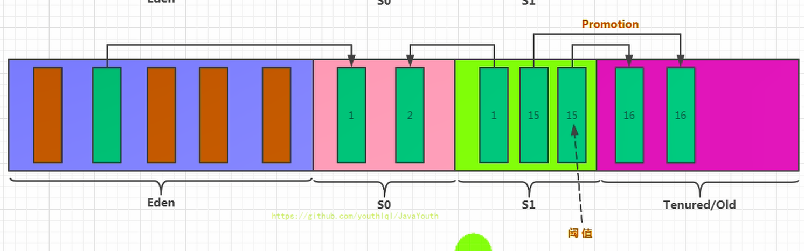

关于垃圾回收：频繁在新生区收集，很少在养老区收集，几乎不在永久区/元空间收集。


#### 分配特殊情况

**对象分配的特殊情况**

1.  如果来了一个新对象，先看看 Eden 是否放的下？
    *   如果 Eden 放得下，则直接放到 Eden 区
    *   如果 Eden 放不下，则触发 YGC ，执行垃圾回收，看看还能不能放下？
2.  将对象放到老年区又有四种情况：
    *   如果 Eden 执行了 YGC 还是无法放不下该对象，那没得办法，只能说明是超大对象，只能直接放到老年代
    *   如果 Eden 区满了，将对象往survivor区拷贝时，发现survivor区放不下啦，那只能便宜了某些新对象，让他们直接晋升至老年区
    *   如果Survivor区中相同年龄的所有对象大小的总和大于Survivor空间的一半，年龄大于或等于该年龄的对象可以直接进入老年代
    *   当survivor中的对象的年龄达到15的时候，将会触发一次 Promotion 晋升的操作，也就是将年轻代中的对象晋升到老年代中
3.  那万一老年代都放不下，则先触发FullGC ，再看看能不能放下，放得下最好，但如果还是放不下，那只能报 OOM 


### GC分类

1.  我们都知道，JVM的调优的一个环节，也就是垃圾收集，我们需要尽量的避免垃圾回收，因为在垃圾回收的过程中，容易出现STW（Stop the World）的问题，**而 Major GC 和 Full GC出现STW的时间，是Minor GC的10倍以上**
  
2. JVM在进行GC时，并非每次都对上面三个内存区域一起回收的，大部分时候回收的都是指新生代。针对Hotspot VM的实现，它里面的GC按照回收区域又分为两大种类型：一种是部分收集（Partial GC），一种是整堆收集（FullGC）

   - 部分收集：不是完整收集整个Java堆的垃圾收集。其中又分为：
     - **新生代收集**（Minor GC/Young GC）：**对新生代（Eden，s0，s1）的垃圾回收**
     - **老年代收集**（Major GC/Old GC）：**对老年代进行垃圾回收**

       **一般认为Major GC等同于Full GC，因为目前只有CMS GC会单独对老年代进行垃圾回收。**
     - 混合收集（Mixed GC）：收集整个新生代以及部分老年代的垃圾收集。目前，只有G1 GC会有这种行为

   - **整堆收集**（Full GC）：对整个堆和方法区进行垃圾回收

> 由于历史原因，外界各种解读，majorGC和Full GC有些混淆。


#### Minor GC

1.  当年轻代空间不足时，就会触发Minor GC，这里的年轻代满指的是**Eden区满**。Survivor满不会主动引发GC，在Eden区满的时候，会顺带触发s0区的GC，也就是被动触发GC（每次Minor GC会清理年轻代的内存）
  
2.  因为Java对象大多都具备朝生夕灭的特性，所以Minor GC非常频繁，一般回收速度也比较快。这一定义既清晰又易于理解。
  
3.  Minor GC会引发STW（Stop The World），暂停其它用户的线程，等垃圾回收结束，用户线程才恢复运行


#### Major GC

**一般认为Major GC等同于Full GC，因为目前只有CMS GC会单独对老年代进行垃圾回收。**

1. **对老年代进行垃圾回收。**

2. **如果Major GC后，内存还不足，就报OOM。**

3. 出现了MajorGc，经常会伴随至少一次的Minor GC。（但非绝对的，在Parallel Scavenge收集器的收集策略里就有直接进行MajorGC的策略选择过程）

   也就是在老年代空间不足时，会先尝试触发Minor GC，如果之后空间还不足，则触发Major GC

4. Major GC的速度一般会比Minor GC慢10倍以上，STW的时间更长。


#### Full GC

**对整个堆和方法区进行垃圾回收**

触发情况：

1.  调用System.gc()时，系统建议执行FullGC，但是不必然执行
2.  老年代空间不足
3.  方法区空间不足
4.  通过Minor GC后进入老年代的平均大小大于老年代的可用内存
5.  由Eden区、survivor space0（From Space）区向survivor space1（To Space）区复制时，对象大小大于To Space可用内存，则把该对象转存到老年代，且老年代的可用内存小于该对象大小

说明：Full GC 是开发或调优中尽量要避免的。这样STW时间会短一些


#### Mixed GC

是G1 GC中独有的。它对**整个新生代region**和**根据global concurrent marking统计得出回收收益高的部分老年代region**进行回收。


#### GC日志分析

```java
/**
 * 测试MinorGC 、 MajorGC、FullGC
 * -Xms9m -Xmx9m -XX:+PrintGCDetails
 * @author shkstart  shkstart@126.com
 * @create 2020  14:19
 */
public class GCTest {
    public static void main(String[] args) {
        int i = 0;
        try {
            List<String> list = new ArrayList<>();
            String a = "atguigu.com";
            while (true) {
                list.add(a);
                a = a + a;
                i++;
            }

        } catch (Throwable t) {
            t.printStackTrace();
            System.out.println("遍历次数为：" + i);
        }
    }
}

```

输出：

```java
[GC (Allocation Failure) [PSYoungGen: 2037K->504K(2560K)] 2037K->728K(9728K), 0.0455865 secs] [Times: user=0.00 sys=0.00, real=0.06 secs] 
[GC (Allocation Failure) [PSYoungGen: 2246K->496K(2560K)] 2470K->1506K(9728K), 0.0009094 secs] [Times: user=0.00 sys=0.00, real=0.00 secs] 
[GC (Allocation Failure) [PSYoungGen: 2294K->488K(2560K)] 3305K->2210K(9728K), 0.0009568 secs] [Times: user=0.00 sys=0.00, real=0.00 secs] 
[GC (Allocation Failure) [PSYoungGen: 1231K->488K(2560K)] 7177K->6434K(9728K), 0.0005594 secs] [Times: user=0.00 sys=0.00, real=0.00 secs] 
[GC (Allocation Failure) [PSYoungGen: 488K->472K(2560K)] 6434K->6418K(9728K), 0.0005890 secs] [Times: user=0.00 sys=0.00, real=0.00 secs] 
[Full GC (Allocation Failure) [PSYoungGen: 472K->0K(2560K)] [ParOldGen: 5946K->4944K(7168K)] 6418K->4944K(9728K), [Metaspace: 3492K->3492K(1056768K)], 0.0045270 secs] [Times: user=0.00 sys=0.00, real=0.01 secs] 
[GC (Allocation Failure) [PSYoungGen: 0K->0K(1536K)] 4944K->4944K(8704K), 0.0004954 secs] [Times: user=0.00 sys=0.00, real=0.00 secs] 
[Full GC (Allocation Failure) java.lang.OutOfMemoryError: Java heap space
	at java.util.Arrays.copyOf(Arrays.java:3332)
	at java.lang.AbstractStringBuilder.ensureCapacityInternal(AbstractStringBuilder.java:124)
	at java.lang.AbstractStringBuilder.append(AbstractStringBuilder.java:448)
	at java.lang.StringBuilder.append(StringBuilder.java:136)
	at com.atguigu.java1.GCTest.main(GCTest.java:20)
[PSYoungGen: 0K->0K(1536K)] [ParOldGen: 4944K->4877K(7168K)] 4944K->4877K(8704K), [Metaspace: 3492K->3492K(1056768K)], 0.0076061 secs] [Times: user=0.00 sys=0.02, real=0.01 secs] 
遍历次数为：16
Heap
 PSYoungGen      total 1536K, used 60K [0x00000000ffd00000, 0x0000000100000000, 0x0000000100000000)
  eden space 1024K, 5% used [0x00000000ffd00000,0x00000000ffd0f058,0x00000000ffe00000)
  from space 512K, 0% used [0x00000000fff80000,0x00000000fff80000,0x0000000100000000)
  to   space 1024K, 0% used [0x00000000ffe00000,0x00000000ffe00000,0x00000000fff00000)
 ParOldGen       total 7168K, used 4877K [0x00000000ff600000, 0x00000000ffd00000, 0x00000000ffd00000)
  object space 7168K, 68% used [0x00000000ff600000,0x00000000ffac3408,0x00000000ffd00000)
 Metaspace       used 3525K, capacity 4502K, committed 4864K, reserved 1056768K
  class space    used 391K, capacity 394K, committed 512K, reserved 1048576K
```


```java
[GC (Allocation Failure) [PSYoungGen: 2037K->504K(2560K)] 2037K->728K(9728K), 0.0455865 secs] [Times: user=0.00 sys=0.00, real=0.06 secs] 

```


* [PSYoungGen: 2037K->504K(2560K)]：年轻代总空间为 2560K ，当前占用 2037K ，经过垃圾回收后剩余504K

* 2037K->728K(9728K)：堆内存总空间为 9728K ，当前占用2037K ，经过垃圾回收后剩余728K


### TLAB(本地分配缓存区)

堆区是线程共享区域，任何线程 都可以访问到堆区中的共享数据。**为避免多个线程操作同一地址**，需要使用**加锁等机制**，这就会影响分配速度。

TLAB的全称是Thread Local Allocation Buffer，即线程本地分配缓存区，这是一个线程专用的内存分配区域。TLAB的作用就是**尽量避免从堆上直接分配内存从而避免频繁的锁争用。**

如果设置了虚拟机参数` -XX:UseTLAB`，在**线程初始化时，同时也会申请一块指定大小的内存，只给当前线程使用，这样每个线程都单独拥有一个空间，如果需要分配内存，就在自己的空间上分配，这样就不存在竞争的情况，可以大大提升分配效率。**

如果当前线程的 TLAB 大小足够，那么从线程当前的 TLAB 中分配；如果不够，当前 TLAB 剩余空间小于**最大浪费空间限制（这是一个动态的值）**，则在eden区中重新申请一个新的 TLAB 进行分配。否则，直接在 TLAB 外进行分配。而原先的TLAB会用dummy对象进行填充，GC 直接标记之后跳过这块内存，增加扫描效率。**发生 GC 的时候，TLAB 被回收。**

**TLAB空间的内存非常小**，缺省情况下仅占有整个Eden空间的**1%**，也可以通过选项-`XX:TLABWasteTargetPercent`设置TLAB空间所占用Eden空间的百分比大小。

**TLAB的本质其实是三个指针管理的区域：start，top 和 end**，其中 start 和 end 是占位用的，标识出这个 TLAB区域，top 是分配指针。


**TLAB 分配过程**


### 空间分配担保

在发生Minor GC之前，虚拟机会检查老年代最大可用的连续空间是否大于新生代所有对象的总空间。

*   如果大于，则此次Minor GC是安全的
*   如果小于，则虚拟机会查看**-XX:HandlePromotionFailure**设置值是否允担保失败。
    *   如果HandlePromotionFailure=true，那么会继续检查**老年代最大可用连续空间是否大于历次晋升到老年代的对象的平均大小**。
        *   如果大于，则尝试进行一次Minor GC，但这次Minor GC依然是有风险的；
        *   如果小于，则进行一次Full GC。
    *   如果HandlePromotionFailure=false，则进行一次Full GC。

    
    

**历史版本**

1.  在JDK6 Update 24之后，HandlePromotionFailure参数不会再影响到虚拟机的空间分配担保策略，观察openJDK中的源码变化，虽然源码中还定义了HandlePromotionFailure参数，但是在代码中已经不会再使用它。
2.  JDK6 Update 24之后的规则变为**只要老年代的连续空间大于新生代对象总大小或者历次晋升的平均大小就会进行Minor GC**，否则将进行Full GC。即 HandlePromotionFailure=true


### 方法逃逸

#### 堆是分配对象的唯一选择么？是的！

**在《深入理解Java虚拟机》中关于Java堆内存有这样一段描述：**

1.  随着JIT编译期的发展与**逃逸分析技术**逐渐成熟，**栈上分配、标量替换**优化技术将会导致一些微妙的变化，所有的对象都分配到堆上也渐渐变得不那么“绝对”了。
  
2.  在Java虚拟机中，对象是在Java堆中分配内存的，这是一个普遍的常识。但是，有一种特殊情况，那就是**如果经过逃逸分析（Escape Analysis）后发现，一个对象并没有逃逸出方法的话，那么就可能被优化成栈上分配**。这样就无需在堆上分配内存，也无须进行垃圾回收了。这也是最常见的堆外存储技术。
  
3.  此外，前面提到的基于OpenJDK深度定制的TaoBao VM，其中创新的GCIH（GC invisible heap）技术实现off-heap，将生命周期较长的Java对象从heap中移至heap外，并且GC不能管理GCIH内部的Java对象，以此达到降低GC的回收频率和提升GC的回收效率的目的。


#### 逃逸分析

* **当一个对象在方法中被定义后，对象只在方法内部使用，则认为没有发生逃逸。**

  ```java
  public static String createStringBuffer(String s1, String s2) {
      StringBuffer sb = new StringBuffer();
      sb.append(s1);
      sb.append(s2);
      return sb.toString();
  }
  ```

* **当一个对象在方法中被定义后，它被外部方法所引用，则认为发生逃逸。例如作为调用参数传递到其他地方中。**

  ```java
  public static StringBuffer createStringBuffer(String s1, String s2) {
      StringBuffer sb = new StringBuffer();
      sb.append(s1);
      sb.append(s2);
      return sb;
  }
  
  public EscapeAnalysis obj;
  public void setObj(){
      this.obj = new EscapeAnalysis();
  }
  
  public void useEscapeAnalysis1(){
      EscapeAnalysis e = getInstance();
      //getInstance().xxx()同样会发生逃逸
  }
  ```

  

**开发中能使用局部变量的，就不要使用在方法外定义。**使用逃逸分析，**C2编译器**可以对代码做如下优化：

1.  **栈上分配**：**若对象不会逃逸，可以在线程的栈上进行分配对象，不需要GC。对象的生命周期和方法相同，随着栈帧的出栈而销毁。**
2.  **分离对象(标量替换)**：若对象不会逃逸，JIT编译器把这个对象拆解成其中包含的若干个成员变量来代替。
3.  **同步省略(锁消除)**：如果同步块所使用的锁对象只能够被一个线程访问，JIT编译器在编译这个同步块的时候就会取消对这部分代码的同步。

> 注意：栈上分配并不成熟，因此可以说对象对被分配到栈上。但是分离对象在虚拟机中得到了应用。

**逃逸分析参数设置**

1.  在JDK 1.7 版本之后，HotSpot中默认就已经开启了逃逸分析

2.  如果使用的是较早的版本，开发人员则可以通过：

    *   选项“-XX:+DoEscapeAnalysis"显式开启逃逸分析
    *   通过选项“-XX:+PrintEscapeAnalysis"查看逃逸分析的筛选结果


#### 栈上分配

1.  JIT编译器在编译期间根据逃逸分析的结果，发现如果一个对象并没有逃逸出方法的话，就可能被优化成栈上分配。分配完成后，继续在调用栈内执行，最后线程结束，栈空间被回收，局部变量对象也被回收。这样就无须进行垃圾回收了。
3.  常见的栈上分配的场景：在逃逸分析中，已经说明了，分别是给成员变量赋值、方法返回值、实例引用传递。


**栈上分配举例**

```java
/**
 * 栈上分配测试
 * -Xmx128m -Xms128m -XX:-DoEscapeAnalysis -XX:+PrintGCDetails
 */
public class StackAllocation {
    public static void main(String[] args) {
        long start = System.currentTimeMillis();

        for (int i = 0; i < 10000000; i++) {
            alloc();
        }
        // 查看执行时间
        long end = System.currentTimeMillis();
        System.out.println("花费的时间为： " + (end - start) + " ms");
        // 为了方便查看堆内存中对象个数，线程sleep
        try {
            Thread.sleep(1000000);
        } catch (InterruptedException e1) {
            e1.printStackTrace();
        }
    }

    private static void alloc() {
        User user = new User();//未发生逃逸
    }

    static class User {

    }
}
```

输出结果：

```
[GC (Allocation Failure) [PSYoungGen: 33280K->808K(38400K)] 33280K->816K(125952K), 0.0483350 secs] [Times: user=0.00 sys=0.00, real=0.06 secs] 
[GC (Allocation Failure) [PSYoungGen: 34088K->808K(38400K)] 34096K->816K(125952K), 0.0008411 secs] [Times: user=0.00 sys=0.00, real=0.00 secs] 
[GC (Allocation Failure) [PSYoungGen: 34088K->792K(38400K)] 34096K->800K(125952K), 0.0008427 secs] [Times: user=0.00 sys=0.00, real=0.00 secs] 
[GC (Allocation Failure) [PSYoungGen: 34072K->808K(38400K)] 34080K->816K(125952K), 0.0012223 secs] [Times: user=0.08 sys=0.00, real=0.00 secs] 
花费的时间为： 114 ms
```


1、JVM 参数设置

-Xmx128m -Xms128m -XX:-DoEscapeAnalysis -XX:+PrintGCDetails

2、日志打印：发生了 GC ，耗时 114ms


**开启逃逸分析的情况**

输出结果：

```
花费的时间为： 5 ms
```

1、参数设置

-Xmx128m -Xms128m -XX:+DoEscapeAnalysis -XX:+PrintGCDetails

2、日志打印：并没有发生 GC ，耗时5ms 。


#### 标量替换(分离对象)

1.  **标量**（scalar）是指一个无法再分解成更小的数据的数据。Java中的原始数据类型就是标量。

2.  相对的，那些还可以分解的数据叫做**聚合量**（Aggregate），Java中的对象就是聚合量，因为他可以分解成其他聚合量和标量。

3.  在JIT阶段，如果经过逃逸分析，发现一个对象不会被外界访问的话，那么经过JIT优化，就会把这个对象拆解成若干个其中包含的若干个成员变量来代替。这个过程就是标量替换。


**标量替换举例**

代码

```java
public static void main(String args[]) {
    alloc();
}
private static void alloc() {
    Point point = new Point(1,2);
    System.out.println("point.x" + point.x + ";point.y" + point.y);
}
class Point {
    private int x;
    private int y;
}
```


以上代码，经过标量替换后，就会变成

```java
private static void alloc() {
    int x = 1;
    int y = 2;
    System.out.println("point.x = " + x + "; point.y=" + y);
}
```

1.  可以看到，Point这个聚合量经过逃逸分析后，发现他并没有逃逸，就被替换成两个标量了。
2.  那么标量替换有什么好处呢？就是可以大大减少堆内存的占用。因为一旦不需要创建对象了，那么就不再需要分配堆内存了。
3.  标量替换为栈上分配提供了很好的基础。


**标量替换参数设置**

参数 -XX:+ElimilnateAllocations：开启了标量替换（默认打开），允许将对象打散分配在栈上。


**代码示例**

```java
/**
 * 标量替换测试
 *  -Xmx100m -Xms100m -XX:+DoEscapeAnalysis -XX:+PrintGC -XX:-EliminateAllocations
 * @author shkstart  shkstart@126.com
 * @create 2020  12:01
 */
public class ScalarReplace {
    public static class User {
        public int id;
        public String name;
    }

    public static void alloc() {
        User u = new User();//未发生逃逸
        u.id = 5;
        u.name = "www.atguigu.com";
    }

    public static void main(String[] args) {
        long start = System.currentTimeMillis();
        for (int i = 0; i < 10000000; i++) {
            alloc();
        }
        long end = System.currentTimeMillis();
        System.out.println("花费的时间为： " + (end - start) + " ms");
    }
}
```


**未开启标量替换**

1、JVM 参数

-Xmx100m -Xms100m -XX:+DoEscapeAnalysis -XX:+PrintGC -XX:-EliminateAllocations

2、日志

```java
[GC (Allocation Failure)  25600K->880K(98304K), 0.0012658 secs]
[GC (Allocation Failure)  26480K->832K(98304K), 0.0012124 secs]
[GC (Allocation Failure)  26432K->784K(98304K), 0.0009719 secs]
[GC (Allocation Failure)  26384K->832K(98304K), 0.0009071 secs]
[GC (Allocation Failure)  26432K->768K(98304K), 0.0010643 secs]
[GC (Allocation Failure)  26368K->824K(101376K), 0.0012354 secs]
[GC (Allocation Failure)  32568K->712K(100864K), 0.0011291 secs]
[GC (Allocation Failure)  32456K->712K(100864K), 0.0006368 secs]
花费的时间为： 99 ms
```


**开启标量替换**

1、JVM 参数

-Xmx100m -Xms100m -XX:+DoEscapeAnalysis -XX:+PrintGC -XX:+EliminateAllocations

2、日志：时间减少很多，且无GC

```
花费的时间为： 6 ms
```


上述代码在主函数中调用了1亿次alloc()方法，进行对象创建由于User对象实例需要占据约16字节的空间，因此累计分配空间达到将近1.5GB。如果堆空间小于这个值，就必然会发生GC。使用如下参数运行上述代码：

`-server -Xmx100m -Xms100m -XX:+DoEscapeAnalysis -XX:+PrintGC -XX:+EliminateAllocations`

这里设置参数如下：

1.  参数 -server：启动Server模式，因为在server模式下，才可以启用逃逸分析。
2.  参数 -XX:+DoEscapeAnalysis：启用逃逸分析
3.  参数 -Xmx10m：指定了堆空间最大为10MB
4.  参数 -XX:+PrintGC：将打印GC日志。
5.  参数 -XX:+EliminateAllocations：开启了标量替换（默认打开），允许将对象打散分配在栈上，比如对象拥有id和name两个字段，那么这两个字段将会被视为两个独立的局部变量进行分配


#### 同步省略(锁消除)

1.  线程同步的代价是相当高的，同步的后果是降低并发性和性能。
  
2.  在动态编译同步块的时候，JIT编译器可以借助逃逸分析来**判断同步块所使用的锁对象是否只能够被一个线程访问而没有被发布到其他线程**。
  
3.  如果没有，那么JIT编译器在编译这个同步块的时候就会取消对这部分代码的同步。这样就能大大提高并发性和性能。这个**取消同步的过程就叫同步省略，也叫锁消除**。


例如下面的代码

```java
public void f() {
    Object hollis = new Object();
    synchronized(hollis) {
        System.out.println(hollis);
    }
}
```


代码中对hollis这个对象加锁，但是hollis对象的生命周期只在f()方法中，并不会被其他线程所访问到，所以在JIT编译阶段就会被优化掉，优化成：

```java
public void f() {
    Object hellis = new Object();
	System.out.println(hellis);
}
```


**字节码分析**

```
public class SynchronizedTest {
    public void f() {
        Object hollis = new Object();
        synchronized(hollis) {
            System.out.println(hollis);
        }
    }
}
```


```java
 0 new #2 <java/lang/Object>
 3 dup
 4 invokespecial #1 <java/lang/Object.<init>>
 7 astore_1
 8 aload_1
 9 dup
10 astore_2
11 monitorenter
12 getstatic #3 <java/lang/System.out>
15 aload_1
16 invokevirtual #4 <java/io/PrintStream.println>
19 aload_2
20 monitorexit
21 goto 29 (+8)
24 astore_3
25 aload_2
26 monitorexit
27 aload_3
28 athrow
29 return
```

注意：字节码文件中并没有进行优化，可以看到加锁和释放锁的操作依然存在，**同步省略操作是在解释运行时发生的**


#### 逃逸分析的不足

1.  关于逃逸分析的论文在1999年就已经发表了，但直到JDK1.6才有实现，而且这项技术到如今也并不是十分成熟的。
2.  其根本原因就是无法保证逃逸分析的性能消耗一定能高于他的消耗。虽然经过逃逸分析可以做标量替换、栈上分配、和锁消除。但是逃逸分析自身也是需要进行一系列复杂的分析的，这其实也是一个相对耗时的过程。
3.  一个极端的例子，就是经过逃逸分析之后，发现没有一个对象是不逃逸的。那这个逃逸分析的过程就白白浪费掉了。
4.  虽然这项技术并不十分成熟，但是它也是即时编译器优化技术中一个十分重要的手段。
5.  注意到有一些观点，认为通过逃逸分析，JVM会在栈上分配那些不会逃逸的对象，这在理论上是可行的，但是取决于JVM设计者的选择。据我所知，**Oracle Hotspot JVM中并未这么做**（刚刚演示的效果，是因为HotSpot实现了标量替换），这一点在逃逸分析相关的文档里已经说明，**所以可以明确在HotSpot虚拟机上，所有的对象实例都是创建在堆上**。
6.  目前很多书籍还是基于JDK7以前的版本，JDK已经发生了很大变化，intern字符串的缓存和静态变量曾经都被分配在永久代上，而永久代已经被元数据区取代。但是**intern字符串缓存和静态变量并不是被转移到元数据区，而是直接在堆上分配**，**所以这一点同样符合前面一点的结论：对象实例都是分配在堆上**。


> Q：**堆是分配对象的唯一选择么？**
>
> A：栈上分配并不成熟，因此可以说对象对被分配到栈上。但是分离对象在虚拟机中得到了应用。


### 堆常用参数

> :point_right: **官方文档**：https://docs.oracle.com/javase/8/docs/technotes/tools/unix/java.html

```java
/**
 * 测试堆空间常用的jvm参数：
 * -XX:+PrintFlagsInitial : 查看所有的参数的默认初始值
 * -XX:+PrintFlagsFinal  ：查看所有的参数的最终值（可能会存在修改，不再是初始值）
 *      具体查看某个参数的指令： jps：查看当前运行中的进程
 *                             jinfo -flag SurvivorRatio 进程id
 *
 * -Xms：初始堆空间内存 （默认为物理内存的1/64）
 * -Xmx：最大堆空间内存（默认为物理内存的1/4）
 * -Xmn：设置新生代的大小。(初始值及最大值)
 * -XX:NewRatio：配置新生代与老年代在堆结构的占比 
 * -XX:SurvivorRatio：设置新生代中Eden和S0/S1空间的比例
 * -XX:MaxTenuringThreshold：设置新生代垃圾的最大年龄
 * -XX:+PrintGCDetails：输出详细的GC处理日志
 * 打印gc简要信息：① -XX:+PrintGC   ② -verbose:gc
 * -XX:HandlePromotionFailure：是否设置空间分配担保
 */
```


### 小结

1.  年轻代是对象的诞生、成长、消亡的区域，一个对象在这里产生、应用，最后被垃圾回收器收集、结束生命。
  
2.  老年代放置长生命周期的对象，通常都是从Survivor区域筛选拷贝过来的Java对象。
  
3.  当然，也有特殊情况，我们知道普通的对象可能会被分配在TLAB上；
  
4.  如果对象较大，无法分配在 TLAB 上，则JVM会试图直接分配在Eden其他位置上；
  
5.  如果对象太大，完全无法在新生代找到足够长的连续空闲空间，JVM就会直接分配到老年代。
  
6.  当GC只发生在年轻代中，回收年轻代对象的行为被称为Minor GC。
  
7.  当GC发生在老年代时则被称为Major GC或者Full GC。
  
8.  一般的，Minor GC的发生频率要比Major GC高很多，即老年代中垃圾回收发生的频率将大大低于年轻代。


---


## 方法区

### 栈、堆、方法区的交互关系

**从线程共享与否的角度来看**

ThreadLocal：如何保证多个线程在并发环境下的安全性？典型场景就是数据库连接管理，以及会话管理。

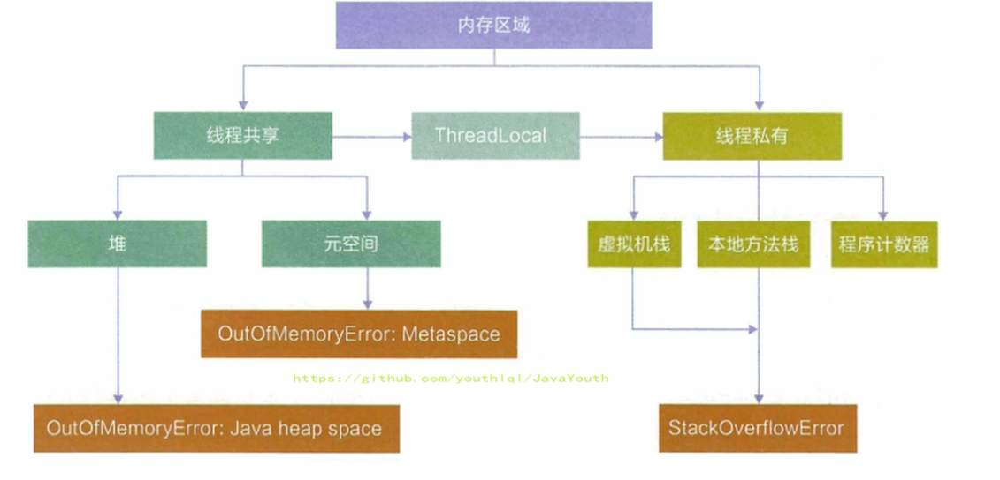

**栈、堆、方法区的交互关系**

**下面涉及了对象的访问定位**

1.  Person 类的 .class 信息存放在方法区中
2.  person 变量存放在 Java 栈的局部变量表中
3.  真正的 person 对象存放在 Java 堆中
4.  在 person 对象中，有个指针指向方法区中的 person 类型数据，表明这个 person 对象是用方法区中的 Person 类 new 出来的


### 方法区的理解


> **官方文档**：https://docs.oracle.com/javase/specs/jvms/se8/html/jvms-2.html#jvms-2.5.4

#### 方法区在哪里？

1.  《Java虚拟机规范》中明确说明：尽管所有的方法区**在逻辑上是属于堆的一部分**，但一些简单的实现可能不会选择去进行垃圾收集或者进行压缩。但对于HotSpotJVM而言，方法区还有一个别名叫做Non-Heap（非堆），目的就是要和堆分开。
3.  所以，**方法区可以看作是一块独立于Java堆的内存空间**。


#### 方法区的基本理解

**方法区主要存放的是 Class，而堆中主要存放的是实例化的对象**

1.  方法区（Method Area）与Java堆一样，是各个线程共享的内存区域。多个线程同时加载统一个类时，只能有一个线程能加载该类，其他线程只能等等待该线程加载完毕，然后直接使用该类，即类只能加载一次。
3.  方法区在JVM启动的时候被创建，并且它的实际的物理内存空间中和Java堆区一样都可以是不连续的。
4.  方法区的大小，跟堆空间一样，可以选择固定大小或者可扩展。
4.  **方法区的大小决定了系统可以保存多少个类**，如果系统定义了太多的类，导致方法区溢出，虚拟机同样会抛出内存溢出错误：`java.lang.OutofMemoryError:PermGen space`或者`java.lang.OutOfMemoryError:Metaspace`
    * 加载大量的第三方的jar包
    * Tomcat部署的工程过多（30~50个）
    * 大量动态的生成反射类
5.  关闭JVM就会释放这个区域的内存。


**代码举例**

```java
public class MethodAreaDemo {
    public static void main(String[] args) {
        System.out.println("start...");
        try {
            Thread.sleep(1000000);
        } catch (InterruptedException e) {
            e.printStackTrace();
        }

        System.out.println("end...");
    }
}
```


简单的程序，加载了1600多个类


#### HotSpot方法区演进


1.  在 JDK7 及以前，习惯上把方法区，称为永久代。JDK8开始，使用元空间取代了永久代。我们可以将方法区类比为Java中的接口，将永久代或元空间类比为Java中具体的实现类
2. 本质上，方法区和永久代并不等价。仅是对Hotspot而言的可以看作等价。《Java虚拟机规范》对如何实现方法区，不做统一要求。例如：BEAJRockit / IBM J9 中不存在永久代的概念。

   现在来看，当年使用永久代，不是好的idea。导致Java程序更容易OOm（超过-XX:MaxPermsize上限）
3.  而到了JDK8，终于完全废弃了永久代的概念，改用与JRockit、J9一样在本地内存中实现的元空间（Metaspace）来代替
4.  元空间的本质和永久代类似，都是对JVM规范中方法区的实现。不过元空间与永久代最大的区别在于：**元空间不在虚拟机设置的内存中，而是使用本地内存**。
5.  永久代、元空间二者并不只是名字变了，内部结构也调整了
6.  根据《Java虚拟机规范》的规定，如果方法区无法满足新的内存分配需求时，将抛出OOM异常


### 设置方法区大小与 OOM


方法区的大小不必是固定的，JVM可以根据应用的需要动态调整。

#### JDK7及以前(永久代)

1.  通过-XX:Permsize来设置永久代初始分配空间。默认值是20.75M
2.  -XX:MaxPermsize来设定永久代最大可分配空间。32位机器默认是64M，64位机器模式是82M
3.  当JVM加载的类信息容量超过了这个值，会报异常OutofMemoryError:PermGen space。


#### JDK8及以后(元空间)

> **JDK8 版本设置元空间大小**

1.  元数据区大小可以使用参数 **-XX:MetaspaceSize** 和 **-XX:MaxMetaspaceSize** 指定
  
2.  默认值依赖于平台，Windows下，-XX:MetaspaceSize 约为21M，-XX:MaxMetaspaceSize的值是-1，即没有限制。
  
3.  与永久代不同，如果不指定大小，默认情况下，虚拟机会耗尽所有的可用系统内存。如果元数据区发生溢出，虚拟机一样会抛出异常OutOfMemoryError:Metaspace
  
4.  -XX:MetaspaceSize：设置初始的元空间大小。对于一个 64位 的服务器端 JVM 来说，其默认的 -XX:MetaspaceSize值为21MB。这就是初始的高水位线，一旦触及这个水位线，Full GC将会被触发并卸载没用的类（即这些类对应的类加载器不再存活），然后这个高水位线将会重置。新的高水位线的值取决于GC后释放了多少元空间。如果释放的空间不足，那么在不超过MaxMetaspaceSize时，适当提高该值。如果释放空间过多，则适当降低该值。
5.  如果初始化的高水位线设置过低，上述高水位线调整情况会发生很多次。通过垃圾回收器的日志可以观察到Full GC多次调用。为了避免频繁地GC，建议将-XX:MetaspaceSize设置为一个相对较高的值。


#### 方法区OOM

举例：

代码：OOMTest 类继承 ClassLoader 类，获得 defineClass() 方法，可自己进行类的加载

```java
/**
 * jdk6/7中：
 * -XX:PermSize=10m -XX:MaxPermSize=10m
 *
 * jdk8中：
 * -XX:MetaspaceSize=10m -XX:MaxMetaspaceSize=10m
 *
 */
public class OOMTest extends ClassLoader {
    public static void main(String[] args) {
        int j = 0;
        try {
            OOMTest test = new OOMTest();
            for (int i = 0; i < 10000; i++) {
                //创建ClassWriter对象，用于生成类的二进制字节码
                ClassWriter classWriter = new ClassWriter(0);
                //指明版本号，修饰符，类名，包名，父类，接口
                classWriter.visit(Opcodes.V1_8, Opcodes.ACC_PUBLIC, "Class" + i, null, "java/lang/Object", null);
                //返回byte[]
                byte[] code = classWriter.toByteArray();
                //类的加载
                test.defineClass("Class" + i, code, 0, code.length);//Class对象
                j++;
            }
        } finally {
            System.out.println(j);
        }
    }
}

```


**不设置元空间的上限**

使用默认的 JVM 参数，元空间不设置上限

输出结果：

```java
10000
```


**设置元空间的上限**

JVM 参数

-XX:MetaspaceSize=10m -XX:MaxMetaspaceSize=10m

输出结果：

```java
8531
Exception in thread "main" java.lang.OutOfMemoryError: Metaspace
	at java.lang.ClassLoader.defineClass1(Native Method)
	at java.lang.ClassLoader.defineClass(ClassLoader.java:763)
	at java.lang.ClassLoader.defineClass(ClassLoader.java:642)
	at com.atguigu.java.OOMTest.main(OOMTest.java:29)
```


#### 如何解决OOM

> 这个属于调优的问题，这里先简单的说一下

1.  要解决OOM异常或heap space的异常，一般的手段是首先通过内存映像分析工具（如Ec1ipse Memory Analyzer）对dump出来的堆转储快照进行分析，重点是确认内存中的对象是否是必要的，也就是要先分清楚到底是出现了内存泄漏（Memory Leak）还是内存溢出（Memory Overflow）
2.  **内存泄漏**就是有大量的引用指向某些对象，但是这些对象以后不会使用了，但是因为它们还和GC ROOT有关联，所以导致以后这些对象也不会被回收，这就是内存泄漏的问题
3.  如果是内存泄漏，可进一步通过工具查看泄漏对象到GC Roots的引用链。于是就能找到泄漏对象是通过怎样的路径与GC Roots相关联并导致垃圾收集器无法自动回收它们的。掌握了泄漏对象的类型信息，以及GC Roots引用链的信息，就可以比较准确地定位出泄漏代码的位置。
4.  如果不存在内存泄漏，换句话说就是内存中的对象确实都还必须存活着，那就应当检查虚拟机的堆参数（-Xmx与-Xms），与机器物理内存对比看是否还可以调大，从代码上检查是否存在某些对象生命周期过长、持有状态时间过长的情况，尝试减少程序运行期的内存消耗。


### 方法区的内部结构

#### 方法区存储什么？⭐

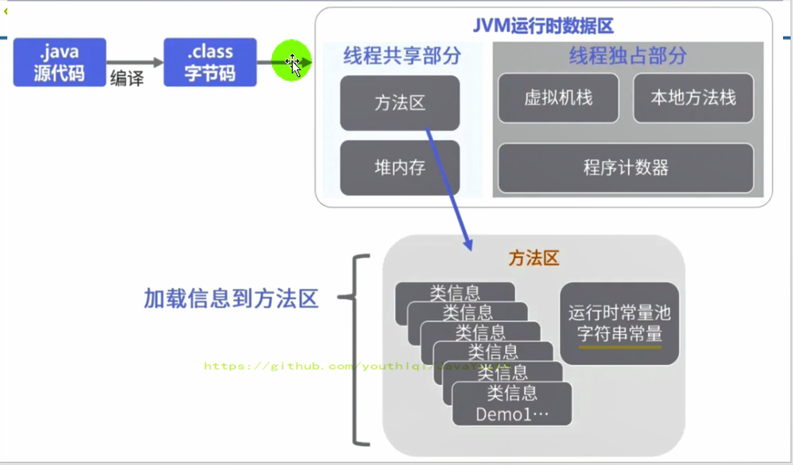


方法区存放了每个**类的元数据**：

1. **运行时常量池**

   - 数值字面量，声明为final的常量
   - 类和接口的全限定名，  字段的名称和描述符，  方法的名称和描述符
2. **类型信息**

   对每个加载的类型（类class、接口interface、枚举enum、注解annotation），JVM必须在方法区中存储以下类型信息：

   1. 这个类型的全类名
   2. 这个类型的修饰符（public，abstract，final的某个子集）
   3. 这个类型直接父类的全类名（对于interface或是java.lang.Object，都没有父类）
   4. 这个类型直接接口的一个有序列表

3. **字段（Field）信息**

   1. JVM必须在方法区中保存类型的所有**字段的相关信息以及字段的声明顺序**。
   2. 字段的相关信息包括：字段名称，字段类型，字段修饰符（public，private，protected，static，final，volatile，transient的某个子集）

4. **方法（Method）信息**

   JVM必须保存所有方法的以下信息，同域信息一样包括声明顺序：

   1. 方法名称
   2. 方法的返回类型（包括 void 返回类型），void 在 Java 中对应的为 void.class
   3. 方法的修饰符（public，private，protected，static，final，synchronized，native，abstract的一个子集）
   4. 方法参数的数量和类型（按顺序）
   5. 方法的字节码（bytecodes）、异常表、操作数栈、局部变量表及大小（abstract和native方法除外）

6. **类变量**。

7. **虚方法表**。存放着各个虚方法的实际入口

8. **一个到class对象的引用**，这个对象存储了所有这个字节码内存块的相关信息。比如：类信息，你可以通过this.getClass().getName()取得所有的方法信息，可以通过this.getClass().getDeclaredMethods()，字段信息可以通过this.getClass().getDeclaredFields()，等等

9. **一个到classLoader的引用**，this.getClass().getClassLoader()就是通过这个应用获取的。

> 注意：**字符串常量池和类变量放在堆里面**。
>

**举例：**

```java
**
 * 测试方法区的内部构成
 */
public class MethodInnerStrucTest extends Object implements Comparable<String>,Serializable {
    //属性
    public int num = 10;
    private static String str = "测试方法的内部结构";
    //构造器
    //方法
    public void test1(){
        int count = 20;
        System.out.println("count = " + count);
    }
    public static int test2(int cal){
        int result = 0;
        try {
            int value = 30;
            result = value / cal;
        } catch (Exception e) {
            e.printStackTrace();
        }
        return result;
    }

    @Override
    public int compareTo(String o) {
        return 0;
    }
}

```


`javap -v -p MethodInnerStrucTest.class > test.txt`

- 反编译字节码文件，并输出值文本文件中，便于查看。参数 -p 确保能查看 private 权限类型的字段或方法

字节码：

```java
Classfile /F:/IDEAWorkSpaceSourceCode/JVMDemo/out/production/chapter09/com/atguigu/java/MethodInnerStrucTest.class
  Last modified 2020-11-13; size 1626 bytes
  MD5 checksum 0d0fcb54854d4ce183063df985141ad0
  Compiled from "MethodInnerStrucTest.java"
//类型信息      
public class com.atguigu.java.MethodInnerStrucTest extends java.lang.Object implements java.lang.Comparable<java.lang.String>, java.io.Serializable
  minor version: 0
  major version: 52
  flags: ACC_PUBLIC, ACC_SUPER
Constant pool:
   #1 = Methodref          #18.#52        // java/lang/Object."<init>":()V
   #2 = Fieldref           #17.#53        // com/atguigu/java/MethodInnerStrucTest.num:I
   #3 = Fieldref           #54.#55        // java/lang/System.out:Ljava/io/PrintStream;
   #4 = Class              #56            // java/lang/StringBuilder
   #5 = Methodref          #4.#52         // java/lang/StringBuilder."<init>":()V
   #6 = String             #57            // count =
   #7 = Methodref          #4.#58         // java/lang/StringBuilder.append:(Ljava/lang/String;)Ljava/lang/StringBuilder;
   #8 = Methodref          #4.#59         // java/lang/StringBuilder.append:(I)Ljava/lang/StringBuilder;
   #9 = Methodref          #4.#60         // java/lang/StringBuilder.toString:()Ljava/lang/String;
  #10 = Methodref          #61.#62        // java/io/PrintStream.println:(Ljava/lang/String;)V
  #11 = Class              #63            // java/lang/Exception
  #12 = Methodref          #11.#64        // java/lang/Exception.printStackTrace:()V
  #13 = Class              #65            // java/lang/String
  #14 = Methodref          #17.#66        // com/atguigu/java/MethodInnerStrucTest.compareTo:(Ljava/lang/String;)I
  #15 = String             #67            // 测试方法的内部结构
  #16 = Fieldref           #17.#68        // com/atguigu/java/MethodInnerStrucTest.str:Ljava/lang/String;
  #17 = Class              #69            // com/atguigu/java/MethodInnerStrucTest
  #18 = Class              #70            // java/lang/Object
  #19 = Class              #71            // java/lang/Comparable
  #20 = Class              #72            // java/io/Serializable
  #21 = Utf8               num
  #22 = Utf8               I
  #23 = Utf8               str
  #24 = Utf8               Ljava/lang/String;
  #25 = Utf8               <init>
  #26 = Utf8               ()V
  #27 = Utf8               Code
  #28 = Utf8               LineNumberTable
  #29 = Utf8               LocalVariableTable
  #30 = Utf8               this
  #31 = Utf8               Lcom/atguigu/java/MethodInnerStrucTest;
  #32 = Utf8               test1
  #33 = Utf8               count
  #34 = Utf8               test2
  #35 = Utf8               (I)I
  #36 = Utf8               value
  #37 = Utf8               e
  #38 = Utf8               Ljava/lang/Exception;
  #39 = Utf8               cal
  #40 = Utf8               result
  #41 = Utf8               StackMapTable
  #42 = Class              #63            // java/lang/Exception
  #43 = Utf8               compareTo
  #44 = Utf8               (Ljava/lang/String;)I
  #45 = Utf8               o
  #46 = Utf8               (Ljava/lang/Object;)I
  #47 = Utf8               <clinit>
  #48 = Utf8               Signature
  #49 = Utf8               Ljava/lang/Object;Ljava/lang/Comparable<Ljava/lang/String;>;Ljava/io/Serializable;
  #50 = Utf8               SourceFile
  #51 = Utf8               MethodInnerStrucTest.java
  #52 = NameAndType        #25:#26        // "<init>":()V
  #53 = NameAndType        #21:#22        // num:I
  #54 = Class              #73            // java/lang/System
  #55 = NameAndType        #74:#75        // out:Ljava/io/PrintStream;
  #56 = Utf8               java/lang/StringBuilder
  #57 = Utf8               count =
  #58 = NameAndType        #76:#77        // append:(Ljava/lang/String;)Ljava/lang/StringBuilder;
  #59 = NameAndType        #76:#78        // append:(I)Ljava/lang/StringBuilder;
  #60 = NameAndType        #79:#80        // toString:()Ljava/lang/String;
  #61 = Class              #81            // java/io/PrintStream
  #62 = NameAndType        #82:#83        // println:(Ljava/lang/String;)V
  #63 = Utf8               java/lang/Exception
  #64 = NameAndType        #84:#26        // printStackTrace:()V
  #65 = Utf8               java/lang/String
  #66 = NameAndType        #43:#44        // compareTo:(Ljava/lang/String;)I
  #67 = Utf8               测试方法的内部结构
  #68 = NameAndType        #23:#24        // str:Ljava/lang/String;
  #69 = Utf8               com/atguigu/java/MethodInnerStrucTest
  #70 = Utf8               java/lang/Object
  #71 = Utf8               java/lang/Comparable
  #72 = Utf8               java/io/Serializable
  #73 = Utf8               java/lang/System
  #74 = Utf8               out
  #75 = Utf8               Ljava/io/PrintStream;
  #76 = Utf8               append
  #77 = Utf8               (Ljava/lang/String;)Ljava/lang/StringBuilder;
  #78 = Utf8               (I)Ljava/lang/StringBuilder;
  #79 = Utf8               toString
  #80 = Utf8               ()Ljava/lang/String;
  #81 = Utf8               java/io/PrintStream
  #82 = Utf8               println
  #83 = Utf8               (Ljava/lang/String;)V
  #84 = Utf8               printStackTrace
{
//域信息
  public int num;
    descriptor: I
    flags: ACC_PUBLIC

  private static java.lang.String str;
    descriptor: Ljava/lang/String;
    flags: ACC_PRIVATE, ACC_STATIC

  //方法信息
  public com.atguigu.java.MethodInnerStrucTest();
    descriptor: ()V
    flags: ACC_PUBLIC
    Code:
      stack=2, locals=1, args_size=1
         0: aload_0
         1: invokespecial #1                  // Method java/lang/Object."<init>":()V
         4: aload_0
         5: bipush        10
         7: putfield      #2                  // Field num:I
        10: return
      LineNumberTable:
        line 10: 0
        line 12: 4
      LocalVariableTable:
        Start  Length  Slot  Name   Signature
            0      11     0  this   Lcom/atguigu/java/MethodInnerStrucTest;

  public void test1();
    descriptor: ()V
    flags: ACC_PUBLIC
    Code:
      stack=3, locals=2, args_size=1
         0: bipush        20
         2: istore_1
         3: getstatic     #3                  // Field java/lang/System.out:Ljava/io/PrintStream;
         6: new           #4                  // class java/lang/StringBuilder
         9: dup
        10: invokespecial #5                  // Method java/lang/StringBuilder."<init>":()V
        13: ldc           #6                  // String count =
        15: invokevirtual #7                  // Method java/lang/StringBuilder.append:(Ljava/lang/String;)Ljava/lang/StringBuilder;
        18: iload_1
        19: invokevirtual #8                  // Method java/lang/StringBuilder.append:(I)Ljava/lang/StringBuilder;
        22: invokevirtual #9                  // Method java/lang/StringBuilder.toString:()Ljava/lang/String;
        25: invokevirtual #10                 // Method java/io/PrintStream.println:(Ljava/lang/String;)V
        28: return
      LineNumberTable:
        line 17: 0
        line 18: 3
        line 19: 28
      LocalVariableTable:
        Start  Length  Slot  Name   Signature
            0      29     0  this   Lcom/atguigu/java/MethodInnerStrucTest;
            3      26     1 count   I

  public static int test2(int);
    descriptor: (I)I
    flags: ACC_PUBLIC, ACC_STATIC
    Code:
      stack=2, locals=3, args_size=1
         0: iconst_0
         1: istore_1
         2: bipush        30
         4: istore_2
         5: iload_2
         6: iload_0
         7: idiv
         8: istore_1
         9: goto          17
        12: astore_2
        13: aload_2
        14: invokevirtual #12                 // Method java/lang/Exception.printStackTrace:()V
        17: iload_1
        18: ireturn
      Exception table:
         from    to  target type
             2     9    12   Class java/lang/Exception
      LineNumberTable:
        line 21: 0
        line 23: 2
        line 24: 5
        line 27: 9
        line 25: 12
        line 26: 13
        line 28: 17
      LocalVariableTable:
        Start  Length  Slot  Name   Signature
            5       4     2 value   I
           13       4     2     e   Ljava/lang/Exception;
            0      19     0   cal   I
            2      17     1 result   I
      StackMapTable: number_of_entries = 2
        frame_type = 255 /* full_frame */
          offset_delta = 12
          locals = [ int, int ]
          stack = [ class java/lang/Exception ]
        frame_type = 4 /* same */

  public int compareTo(java.lang.String);
    descriptor: (Ljava/lang/String;)I
    flags: ACC_PUBLIC
    Code:
      stack=1, locals=2, args_size=2
         0: iconst_0
         1: ireturn
      LineNumberTable:
        line 33: 0
      LocalVariableTable:
        Start  Length  Slot  Name   Signature
            0       2     0  this   Lcom/atguigu/java/MethodInnerStrucTest;
            0       2     1     o   Ljava/lang/String;

  public int compareTo(java.lang.Object);
    descriptor: (Ljava/lang/Object;)I
    flags: ACC_PUBLIC, ACC_BRIDGE, ACC_SYNTHETIC
    Code:
      stack=2, locals=2, args_size=2
         0: aload_0
         1: aload_1
         2: checkcast     #13                 // class java/lang/String
         5: invokevirtual #14                 // Method compareTo:(Ljava/lang/String;)I
         8: ireturn
      LineNumberTable:
        line 10: 0
      LocalVariableTable:
        Start  Length  Slot  Name   Signature
            0       9     0  this   Lcom/atguigu/java/MethodInnerStrucTest;

  static {};
    descriptor: ()V
    flags: ACC_STATIC
    Code:
      stack=1, locals=0, args_size=0
         0: ldc           #15                 // String 测试方法的内部结构
         2: putstatic     #16                 // Field str:Ljava/lang/String;
         5: return
      LineNumberTable:
        line 13: 0
}
Signature: #49                          // Ljava/lang/Object;Ljava/lang/Comparable<Ljava/lang/String;>;Ljava/io/Serializable;
SourceFile: "MethodInnerStrucTest.java"

```


**类型信息**

在运行时方法区中，类信息中记录了哪个加载器加载了该类，同时类加载器也记录了它加载了哪些类

````java
//类型信息      
public class com.atguigu.java.MethodInnerStrucTest extends java.lang.Object implements java.lang.Comparable<java.lang.String>, java.io.Serializable
````


**域信息**

1.  descriptor: I 表示字段类型为 Integer
2.  flags: ACC_PUBLIC 表示字段权限修饰符为 public

```java
//域信息
  public int num;
    descriptor: I
    flags: ACC_PUBLIC

  private static java.lang.String str;
    descriptor: Ljava/lang/String;
    flags: ACC_PRIVATE, ACC_STATIC
```


**方法信息**

1.  descriptor: ()V 表示方法返回值类型为 void
2.  flags: ACC_PUBLIC 表示方法权限修饰符为 public
3.  stack=3 表示操作数栈深度为 3
4.  locals=2 表示局部变量个数为 2 个（实力方法包含 this）
5.  test1() 方法虽然没有参数，但是其 args_size=1 ，这时因为将 this 作为了参数

```java
public void test1();
    descriptor: ()V
    flags: ACC_PUBLIC
    Code:
      stack=3, locals=2, args_size=1
         0: bipush        20
         2: istore_1
         3: getstatic     #3                  // Field java/lang/System.out:Ljava/io/PrintStream;
         6: new           #4                  // class java/lang/StringBuilder
         9: dup
        10: invokespecial #5                  // Method java/lang/StringBuilder."<init>":()V
        13: ldc           #6                  // String count =
        15: invokevirtual #7                  // Method java/lang/StringBuilder.append:(Ljava/lang/String;)Ljava/lang/StringBuilder;
        18: iload_1
        19: invokevirtual #8                  // Method java/lang/StringBuilder.append:(I)Ljava/lang/StringBuilder;
        22: invokevirtual #9                  // Method java/lang/StringBuilder.toString:()Ljava/lang/String;
        25: invokevirtual #10                 // Method java/io/PrintStream.println:(Ljava/lang/String;)V
        28: return
      LineNumberTable:
        line 17: 0
        line 18: 3
        line 19: 28
      LocalVariableTable:
        Start  Length  Slot  Name   Signature
            0      29     0  this   Lcom/atguigu/java/MethodInnerStrucTest;
            3      26     1 count   I

```


#### 常量池

##### 常量池

常量池，它包含了类中中引用的所有字符串常量、数字值、类名、接口名、方法名等。存储**字面量**和**符号引用**。

- 字面量包括：数量值，字符串值
- 符号引用：类引用，字段引用，方法引用

```java
int a;//a变量，a也是符号引用
int b=10;//b为常量，符号引用,10为字面量
string str="hello world";//str为变量，符号引用,hello world为也字面量
```


**为什么需要常量池？**

一个java源文件中的类、接口，编译后产生一个字节码文件。而Java中的字节码需要数据支持，通常这种数据会很大以至于不能直接存到字节码里，换另一种方式，可以存到常量池。这个字节码包含了指向常量池的引用。在动态链接的时候会用到运行时常量池。


##### 运行时常量池

1. **每个class一份，存放在方法区中(元空间中)。**

2. 常量池表（Constant Pool Table）是Class字节码文件的一部分，用于存放编译期生成的各种字面量与符号引用，**这部分内容将在类加载后存放到方法区的运行时常量池中**。（**运行时常量池就是常量池在程序运行时的称呼**）

3. 运行时常量池，在加载类和接口到虚拟机后，就会创建对应的运行时常量池。

4. JVM为每个已加载的类型（类或接口）都维护一个常量池。池中的数据项像数组项一样，是通过索引访问的。

5. 运行时常量池中包含多种不同的常量，**包括编译期就已经明确的数值字面量**，**也包括到运行期解析后才能够获得的方法或者字段引用**。**此时不再是常量池中的符号地址了，这里换为真实地址**。（符号地址：#1）

6. 运行时常量池，相对于Class文件常量池的另一重要特征是：**具备动态性。**

   eg：字符串的拼接

7. 运行时常量池类似于传统编程语言中的符号表（symbol table），但是它所包含的数据却比符号表要更加丰富一些。

8. 当创建类或接口的运行时常量池时，如果构造运行时常量池所需的内存空间超过了方法区所能提供的最大值，则JVM会抛OutofMemoryError异常。


##### 字符串常量池

- **每个JVM中只有一份，存在于堆中**。
- 字符串常量池里存放的是**字符串对象**或**字符串对象引用**。
- **String Pool是一个固定大小的Hashtable，而且不会存储相同内容的字符串对象**。


### 方法区的使用举例

```java
public class MethodAreaDemo {
    public static void main(String[] args) {
        int x = 500;
        int y = 100;
        int a = x / y;
        int b = 50;
        System.out.println(a + b);
    }
}
```


字节码

```java
public class com.atguigu.java1.MethodAreaDemo
  minor version: 0
  major version: 51
  flags: ACC_PUBLIC, ACC_SUPER
Constant pool:
   #1 = Methodref          #5.#24         // java/lang/Object."<init>":()V
   #2 = Fieldref           #25.#26        // java/lang/System.out:Ljava/io/PrintStream;
   #3 = Methodref          #27.#28        // java/io/PrintStream.println:(I)V
   #4 = Class              #29            // com/atguigu/java1/MethodAreaDemo
   #5 = Class              #30            // java/lang/Object
   #6 = Utf8               <init>
   #7 = Utf8               ()V
   #8 = Utf8               Code
   #9 = Utf8               LineNumberTable
  #10 = Utf8               LocalVariableTable
  #11 = Utf8               this
  #12 = Utf8               Lcom/atguigu/java1/MethodAreaDemo;
  #13 = Utf8               main
  #14 = Utf8               ([Ljava/lang/String;)V
  #15 = Utf8               args
  #16 = Utf8               [Ljava/lang/String;
  #17 = Utf8               x
  #18 = Utf8               I
  #19 = Utf8               y
  #20 = Utf8               a
  #21 = Utf8               b
  #22 = Utf8               SourceFile
  #23 = Utf8               MethodAreaDemo.java
  #24 = NameAndType        #6:#7          // "<init>":()V
  #25 = Class              #31            // java/lang/System
  #26 = NameAndType        #32:#33        // out:Ljava/io/PrintStream;
  #27 = Class              #34            // java/io/PrintStream
  #28 = NameAndType        #35:#36        // println:(I)V
  #29 = Utf8               com/atguigu/java1/MethodAreaDemo
  #30 = Utf8               java/lang/Object
  #31 = Utf8               java/lang/System
  #32 = Utf8               out
  #33 = Utf8               Ljava/io/PrintStream;
  #34 = Utf8               java/io/PrintStream
  #35 = Utf8               println
  #36 = Utf8               (I)V
{
  public com.atguigu.java1.MethodAreaDemo();
    descriptor: ()V
    flags: ACC_PUBLIC
    Code:
      stack=1, locals=1, args_size=1
         0: aload_0
         1: invokespecial #1                  // Method java/lang/Object."<init>":()V
         4: return
      LineNumberTable:
        line 7: 0
      LocalVariableTable:
        Start  Length  Slot  Name   Signature
            0       5     0  this   Lcom/atguigu/java1/MethodAreaDemo;

  public static void main(java.lang.String[]);
    descriptor: ([Ljava/lang/String;)V
    flags: ACC_PUBLIC, ACC_STATIC
    Code:
      stack=3, locals=5, args_size=1
         0: sipush        500
         3: istore_1
         4: bipush        100
         6: istore_2
         7: iload_1
         8: iload_2
         9: idiv
        10: istore_3
        11: bipush        50
        13: istore        4
        15: getstatic     #2                  // Field java/lang/System.out:Ljava/io/PrintStream;
        18: iload_3
        19: iload         4
        21: iadd
        22: invokevirtual #3                  // Method java/io/PrintStream.println:(I)V
        25: return
      LineNumberTable:
        line 9: 0
        line 10: 4
        line 11: 7
        line 12: 11
        line 13: 15
        line 14: 25
      LocalVariableTable:
        Start  Length  Slot  Name   Signature
            0      26     0  args   [Ljava/lang/String;
            4      22     1     x   I
            7      19     2     y   I
           11      15     3     a   I
           15      11     4     b   I
}
SourceFile: "MethodAreaDemo.java"

```


**图解字节码指令执行流程：**

1、初始状态


2、首先将操作数500压入操作数栈中

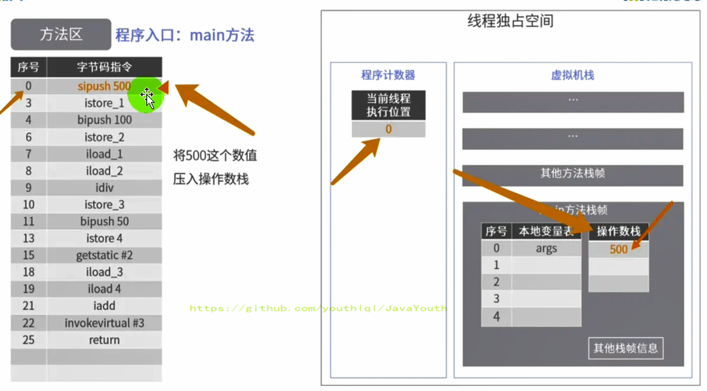

3、然后操作数 500 从操作数栈中取出，存储到局部变量表中索引为 1 的位置


4、


5、


6、


7、


8、


9、


10、

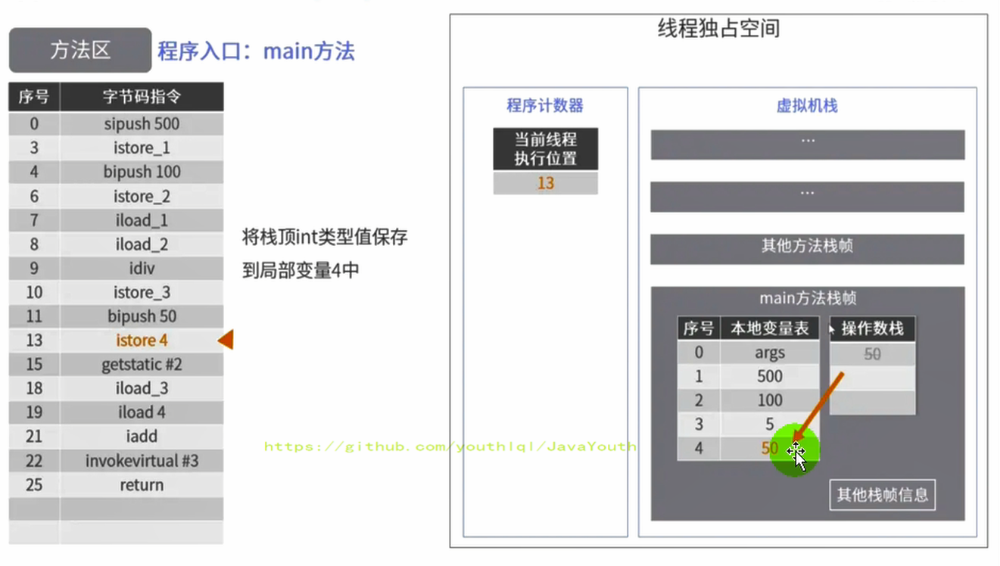

11、图片写错了是#25和#26（获得System类）

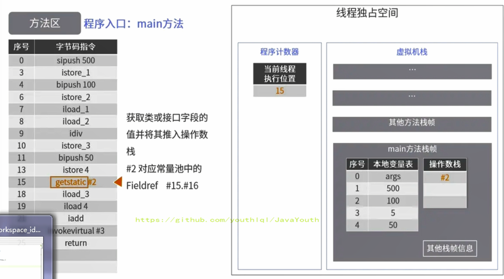

12、


13、

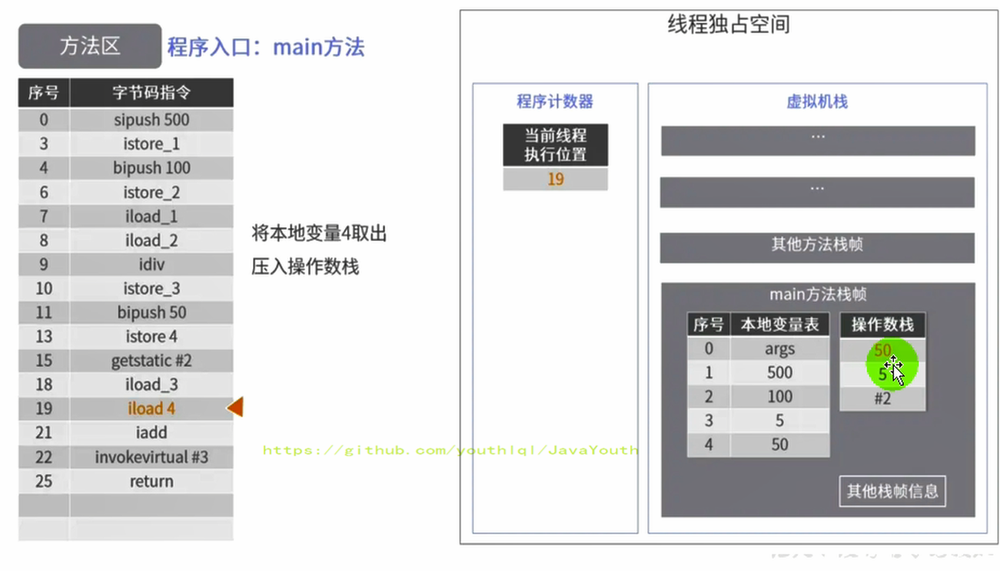

15、执行加法运算后，将计算结果放在操作数栈顶


16、就是真正的打印


17、

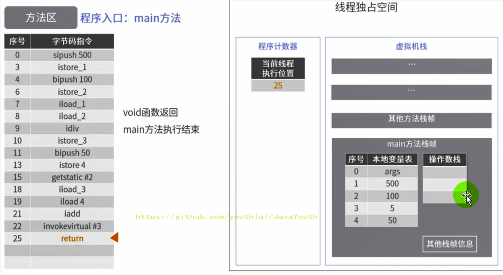


**符号引用 --> 直接饮用**

1.  上面代码调用 System.out.println() 方法时，首先需要看看 System 类有没有加载，再看看 PrintStream 类有没有加载
2.  如果没有加载，则执行加载，执行时，将常量池中的符号引用（字面量）转换为运行时常量池的直接引用（真正的地址值）


### 方法区演进细节

#### 永久代演进过程

1. 首先明确：只有Hotspot才有永久代。BEA JRockit、IBMJ9等来说，是不存在永久代的概念的。原则上如何实现方法区属于虚拟机实现细节，不受《Java虚拟机规范》管束，并不要求统一

2. Hotspot中方法区的变化：

   

| JDK1.6及以前 | 有永久代（permanent generation），静态变量存储在永久代上     |
| ------------ | ------------------------------------------------------------ |
| JDK1.7       | 有永久代，但已经逐步 “去永久代”，**字符串常量池，静态变量移除，保存在堆中** |
| JDK1.8       | 无永久代，类型信息，字段，方法，常量保存在本地内存的元空间，但字符串常量池、静态变量仍然在堆中。 |


**JDK6**

方法区由永久代实现，使用 JVM 虚拟机内存（虚拟的内存）


**JDK7**

方法区由永久代实现，使用 JVM 虚拟机内存

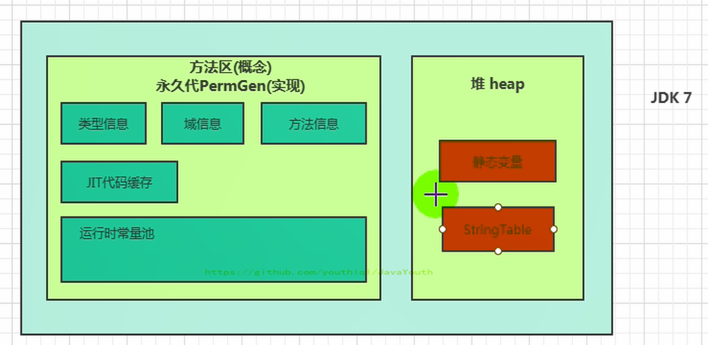


**JDK8**

方法区由元空间实现，使用物理机本地内存

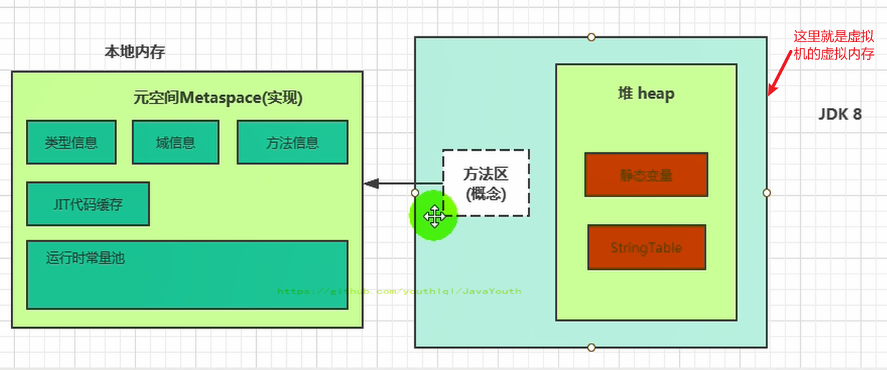


#### 永久代为什么要被元空间替代？

> **官方文档**：http://openjdk.java.net/jeps/122

1.  随着Java8的到来，HotSpot VM中再也见不到永久代了。但是这并不意味着类的元数据信息也消失了。这些数据被移到了一个与堆不相连的本地内存区域，这个区域叫做元空间（Metaspace）。
2.  由于类的元数据分配在本地内存中，元空间的最大可分配空间就是系统可用内存空间。
3.  这项改动是很有必要的，原因有：
    1.  **为永久代设置空间大小是很难确定的(小了会出现OOM，大了浪费)。**在某些场景下，如果动态加载类过多，容易产生Perm区的OOM。比如某个实际Web工程中，因为功能点比较多，在运行过程中，要不断动态加载很多类，经常出现致命错误。`Exception in thread 'dubbo client x.x connector' java.lang.OutOfMemoryError:PermGen space`而元空间和永久代之间最大的区别在于：**元空间并不在堆中，而是使用本地内存。 因此，默认情况下，元空间的大小仅受本地内存限制。**
    2.  **对永久代进行调优是很困难的**。方法区的垃圾收集主要回收两部分内容：常量池中废弃的常量和不再用的类型，方法区的调优主要是为了降低**Full GC**
        1.  有些人认为方法区（如HotSpot虚拟机中的元空间或者永久代）是没有垃圾收集行为的，其实不然。《Java虚拟机规范》对方法区的约束是非常宽松的，提到过可以不要求虚拟机在方法区中实现垃圾收集。事实上也确实有未实现或未能完整实现方法区类型卸载的收集器存在（如JDK11时期的ZGC收集器就不支持类卸载）。
        2.  一般来说这个区域的回收效果比较难令人满意，尤其是类型的卸载，条件相当苛刻。但是这部分区域的回收有时又确实是必要的。以前Sun公司的Bug列表中，曾出现过的若干个严重的Bug就是由于低版本的HotSpot虚拟机对此区域未完全回收而导致内存泄漏。


#### 字符串常量池

**字符串常量池 StringTable 为什么要调整位置？**

- JDK7中将StringTable放到了堆空间中。因为永久代的回收效率很低，在Full GC的时候才会执行永久代的垃圾回收，而Full GC是老年代的空间不足、永久代不足时才会触发。

- 这就导致StringTable回收效率不高，而我们开发中会有大量的字符串被创建，**回收效率低，导致永久代内存不足**。放到堆里，能及时回收内存。

#### 静态变量放在哪里

##### 对象实体在哪里放着？

对象实体放在堆的老年代中。

```java
/**
 * 结论：
 * 1、静态引用对应的对象实体(也就是这个new byte[1024 * 1024 * 100])始终都存在堆空间，
 * 2、只是那个变量(相当于下面的arr变量名)在JDK6,JDK7,JDK8存放位置中有所变化
 *
 * jdk7：
 * -Xms200m -Xmx200m -XX:PermSize=300m -XX:MaxPermSize=300m -XX:+PrintGCDetails
 * jdk 8：
 * -Xms200m -Xmx200m -XX:MetaspaceSize=300m -XX:MaxMetaspaceSize=300m -XX:+PrintGCDetails
 */
public class StaticFieldTest {
    private static byte[] arr = new byte[1024 * 1024 * 100];//100MB

    public static void main(String[] args) {
        System.out.println(StaticFieldTest.arr);
    }
}
```


JDK6环境下


JDK7环境下


JDK8环境


##### 变量(名)存放在哪里？

这个问题需要用JHSDB工具来进行分析，这个工具是JDK9开始自带的(JDK9以前没有)，在bin目录下可以找到

```java
package com.atguigu.java1;

/**
 * 《深入理解Java虚拟机》中的案例：
 * staticObj、instanceObj、localObj存放在哪里？
 */
public class StaticObjTest {
    static class Test {
        static ObjectHolder staticObj = new ObjectHolder();
        ObjectHolder instanceObj = new ObjectHolder();

        void foo() {
            ObjectHolder localObj = new ObjectHolder();
            System.out.println("done");
        }
    }

    private static class ObjectHolder {
    }

    public static void main(String[] args) {
        Test test = new StaticObjTest.Test();
        test.foo();
    }
}

```

**JDK6环境下**

1、staticObj随着Test的类型信息存放在方法区

2、instanceObj随着Test的对象实例存放在Java堆

3、localObject则是存放在foo()方法栈帧的局部变量表中。

4、测试发现：三个对象的数据在内存中的地址都落在Eden区范围内，所以结论：**只要是对象实例必然会在Java堆中分配**。

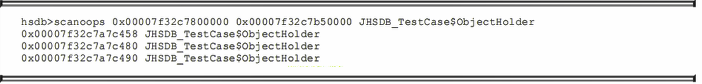

> 1、0x00007f32c7800000(Eden区的起始地址)    ----   0x00007f32c7b50000(Eden区的终止地址)  
>
> 2、可以发现三个变量都在这个范围内
>
> 3、所以可以得到上面结论


5、接着，找到了一个引用该staticObj对象的地方，是在一个java.lang.Class的实例里，并且给出了这个实例的地址，通过Inspector查看该对象实例，可以清楚看到这确实是一个java.lang.Class类型的对象实例，里面有一个名为staticobj的实例字段：

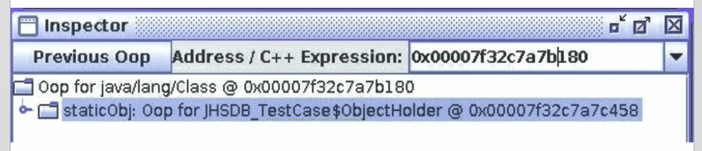

从《Java虚拟机规范》所定义的概念模型来看，所有Class相关的信息都应该存放在方法区之中，但方法区该如何实现，《Java虚拟机规范》并未做出规定，这就成了一件允许不同虚拟机自己灵活把握的事情。JDK7及其以后版本的HotSpot虚拟机选择把**静态变量与类型在Java语言一端的映射Class对象存放在一起**，**存储于Java堆之中**，从我们的实验中也明确验证了这一点


### 方法区的垃圾回收

1.  有些人认为方法区（如Hotspot虚拟机中的元空间或者永久代）是没有垃圾收集行为的，其实不然。《Java虚拟机规范》对方法区的约束是非常宽松的，提到过可以不要求虚拟机在方法区中实现垃圾收集。事实上也确实有未实现或未能完整实现方法区**类型卸载**的收集器存在（如JDK11时期的ZGC收集器就不支持类卸载）。
  
3.  一般来说这个区域的回收效果比较难令人满意，尤其是类型的卸载，条件相当苛刻。但是这部分区域的回收有时又确实是必要的。以前sun公司的Bug列表中，曾出现过的若干个严重的Bug就是由于低版本的HotSpot虚拟机对此区域未完全回收而导致内存泄漏。
  
4.  方法区的垃圾收集主要回收两部分内容：**常量池中废弃的常量和不再使用的类型**。


**常量的回收**：


1.  先来说说方法区内常量池之中主要存放的两大类常量：字面量和符号引用。字面量比较接近Java语言层次的常量概念，如文本字符串、被声明为final的常量值等。而符号引用则属于编译原理方面的概念，包括下面三类常量：

    *   类和接口的全限定名
    *   字段的名称和描述符
    *   方法的名称和描述符
2.  HotSpot虚拟机对常量池的回收策略是很明确的，**只要常量池中的常量没有被任何地方引用，就可以被回收。**
  
3.  回收废弃常量与回收Java堆中的对象非常类似。（关于常量的回收比较简单，重点是类的回收）


**类的回收**(**类卸载**)：

1. 判定一个常量是否“废弃”还是相对简单，而要判定一个类型是否属于“不再被使用的类”的条件就比较苛刻了。需要同时满足下面三个条件：
   - **该类所有的实例都已经被回收**，也就是Java堆中不存在该类及其任何派生子类的实例。
   - **该类对应的java.lang.Class对象没有在任何地方被引用**，无法在任何地方通过反射访问该类的方法。
   - **加载该类的类加载器已经被回收**，这个条件除非是经过精心设计的可替换类加载器的场景，如OSGi、JSP的重加载等，否则通常是很难达成的。
2. Java虚拟机被允许对满足上述三个条件的无用类进行回收，这里说的仅仅是“被允许”，而并不是和对象一样，没有引用了就必然会回收。关于是否要对类型进行回收，HotSpot虚拟机提供了`-Xnoclassgc`参数进行控制，还可以使用`-verbose:class` 以及 `-XX：+TraceClass-Loading`、`-XX：+TraceClassUnLoading`查看类加载和卸载信息
3. 在大量使用反射、动态代理、CGLib等字节码框架，动态生成JSP以及OSGi这类频繁自定义类加载器的场景中，通常都需要Java虚拟机具备类型卸载的能力，以保证不会对方法区造成过大的内存压力。


### 常见面试题

1.  百度
    *   三面：说一下JVM内存模型吧，有哪些区？分别干什么的？
2.  蚂蚁金服：
    *   Java8的内存分代改进
    *   JVM内存分哪几个区，每个区的作用是什么？
    *   一面：JVM内存分布/内存结构？栈和堆的区别？堆的结构？为什么两个survivor区？
    *   二面：Eden和survior的比例分配
3.  小米：
    *   jvm内存分区，为什么要有新生代和老年代
4.  字节跳动：
    *   二面：Java的内存分区
    *   二面：讲讲vm运行时数据库区
    *   什么时候对象会进入老年代？
5.  京东：
    *   JVM的内存结构，Eden和Survivor比例。
    *   JVM内存为什么要分成新生代，老年代，持久代。新生代中为什么要分为Eden和survivor。
6.  天猫：
    *   一面：Jvm内存模型以及分区，需要详细到每个区放什么。
    *   一面：JVM的内存模型，Java8做了什么改
7.  拼多多：
    *   JVM内存分哪几个区，每个区的作用是什么？
8.  美团：
    *   java内存分配
    *   jvm的永久代中会发生垃圾回收吗？
    *   一面：jvm内存分区，为什么要有新生代和老年代？


