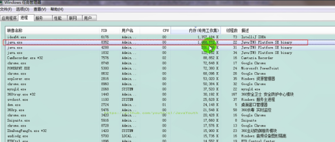

## 对象

### 对象的结构

一个对象的结构：

<center></center>


普通对象的对象头

<center></center>

数组对象的对象头

<center></center>

Klass Word为指针，指向对应的**类的元数据**；

Mark Word 结构为：

<center></center>

<center></center>


```java
public class Customer{
    int id = 1001;
    String name;
    Account acct;

    {
        name = "匿名客户";
    }
    public Customer(){
        acct = new Account();
    }
    public static void main(String[] args) {
        Customer cust = new Customer();
    }
}
class Account{

}
```


### 对象创建的方式

1.  **new**：最常见的方式、单例类中调用getInstance的静态类方法，XXXFactory的静态方法
2.  **Class的newInstance方法**：反射的方式，在JDK9里面被标记为过时的方法，因为只能调用空参构造器，并且权限必须为 public
3.  **Constructor的newInstance(**Xxxx)：反射的方式，可以调用空参的，或者带参的构造器
4.  **使用clone()**：不调用任何的构造器，要求当前的类需要实现Cloneable接口中的clone方法
5.  **使用序列化**：从文件中，从网络中获取一个对象的二进制流，序列化一般用于Socket的网络传输
6.  **第三方库 Objenesis**


### 对象创建的步骤

> **从字节码看待对象的创建过程**

```java
public class ObjectTest {
    public static void main(String[] args) {
        Object obj = new Object();
    }
}
```


```
 public static void main(java.lang.String[]);
    descriptor: ([Ljava/lang/String;)V
    flags: ACC_PUBLIC, ACC_STATIC
    Code:
      stack=2, locals=2, args_size=1
         0: new           #2                  // class java/lang/Object
         3: dup           
         4: invokespecial #1                  // Method java/lang/Object."<init>":()V
         7: astore_1
         8: return
      LineNumberTable:
        line 9: 0
        line 10: 8
      LocalVariableTable:
        Start  Length  Slot  Name   Signature
            0       9     0  args   [Ljava/lang/String;
            8       1     1   obj   Ljava/lang/Object;
}
```

> dup用于复制引用，此时操作数栈有两个引用。一个用于复制，一个用于具体操作。

主要是六个步骤：

1. **检查对象对应的类是否已经被加载**
2. **为对象分配内存**
3. **处理并发问题**
4. **初始化分配到的空间**
5. **设置对象的对象头**
6. **执行init方法进行初始化**


**1、判断对象对应的类是否加载、链接、初始化**

1.  虚拟机遇到一条new指令，**首先去检查这个指令的参数能否在运行时常量池中定位到一个类的符号引用，并且检查这个符号引用代表的类是否已经被加载，解析和初始化。**（即判断类元信息是否存在）。
2.  如果该类没有加载，那么在双亲委派模式下，使用当前类加载器以ClassLoader + 包名 + 类名为key进行查找对应的.class文件，如果没有找到文件，则抛出ClassNotFoundException异常，如果找到，则进行类加载，并生成对应的Class对象。


**2、为对象分配内存**

1.  **首先计算对象占用空间的大小，接着在堆中划分一块内存给新对象。**如果实例成员变量是引用变量，仅分配引用变量空间即可，即4个字节大小
2.  如果内存规整：**采用指针碰撞**分配内存
    *   如果内存是规整的，那么虚拟机将采用的是指针碰撞法（Bump The Point）来为对象分配内存。
    *   意思是所有用过的内存在一边，空闲的内存放另外一边，中间放着一个指针作为分界点的指示器，分配内存就仅仅是把指针往空闲内存那边挪动一段与对象大小相等的距离罢了。
    *   如果垃圾收集器选择的是Serial ，ParNew这种基于压缩算法的，虚拟机采用这种分配方式。一般使用带Compact（整理）过程的收集器时，使用指针碰撞。
    *   **标记压缩（整理）算法**会整理内存碎片，堆内存一存对象，另一边为空闲区域
3.  如果内存不规整
    *   如果内存不是规整的，已使用的内存和未使用的内存相互交错，那么虚拟机将采用的是**空闲列表**来为对象分配内存。
    *   意思是虚拟机维护了一个列表，记录上哪些内存块是可用的，再分配的时候从列表中找到一块足够大的空间划分给对象实例，并更新列表上的内容。这种分配方式成为了 “空闲列表（Free List）”
    *   **标记清除算法**清理过后的堆内存，就会存在很多内存碎片。

选择哪种分配方式由Java堆是否规整所决定，而Java堆是否规整又由所采用的垃圾收集器是否带有压缩整理功能决定

**3、处理并发问题**

1.  每个线程预先分配TLAB - 通过设置 -XX:+UseTLAB参数来设置（区域加锁机制）
2.  采用CAS+失败重试保证更新的原子性


**4、初始化分配到的空间**

**给对象属性赋默认值**，保证对象实例字段在不赋值可以直接使用


**5、设置对象的对象头**

将对象的所属类（即类的元数据信息）、对象的HashCode和对象的GC信息、锁信息等数据存储在对象的对象头中。这个过程的具体设置方式取决于JVM实现。


**6、执行init方法进行初始化**

1.  在Java程序的视角看来，初始化才正式开始。**直接初始化成员变量，执行实例化代码块，执行构造方法，并把堆内对象的首地址赋值给引用变量**
  
2.  因此一般来说（由字节码中跟随invokespecial指令所决定），new指令之后会接着就是执行init方法，把对象按照程序员的意愿进行初始化，这样一个真正可用的对象才算完成创建出来。

>**给对象属性初始化**的顺序：
>
>1. 默认初始化
>2. 直接初始化/代码块初始化（并列关系，谁先谁后看代码编写的顺序）
>3. 构造器初始化


> **从字节码角度看 init 方法**

```java
/**
 * 测试对象实例化的过程
 *  ① 加载类元信息 - ② 为对象分配内存 - ③ 处理并发问题  - ④ 属性的默认初始化（零值初始化）
 *  - ⑤ 设置对象头的信息 - ⑥ 属性的显式初始化、代码块中初始化、构造器中初始化
 *
 *
 *  给对象的属性赋值的操作：
 *  ① 属性的默认初始化 - ② 显式初始化 / ③ 代码块中初始化 - ④ 构造器中初始化
 */

public class Customer{
    int id = 1001;
    String name;
    Account acct;

    {
        name = "匿名客户";
    }
    public Customer(){
        acct = new Account();
    }

}
class Account{

}
```


**Customer类的字节码**

```java
 0 aload_0
 1 invokespecial #1 <java/lang/Object.<init>>
 4 aload_0
 5 sipush 1001
 8 putfield #2 <com/atguigu/java/Customer.id>
11 aload_0
12 ldc #3 <匿名客户>
14 putfield #4 <com/atguigu/java/Customer.name>
17 aload_0
18 new #5 <com/atguigu/java/Account>
21 dup
22 invokespecial #6 <com/atguigu/java/Account.<init>>
25 putfield #7 <com/atguigu/java/Customer.acct>
28 return
```


*   init() 方法的字节码指令：
    *   属性的默认值初始化：`id = 1001;`
    *   显示初始化/代码块初始化：`name = "匿名客户";`
    *   构造器初始化：`acct = new Account();`

    
    


### 对象的访问定位

**JVM是如何通过栈帧中的对象引用访问到其内部的对象实例呢？**


定位，通过栈上reference访问

**对象的两种访问方式：句柄访问和直接指针**

**1、句柄访问**

1.  缺点：在堆空间中开辟了一块空间作为句柄池，句柄池本身也会占用空间；通过两次指针访问才能访问到堆中的对象，效率低
2.  优点：reference中存储稳定句柄地址，对象被移动（垃圾收集时移动对象很普遍）时只会改变句柄中实例数据指针即可，reference本身不需要被修改


**2、直接指针（HotSpot采用）**

1.  优点：直接指针是局部变量表中的引用，直接指向堆中的实例，在对象实例中有类型指针，指向的是方法区中的对象类型数据
2.  缺点：对象被移动（垃圾收集时移动对象很普遍）时需要修改 reference 的值


## 直接内存

### 直接内存概述

1.  不是虚拟机运行时数据区的一部分，也不是《Java虚拟机规范》中定义的内存区域。

2.  直接内存是在Java堆外的、直接向系统申请的内存区间。

3.  来源于NIO，通过存在堆中的DirectByteBuffer操作Native内存

4.  通常，访问直接内存的速度会优于Java堆。即读写性能高。

  5.  因此出于性能考虑，读写频繁的场合可能会考虑使用直接内存。
  6.  Java的NIO库允许Java程序使用直接内存，用于数据缓冲区


```java
/**
 *  IO                  NIO (New IO / Non-Blocking IO)
 *  byte[] / char[]     Buffer
 *  Stream              Channel
 *
 * 查看直接内存的占用与释放
 */
public class BufferTest {
    private static final int BUFFER = 1024 * 1024 * 1024;//1GB

    public static void main(String[] args){
        //直接分配本地内存空间
        ByteBuffer byteBuffer = ByteBuffer.allocateDirect(BUFFER);
        System.out.println("直接内存分配完毕，请求指示！");

        Scanner scanner = new Scanner(System.in);
        scanner.next();

        System.out.println("直接内存开始释放！");
        byteBuffer = null;
        System.gc();
        scanner.next();
    }
}

```

直接占用了 1G 的本地内存




### BIO 与 NIO

**非直接缓存区（BIO）**

原来采用BIO的架构，在读写本地文件时，我们需要从用户态切换成内核态


**直接缓冲区（NIO）**

NIO 直接操作物理磁盘，省去了中间过程


### 直接内存与 OOM

1.  直接内存也可能导致OutofMemoryError异常

2.  由于直接内存在Java堆外，因此它的大小不会直接受限于-Xmx指定的最大堆大小，但是系统内存是有限的，Java堆和直接内存的总和依然受限于操作系统能给出的最大内存。

3.  直接内存的缺点为：

    *   分配回收成本较高
    *   不受JVM内存回收管理
4.  直接内存大小可以通过MaxDirectMemorySize设置

5.  如果不指定，默认与堆的最大值-Xmx参数值一致


```
/**
 * 本地内存的OOM:  OutOfMemoryError: Direct buffer memory
 *
 */
public class BufferTest2 {
    private static final int BUFFER = 1024 * 1024 * 20;//20MB

    public static void main(String[] args) {
        ArrayList<ByteBuffer> list = new ArrayList<>();

        int count = 0;
        try {
            while(true){
                ByteBuffer byteBuffer = ByteBuffer.allocateDirect(BUFFER);
                list.add(byteBuffer);
                count++;
                try {
                    Thread.sleep(100);
                } catch (InterruptedException e) {
                    e.printStackTrace();
                }
            }
        } finally {
            System.out.println(count);
        }


    }
}

```


```java
Exception in thread "main" java.lang.OutOfMemoryError: Direct buffer memory
	at java.nio.Bits.reserveMemory(Bits.java:694)
	at java.nio.DirectByteBuffer.<init>(DirectByteBuffer.java:123)
	at java.nio.ByteBuffer.allocateDirect(ByteBuffer.java:311)
	at com.atguigu.java.BufferTest2.main(BufferTest2.java:21)
```


StringTable（字符串常量池）
------------------

### String的基本特性

1. **String是不可变的**。当对字符串重新赋值，连接操作，replace()操作时，都会重新创建一个String对象
2. **String Pool是一个固定大小的Hashtable，而且不会存储相同内容的字符串对象**。
3. **String被声明为final的**，不可被继承，String实现了Serializable接口：表示字符串是支持序列化的。实现了Comparable接口：表示String可以比较大小
4. String在jdk8及以前内部定义了`final char value[]`用于存储字符串数据。JDK9时改为`byte[]`+编码标识符

**为什么改为 byte\[\] 存储？**

1.  String类的当前实现将字符存储在char数组中，每个字符使用两个字节(16位)。
2.  从许多不同的应用程序收集的数据表明，字符串是堆使用的主要组成部分，而且大多数字符串对象只包含**拉丁字符**（Latin-1）。**这些字符只需要一个字节的存储空间**，因此这些字符串对象的内部char数组中有一半的空间将不会使用，产生了大量浪费。
3.  之前 String 类使用 UTF-16 的 char\[\] 数组存储，现在改为 byte\[\] 数组 外加一个编码标识存储。该编码表示如果你的字符是**ISO-8859-1或者Latin-1**，那么只需要一个字节存。如果你是其它字符集，比如UTF-8，你仍然用两个字节存
4.  结论：String再也不用char\[\] 来存储了，改成了byte \[\] 加上编码标记，节约了一些空间
5.  同时基于String的数据结构，例如StringBuffer和StringBuilder也同样做了修改

```java
// 之前
private final char value[];
// 之后
private final byte[] value
```


### String 的底层结构

**字符串常量池是不会存储相同内容的字符串的**

1.  **String的String Pool（字符串常量池）是一个固定大小的Hashtable**，默认值大小长度是1009。如果放进String Pool的String非常多，就会造成Hash冲突严重，从而导致链表会很长，而链表长了后直接会造成的影响就是当调用String.intern()方法时性能会大幅下降。
2.  使用-XX:StringTablesize可设置StringTable的长度
3.  在JDK6中StringTable是固定的，就是1009的长度，所以如果常量池中的字符串过多就会导致效率下降很快，StringTablesize设置没有要求
4.  在JDK7中，StringTable的长度默认值是60013，StringTablesize设置没有要求
5.  在JDK8中，StringTable的长度默认值是60013，StringTable可以设置的最小值为1009


**测试不同 StringTable 长度下，程序的性能**

代码

```java
/**
 * 产生10万个长度不超过10的字符串，包含a-z,A-Z
 */
public class GenerateString {
    public static void main(String[] args) throws IOException {
        FileWriter fw =  new FileWriter("words.txt");

        for (int i = 0; i < 100000; i++) {
            //1 - 10
           int length = (int)(Math.random() * (10 - 1 + 1) + 1);
            fw.write(getString(length) + "\n");
        }

        fw.close();
    }

    public static String getString(int length){
        String str = "";
        for (int i = 0; i < length; i++) {
            //65 - 90, 97-122
            int num = (int)(Math.random() * (90 - 65 + 1) + 65) + (int)(Math.random() * 2) * 32;
            str += (char)num;
        }
        return str;
    }
}

```


```java
public class StringTest2 {
    public static void main(String[] args) {

        BufferedReader br = null;
        try {
            br = new BufferedReader(new FileReader("words.txt"));
            long start = System.currentTimeMillis();
            String data;
            while((data = br.readLine()) != null){
                data.intern(); //如果字符串常量池中没有对应data的字符串的话，则在常量池中生成
            }

            long end = System.currentTimeMillis();

            System.out.println("花费的时间为：" + (end - start));//1009:143ms  100009:47ms
        } catch (IOException e) {
            e.printStackTrace();
        } finally {
            if(br != null){
                try {
                    br.close();
                } catch (IOException e) {
                    e.printStackTrace();
                }

            }
        }
    }
}

```


*   -XX:StringTableSize=1009 ：程序耗时 143ms
  
*   -XX:StringTableSize=100009 ：程序耗时 47ms


### String 的内存分配⭐

1.  在Java语言中有8种基本数据类型和一种比较特殊的类型String。这些类型为了使它们在运行过程中速度更快、更节省内存，都提供了一种常量池的概念。
  
2. 常量池就类似一个Java系统级别提供的缓存。8种基本数据类型的常量池都是系统协调的，String类型的常量池比较特殊。

   * **通过双引号会在字符串常量池中创建字符串对象**

     ```java
     String str = "asd";
     ```

   * **通过new,concat,replace等会在堆中创建字符串对象，并返回引用**

   * **通过intern()返回时，如果字符串常量池已创建出通过equals()比较相等的字符串对象，则直接返回；否则，则将堆中对此对象的引用添加到字符串常量池中，然后返回该引用**

     ```java
     String str9 = new String("i").intern(); //字符串常量池和堆中各一个i对象，返回的是字符串常量池中的引用
     
     String str10 = new String("j")+new String("j"); //字符串常量池两个对象：i，j；堆中四个对象：StringBuilder，i，j，ij
     str10.intern();  //堆中对ij对象的引用添加到字符串常量池中，并返回该引用
     ```

     > 具体分析可看intern()章节。

     


1.  Java 6及以前，字符串常量池存放在永久代
2.  Java 7中 Oracle的工程师对字符串池的逻辑做了很大的改变，即将字符串常量池的位置调整到Java堆内
    *   所有的字符串都保存在堆（Heap）中，和其他普通对象一样，这样可以让你在进行调优应用时仅需要调整堆大小就可以了。
    *   字符串常量池概念原本使用得比较多，但是这个改动使得我们有足够的理由让我们重新考虑在Java 7中使用String.intern()。
3.  Java8元空间，字符串常量在堆


### 字符串拼接操作

#### 结论⭐

1. **常量(" "或final修饰的String对象)的拼接会在字符串常量池中创建对象(如果没有的话)**，原理是编译期优化。

   ```java
   String s1 = "a"+"b";
   final String s2 = "a";
   final String s3 = "b";
   String s4 = s2+s3;
   ```

2. **拼接中只要其中有一个字符串是非常量对象，通过StringBuilder拼接并在堆中创建对象**。(append(),toString())

   ```java
   String s1 = new String("a") + new String("b"); //会创建5个对象
   String s2 = "a";
   String s3 = "b";
   String s4 = s2+s3;
   ```

3. 如果**拼接的结果调用intern()方法**，根据该字符串是否在常量池中存在，分为：
   *   如果存在，则返回字符串在常量池中的地址
   *   如果不存在，则将堆中对此对象的引用添加到字符串常量池中，然后返回该引用。


**1、常量与常量的拼接结果在常量池，原理是编译期优化**

代码

```java
@Test
    public void test1(){
        String s1 = "a" + "b" + "c";//编译期优化：等同于"abc"
        String s2 = "abc"; //"abc"一定是放在字符串常量池中，将此地址赋给s2
        /*
         * 最终.java编译成.class,再执行.class
         * String s1 = "abc";
         * String s2 = "abc"
         */
        System.out.println(s1 == s2); //true
        System.out.println(s1.equals(s2)); //true
    }
```


从字节码指令看出：编译器做了优化，将 “a” + “b” + “c” 优化成了 “abc”

```java
0 ldc #2 <abc>
2 astore_1
3 ldc #2 <abc>
5 astore_2
6 getstatic #3 <java/lang/System.out>
9 aload_1
10 aload_2
11 if_acmpne 18 (+7)
14 iconst_1
15 goto 19 (+4)
18 iconst_0
19 invokevirtual #4 <java/io/PrintStream.println>
22 getstatic #3 <java/lang/System.out>
25 aload_1
26 aload_2
27 invokevirtual #5 <java/lang/String.equals>
30 invokevirtual #4 <java/io/PrintStream.println>
33 return
```


IDEA 反编译 class 文件后，来看这个问题


**2、拼接前后，只要其中有一个是对象，结果就在堆中**

**调用 intern() 方法，则主动将字符串对象存入字符串常量池中，并将其地址返回**

```java
@Test
    public void test2(){
        String s1 = "javaEE";
        String s2 = "hadoop";

        String s3 = "javaEEhadoop";
        String s4 = "javaEE" + "hadoop";//编译期优化
        //如果拼接符号的前后出现了变量，则相当于在堆空间中new String()，具体的内容为拼接的结果：javaEEhadoop
        String s5 = s1 + "hadoop";
        String s6 = "javaEE" + s2;
        String s7 = s1 + s2;
        String s8 = new String("javaEE")+"hadoop";
        

        System.out.println(s3 == s4);//true
        System.out.println(s3 == s5);//false
        System.out.println(s3 == s6);//false
        System.out.println(s3 == s7);//false
        System.out.println(s5 == s6);//false
        System.out.println(s5 == s7);//false
        System.out.println(s6 == s7);//false
        System.out.println(s7 == s8);//false
        
        //intern():判断字符串常量池中是否存在javaEEhadoop值，如果存在，则返回常量池中javaEEhadoop的地址；
        //如果字符串常量池中不存在javaEEhadoop，则在常量池中加载一份javaEEhadoop，并返回次对象的地址。
        String s8 = s6.intern();
        System.out.println(s3 == s8);//true
    }

```


从字节码角度来看：拼接前后有变量，都会使用到 StringBuilder 类

```java
0 ldc #6 <javaEE>
2 astore_1
3 ldc #7 <hadoop>
5 astore_2
6 ldc #8 <javaEEhadoop>
8 astore_3
9 ldc #8 <javaEEhadoop>
11 astore 4
13 new #9 <java/lang/StringBuilder>
16 dup
17 invokespecial #10 <java/lang/StringBuilder.<init>>
20 aload_1
21 invokevirtual #11 <java/lang/StringBuilder.append>
24 ldc #7 <hadoop>
26 invokevirtual #11 <java/lang/StringBuilder.append>
29 invokevirtual #12 <java/lang/StringBuilder.toString>
32 astore 5
34 new #9 <java/lang/StringBuilder>
37 dup
38 invokespecial #10 <java/lang/StringBuilder.<init>>
41 ldc #6 <javaEE>
43 invokevirtual #11 <java/lang/StringBuilder.append>
46 aload_2
47 invokevirtual #11 <java/lang/StringBuilder.append>
50 invokevirtual #12 <java/lang/StringBuilder.toString>
53 astore 6
55 new #9 <java/lang/StringBuilder>
58 dup
59 invokespecial #10 <java/lang/StringBuilder.<init>>
62 aload_1
63 invokevirtual #11 <java/lang/StringBuilder.append>
66 aload_2
67 invokevirtual #11 <java/lang/StringBuilder.append>
70 invokevirtual #12 <java/lang/StringBuilder.toString>
73 astore 7
75 getstatic #3 <java/lang/System.out>
78 aload_3
79 aload 4
81 if_acmpne 88 (+7)
84 iconst_1
85 goto 89 (+4)
88 iconst_0
89 invokevirtual #4 <java/io/PrintStream.println>
92 getstatic #3 <java/lang/System.out>
95 aload_3
96 aload 5
98 if_acmpne 105 (+7)
101 iconst_1
102 goto 106 (+4)
105 iconst_0
106 invokevirtual #4 <java/io/PrintStream.println>
109 getstatic #3 <java/lang/System.out>
112 aload_3
113 aload 6
115 if_acmpne 122 (+7)
118 iconst_1
119 goto 123 (+4)
122 iconst_0
123 invokevirtual #4 <java/io/PrintStream.println>
126 getstatic #3 <java/lang/System.out>
129 aload_3
130 aload 7
132 if_acmpne 139 (+7)
135 iconst_1
136 goto 140 (+4)
139 iconst_0
140 invokevirtual #4 <java/io/PrintStream.println>
143 getstatic #3 <java/lang/System.out>
146 aload 5
148 aload 6
150 if_acmpne 157 (+7)
153 iconst_1
154 goto 158 (+4)
157 iconst_0
158 invokevirtual #4 <java/io/PrintStream.println>
161 getstatic #3 <java/lang/System.out>
164 aload 5
166 aload 7
168 if_acmpne 175 (+7)
171 iconst_1
172 goto 176 (+4)
175 iconst_0
176 invokevirtual #4 <java/io/PrintStream.println>
179 getstatic #3 <java/lang/System.out>
182 aload 6
184 aload 7
186 if_acmpne 193 (+7)
189 iconst_1
190 goto 194 (+4)
193 iconst_0
194 invokevirtual #4 <java/io/PrintStream.println>
197 aload 6
199 invokevirtual #13 <java/lang/String.intern>
202 astore 8
204 getstatic #3 <java/lang/System.out>
207 aload_3
208 aload 8
210 if_acmpne 217 (+7)
213 iconst_1
214 goto 218 (+4)
217 iconst_0
218 invokevirtual #4 <java/io/PrintStream.println>
221 return
```


#### 字符串拼接的底层细节

**举例1**

```java
    @Test
    public void test3(){
        String s1 = "a";
        String s2 = "b";
        String s3 = "ab";
        /*
        如下的s1 + s2 的执行细节：(变量s是我临时定义的）
        ① StringBuilder s = new StringBuilder();
        ② s.append("a")
        ③ s.append("b")
        ④ s.toString()  --> 约等于 new String("ab")，但不等价

        补充：在jdk5.0之后使用的是StringBuilder,在jdk5.0之前使用的是StringBuffer
         */
        String s4 = s1 + s2;//
        System.out.println(s3 == s4);//false
    }
```


字节码指令

```java
0 ldc #14 <a>
2 astore_1
3 ldc #15 <b>
5 astore_2
6 ldc #16 <ab>
8 astore_3
9 new #9 <java/lang/StringBuilder>
12 dup
13 invokespecial #10 <java/lang/StringBuilder.<init>>
16 aload_1
17 invokevirtual #11 <java/lang/StringBuilder.append>
20 aload_2
21 invokevirtual #11 <java/lang/StringBuilder.append>
24 invokevirtual #12 <java/lang/StringBuilder.toString>
27 astore 4
29 getstatic #3 <java/lang/System.out>
32 aload_3
33 aload 4
35 if_acmpne 42 (+7)
38 iconst_1
39 goto 43 (+4)
42 iconst_0
43 invokevirtual #4 <java/io/PrintStream.println>
46 return
```


**举例2**

```java
/*
    1. 字符串拼接操作不一定使用的是StringBuilder!
       如果拼接符号左右两边都是字符串常量或常量引用，则仍然使用编译期优化，即非StringBuilder的方式。
    2. 针对于final修饰类、方法、基本数据类型、引用数据类型的量的结构时，能使用上final的时候建议使用上。
     */
    @Test
    public void test4(){
        final String s1 = "a";
        final String s2 = "b";
        String s3 = "ab";
        String s4 = s1 + s2;
        System.out.println(s3 == s4);//true
    }
```


从字节码角度来看：为变量 s4 赋值时，直接使用 #16 符号引用，即字符串常量 “ab”

```java
0 ldc #14 <a>
2 astore_1
3 ldc #15 <b>
5 astore_2
6 ldc #16 <ab>
8 astore_3
9 ldc #16 <ab>
11 astore 4
13 getstatic #3 <java/lang/System.out>
16 aload_3
17 aload 4
19 if_acmpne 26 (+7)
22 iconst_1
23 goto 27 (+4)
26 iconst_0
27 invokevirtual #4 <java/io/PrintStream.println>
30 return
```


**拼接操作与 append 操作的效率对比**

```java

    @Test
    public void test6(){

        long start = System.currentTimeMillis();

//        method1(100000);//4014
        method2(100000);//7

        long end = System.currentTimeMillis();

        System.out.println("花费的时间为：" + (end - start));
    }

    public void method1(int highLevel){
        String src = "";
        for(int i = 0;i < highLevel;i++){
            src = src + "a";//每次循环都会创建一个StringBuilder、String
        }
//        System.out.println(src);

    }

    public void method2(int highLevel){
        //只需要创建一个StringBuilder
        StringBuilder src = new StringBuilder();
        for (int i = 0; i < highLevel; i++) {
            src.append("a");
        }
//        System.out.println(src);
    }
```


1.  体会执行效率：通过StringBuilder的append()的方式添加字符串的效率要远高于使用String的字符串拼接方式！
  
2.  原因：
  
    1.  StringBuilder的append()的方式：
        *   自始至终中只创建过一个StringBuilder的对象
    2.  使用String的字符串拼接方式：
        *   创建过多个StringBuilder和String（调的toString方法）的对象，内存占用更大；
        *   如果进行GC，需要花费额外的时间（在拼接的过程中产生的一些中间字符串可能永远也用不到，会产生大量垃圾字符串）。
3.  改进的空间：
  
    *   在实际开发中，如果基本确定要前前后后添加的字符串长度不高于某个限定值highLevel的情况下，建议使用构造器实例化：
    *   `StringBuilder s = new StringBuilder(highLevel); //new char[highLevel]`
    *   这样可以避免频繁扩容


### intern() 的使用

#### intern() 方法的说明

```java
public native String intern();
```

1.  intern是一个native方法，调用的是底层C的方法。
  
2. **intern就是确保从字符串常量池中返回对象引用，即当字符串内容相同时，获取的对象是同一个。**

3. 字符串常量池池最初是空的，由String类私有地维护。在**调用intern方法时，如果字符串常量池已创建出通过equals()比较内容相等的对象，则直接返回；否则，则将堆中对此对象的引用添加到字符串常量池中，然后返回该引用。**

4. 如果不是用双引号声明的String对象，可以使用String提供的intern方法：intern方法会从字符串常量池中查询当前字符串是否存在，若不存在就会将当前字符串放入常量池中。比如：

       String myInfo = new string("I love atguigu").intern();

5. 也就是说，如果在任意字符串上调用String.intern方法，那么其返回结果所指向的那个类实例，必须和直接以常量形式出现的字符串实例完全相同。因此，下列表达式的值必定是true

       ("a"+"b"+"c").intern()=="abc"

   


#### 案例

##### new String(“ab”)会创建几个对象？

```java
/**
 * 题目：
 * new String("ab")会创建几个对象？看字节码，就知道是两个。
 *     一个对象是：new关键字在堆空间创建的
 *     另一个对象是：字符串常量池中的对象"ab"。 字节码指令：ldc
 *
 */
public class StringNewTest {
    public static void main(String[] args) {
        String str = new String("ab");
    }
}
```


字节码指令

```java
0 new #2 <java/lang/String>
3 dup
4 ldc #3 <ab>
6 invokespecial #4 <java/lang/String.<init>>
9 astore_1
10 return
```


`0 new #2 <java/lang/String>`：在堆中创建了一个 String 对象

`4 ldc #3 <ab>` ：在字符串常量池中放入 “ab”（如果之前字符串常量池中没有 “ab” 的话）


##### new String(“a”) + new String(“b”) 会创建几个对象？

代码

```java
/**
 * 思考：
 * new String("a") + new String("b")呢？
 *  对象1：new StringBuilder()
 *  对象2： new String("a")
 *  对象3： 常量池中的"a"
 *  对象4： new String("b")
 *  对象5： 常量池中的"b"
 *
 *  深入剖析： StringBuilder的toString():
 *      对象6 ：new String("ab")
 *       强调一下，toString()的调用，在字符串常量池中，没有生成"ab"
 *
 */
public class StringNewTest {
    public static void main(String[] args) {

        String str = new String("a") + new String("b");
    }
}
```

字节码指令

```java
0 new #2 <java/lang/StringBuilder>
3 dup
4 invokespecial #3 <java/lang/StringBuilder.<init>>
7 new #4 <java/lang/String>
10 dup
11 ldc #5 <a>
13 invokespecial #6 <java/lang/String.<init>>
16 invokevirtual #7 <java/lang/StringBuilder.append>
19 new #4 <java/lang/String>
22 dup
23 ldc #8 <b>
25 invokespecial #6 <java/lang/String.<init>>
28 invokevirtual #7 <java/lang/StringBuilder.append>
31 invokevirtual #9 <java/lang/StringBuilder.toString>
34 astore_1
35 return
```

**答案是4个或5个或6个**

字节码指令分析：
1.  `0 new #2 <java/lang/StringBuilder>` ：拼接字符串会创建一个 StringBuilder 对象
2.  `7 new #4 <java/lang/String>` ：创建 String 对象，对应于 new String(“a”)
3.  `11 ldc #5 <a>` ：在字符串常量池中放入 “a”（如果之前字符串常量池中没有 “a” 的话）
4.  `19 new #4 <java/lang/String>` ：创建 String 对象，对应于 new String(“b”)
5.  `23 ldc #8 <b>` ：在字符串常量池中放入 “b”（如果之前字符串常量池中没有 “b” 的话）
6.  `31 invokevirtual #9 <java/lang/StringBuilder.toString>` ：调用 StringBuilder 的 toString() 方法，会生成一个 String 对象


##### intern()的思考⭐

```java
**
    * 如何保证变量s指向的是字符串常量池中的数据呢？
    * 有两种方式：	
    * 方式一： String s = "shkstart";//字面量定义的方式
* 方式二： 调用intern()
    *         String s = new String("shkstart").intern();
*         String s = new StringBuilder("shkstart").toString().intern();
*
    */
    public class 	StringIntern {
        public static void main(String[] args) {

            String s = new String("1");
            s.intern();//调用此方法之前，字符串常量池中已经存在了"1"
            String s2 = "1";
            System.out.println(s == s2);//jdk6：false   jdk7/8：false

            /*
         1、s3变量记录的地址为：new String("11")
         2、经过上面的分析，我们已经知道执行完pos_1的代码，在堆中有了一个new String("11")
         这样的String对象。但是在字符串常量池中没有"11"
         3、接着执行s3.intern()，在字符串常量池中生成"11"
           3-1、在JDK6的版本中，字符串常量池还在永久代，所以直接在永久代生成"11",也就有了新的地址
           3-2、而在JDK7的后续版本中，字符串常量池被移动到了堆中，此时堆里已经有new String（"11"）了。出于节省空间的目的，直接将堆中的那个字符串的引用地址储存在字符串常量池中。没错，字符串常量池中存的是new String（"11"）在堆中的地址
         4、所以在JDK7后续版本中，s3和s4指向的完全是同一个地址。
         */
            String s3 = new String("1") + new String("1");//pos_1
            s3.intern();

            String s4 = "11";//s4变量记录的地址：使用的是上一行代码代码执行时，在常量池中生成的"11"的地址
            System.out.println(s3 == s4);//jdk6：false  jdk7/8：true
        }


    }

```

**内存分析**

JDK6 ：正常眼光判断即可
*   new String() 即在堆中
*   str.intern() 则把字符串放入常量池中


JDK7及后续版本，**注意大坑**


```java
/**
 * StringIntern.java中练习的拓展：
 *
 */
public class StringIntern1 {
    public static void main(String[] args) {
        //执行完下一行代码以后，字符串常量池中，是否存在"11"呢？答案：不存在！！
        String s3 = new String("1") + new String("1");//new String("11")
        //在字符串常量池中生成对象"11"，代码顺序换一下，实打实的在字符串常量池里有一个"11"对象
        String s4 = "11";  
        String s5 = s3.intern();

        // s3 是堆中的 "ab" ，s4 是字符串常量池中的 "ab"
        System.out.println(s3 == s4);//false

        // s5 是从字符串常量池中取回来的引用，当然和 s4 相等
        System.out.println(s5 == s4);//true
    }
}
```


##### 完整案例

```java
package com.atguigu.java;

import org.openjdk.jol.vm.VM;

/**
 * @author codekiller
 * @date 2022/1/23 17:18
 * @Description TODO
 */
public class StringTest {
    public static void main(String[] args) {
        String str1 = new String("a");
        String str1_ = "a";
        System.out.println(str1==str1_);  //false

        String str2 = "b";
        String str2_ = new String("b");
        System.out.println(str2==str2_);  //false

        String str3 = new String("c").intern();
        String str3_ = "c";
        System.out.println(str3==str3_);  //true

        String str4 = "d";
        String str4_ = new String("d").intern();
        System.out.println(str4==str4_);  //true

        ///////////////////////////////////////////////

        String str5 = new String("e");
        String str5_ = new String("e");
        System.out.println(str5==str5_); //false

        String str6 = new String("f").intern();
        String str6_ = new String("f").intern();
        System.out.println(str6==str6_);  //true

        ///////////////////////////////////////////////

        String str7 = new String("g");
        String str7_ = str7.concat("g");  //若加个intern就相等
        String str7__ = "gg";
        System.out.println(str7_==str7__);  //false

        String str8 = "h";
        str8 = str8.concat("h");  //若加个intern就相等
        String str8_ = "hh";
        System.out.println(str8==str8_);  //false

        ///////////////////////////////////////////////
        String str9 = new String("i");  //会创建两个对象
        str9.intern();
        String str9_ = "i";
        System.out.println(str9==str9_);  //false


        String str10 = new String("j")+new String("j");   //会创建5个对象
        String str10_ = str10.intern();
        String str10__ = "jj";
        System.out.println(str10==str10_);  //true
        System.out.println(str10==str10__);  //true

        String str11 = new String("k")+new String("k");
        String str11_ = "kk";
        String str11__ = str11.intern();
        System.out.println(str11 == str11_);   //false
        System.out.println(str11_ == str11__);  //true
    }
}
```


 

#### intern() 的效率测试（空间角度）

```java
/**
 * 使用intern()测试执行效率：空间使用上
 *
 * 结论：对于程序中大量存在存在的字符串，尤其其中存在很多重复字符串时，使用intern()可以节省内存空间。
 *
 */
public class StringIntern2 {
    static final int MAX_COUNT = 1000 * 10000;
    static final String[] arr = new String[MAX_COUNT];

    public static void main(String[] args) {
        Integer[] data = new Integer[]{1,2,3,4,5,6,7,8,9,10};

        long start = System.currentTimeMillis();
        for (int i = 0; i < MAX_COUNT; i++) {
//            arr[i] = new String(String.valueOf(data[i % data.length]));
            arr[i] = new String(String.valueOf(data[i % data.length])).intern();

        }
        long end = System.currentTimeMillis();
        System.out.println("花费的时间为：" + (end - start));

        try {
            Thread.sleep(1000000);
        } catch (InterruptedException e) {
            e.printStackTrace();
        }
        System.gc();
    }
}
```


1、直接 new String ：由于每个 String 对象都是 new 出来的，所以程序需要维护大量存放在堆空间中的 String 实例，程序内存占用也会变高

```java
arr[i] = new String(String.valueOf(data[i % data.length]));
```


2、使用 intern() 方法：由于数组中字符串的引用都指向字符串常量池中的字符串，所以程序需要维护的 String 对象更少，内存占用也更低

```java
//调用了intern()方法使用了字符串常量池里的字符串，那么前面堆里的字符串便会被GC掉，这也是intern省内存的关键原因
arr[i] = new String(String.valueOf(data[i % data.length])).intern();
```


**结论**：

1.  对于程序中大量使用存在的字符串时，尤其存在很多已经重复的字符串时，使用intern()方法能够节省很大的内存空间。
2.  大的网站平台，需要内存中存储大量的字符串。比如社交网站，很多人都存储：北京市、海淀区等信息。这时候如果字符串都调用intern() 方法，就会很明显降低内存的大小。


### StringTable 的垃圾回收

```java
/**
 * String的垃圾回收:
 * -Xms15m -Xmx15m -XX:+PrintStringTableStatistics -XX:+PrintGCDetails
 */
public class StringGCTest {
    public static void main(String[] args) {
        for (int j = 0; j < 100000; j++) {
            String.valueOf(j).intern();
        }
    }
}
```


输出结果：
*   在 PSYoungGen 区发生了垃圾回收
*   Number of entries 和 Number of literals 明显没有 100000
*   以上两点均说明 StringTable 区发生了垃圾回收


### G1 中的 String 去重操作

> **官方文档**：http://openjdk.java.net/jeps/192

暂时了解一下，后面会详解垃圾回收器

**String去重操作的背景**

> 注意不是字符串常量池的去重操作，字符串常量池本身就没有重复的

1.  背景：对许多Java应用（有大的也有小的）做的测试得出以下结果：
    *   堆存活数据集合里面String对象占了25%
    *   堆存活数据集合里面重复的String对象有13.5%
    *   String对象的平均长度是45
2.  许多大规模的Java应用的瓶颈在于内存，测试表明，在这些类型的应用里面，Java堆中存活的数据集合差不多25%是String对象。更进一步，这里面差不多一半String对象是重复的，重复的意思是说：`str1.equals(str2)= true`。堆上存在重复的String对象必然是一种内存的浪费。这个项目将在G1垃圾收集器中实现自动持续对重复的String对象进行去重，这样就能避免浪费内存。


**String 去重的的实现**

1.  当垃圾收集器工作的时候，会访问堆上存活的对象。对每一个访问的对象都会检查是否是候选的要去重的String对象。
2.  如果是，把这个对象的一个引用插入到队列中等待后续的处理。一个去重的线程在后台运行，处理这个队列。处理队列的一个元素意味着从队列删除这个元素，然后尝试去重它引用的String对象。
3.  使用一个**Hashtable**来记录所有的被String对象使用的不重复的char数组。当去重的时候，会查这个Hashtable，来看堆上是否已经存在一个一模一样的char数组。
4.  如果存在，**String对象会被调整引用那个数组，释放对原来的数组的引用**，最终会被垃圾收集器回收掉。
5.  如果查找失败，char数组会被插入到Hashtable，这样以后的时候就可以共享这个数组了。


**命令行选项**

1.  UseStringDeduplication(bool) ：开启String去重，默认是不开启的，需要手动开启。
2.  PrintStringDeduplicationStatistics(bool) ：打印详细的去重统计信息
3.  stringDeduplicationAgeThreshold(uintx) ：达到这个年龄的String对象被认为是去重的候选对象

