执行引擎
-----------

### 执行引擎概述

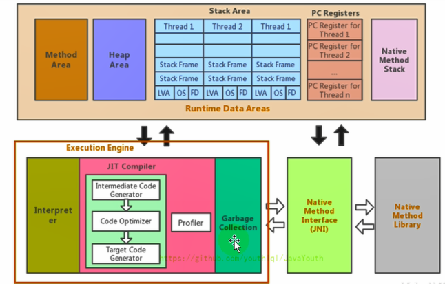

1.  执行引擎是Java虚拟机核心的组成部分之一。
2.  “虚拟机”是一个相对于“物理机”的概念，这两种机器都有代码执行能力，其区别是物理机的执行引擎是直接建立在处理器、缓存、指令集和操作系统层面上的，而**虚拟机的执行引擎则是由软件自行实现的**，因此可以不受物理条件制约地定制指令集与执行引擎的结构体系，**能够执行那些不被硬件直接支持的指令集格式**。
3.  JVM的主要任务是负责**装载字节码到其内部**，但字节码并不能够直接运行在操作系统之上，因为字节码指令并非等价于本地机器指令，它内部包含的仅仅只是一些能够被JVM所识别的字节码指令、符号表，以及其他辅助信息。
4.  那么，如果想要让一个Java程序运行起来，执行引擎（Execution Engine）的任务就是**执行字节码指令，准确来说是将字节码指令解释/编译为对应平台上的本地机器指令才可以**。简单来说，JVM中的执行引擎充当了将高级语言翻译为机器语言的译者。

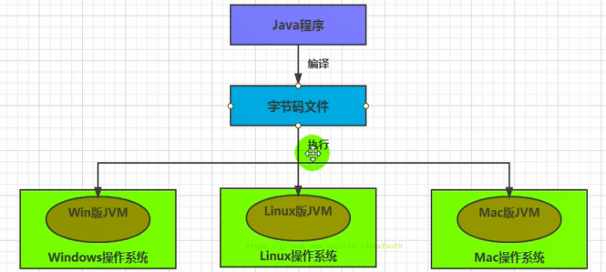

1、前端编译：从Java程序员-字节码文件的这个过程叫前端编译

2、执行引擎这里有两种行为：一种是解释执行，一种是编译执行（这里的是后端编译）。


### Java代码编译和执行过程

#### 解释执行和即时编译

大部分的程序代码转换成物理机的目标代码或虚拟机能执行的指令集之前，都需要经过下图中的各个步骤：

1.  前面橙色部分是编译生成生成字节码文件的过程（javac编译器来完成，也就是前端编译器），和JVM没有关系。
  
2.  后面绿色（解释执行）和蓝色（即时编译）才是JVM需要考虑的过程
  
    

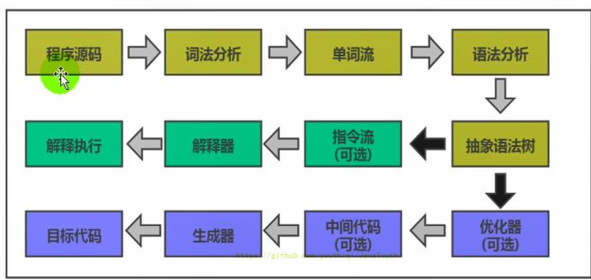
    

3. javac编译器（前端编译器）流程图如下所示：

    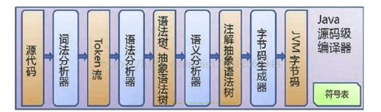

    

4. Java字节码的执行是由JVM执行引擎来完成，流程图如下所示

    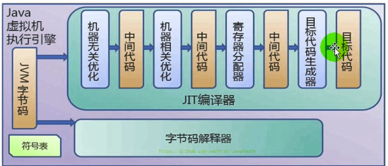

    


#### 解释器与编译器

1.  **解释器**：当Java虚拟机启动时会根据预定义的规范对字节码指令采用**逐行**解释的方式**执行**，将每条字节码文件中的内容“翻译”为对应平台的本地机器指令执行。
2.  **JIT（Just In Time Compiler）编译器**：就是虚拟机将字节码**一次性直接**编译成和本地机器平台相关的机器语言，**但并不是马上执行**。


#### Java是半编译半解释型语言

1.  JDK1.0时代，将Java语言定位为“解释执行”还是比较准确的。再后来，Java也发展出可以直接生成本地代码的编译器。
2.  现在**JVM的执行引擎在执行字节码指令的时候，通常都会将解释执行与编译执行二者结合起来进行**。
3.  JIT编译器将字节码翻译成本地代码后，就可以做一个缓存操作，存储在方法区的JIT 代码缓存中（执行效率更高了），并且在翻译成本地代码的过程中可以做优化。


**用图总结一下**

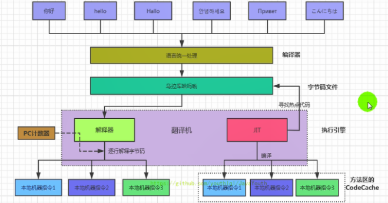

### 机器码 指令 汇编语言

#### 机器码


1.  各种用二进制编码方式表示的指令，叫做机器指令码。开始，人们就用它采编写程序，这就是机器语言。
2.  机器语言虽然能够被计算机理解和接受，但和人们的语言差别太大，不易被人们理解和记忆，并且用它编程容易出差错。
3.  用它编写的程序一经输入计算机，CPU直接读取运行，因此和其他语言编的程序相比，执行速度最快。
4.  机器指令与CPU紧密相关，所以不同种类的CPU所对应的机器指令也就不同。


#### 指令和指令集

**指令**

1.  由于机器码是由0和1组成的二进制序列，可读性实在太差，于是人们发明了指令。
  
2.  指令就是把机器码中特定的0和1序列，简化成对应的指令（一般为英文简写，如mov，inc等），可读性稍好
  
3.  由于不同的硬件平台，执行同一个操作，对应的机器码可能不同，所以不同的硬件平台的同一种指令（比如mov），对应的机器码也可能不同。


**指令集**

不同的硬件平台，各自支持的指令，是有差别的。因此每个平台所支持的指令，称之为对应平台的指令集。如常见的

1.  x86指令集，对应的是x86架构的平台
2.  ARM指令集，对应的是ARM架构的平台


#### 汇编语言


1.  由于指令的可读性还是太差，于是人们又发明了汇编语言。
2.  在汇编语言中，**用助记符（Mnemonics）代替机器指令的操作码，用地址符号（Symbol）或标号（Label）代替指令或操作数的地址。**
3.  在不同的硬件平台，汇编语言对应着不同的机器语言指令集，通过汇编过程转换成机器指令。
4.  由于计算机只认识指令码，所以用汇编语言编写的程序还必须翻译（汇编）成机器指令码，计算机才能识别和执行。


#### 高级语言


1. 为了使计算机用户编程序更容易些，后来就出现了各种高级计算机语言。高级语言比机器语言、汇编语言更接近人的语言

2. 当计算机执行高级语言编写的程序时，仍然需要把程序解释和编译成机器的指令码。完成这个过程的程序就叫做解释程序或编译程序。

    

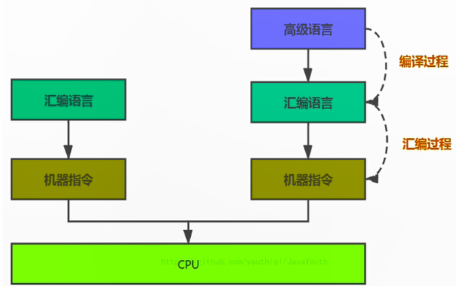


#### 字节码

1.  字节码是一种中间状态（中间码）的二进制代码（文件），它比机器码更抽象，需要直译器转译后才能成为机器码

2.  字节码主要为了实现特定软件运行和软件环境、与硬件环境无关。

3.  字节码的实现方式是通过编译器和虚拟机器。编译器将源码编译成字节码，特定平台上的虚拟机器将字节码转译为可以直接执行的指令。

4.  字节码典型的应用为：Java bytecode


#### C、C++源程序执行过程

**编译过程又可以分成两个阶段：编译和汇编。**

1.  编译过程：是读取源程序（字符流），对之进行词法和语法的分析，将高级语言指令转换为功能等效的汇编代码
  
2.  汇编过程：实际上指把汇编语言代码翻译成目标机器指令的过程。

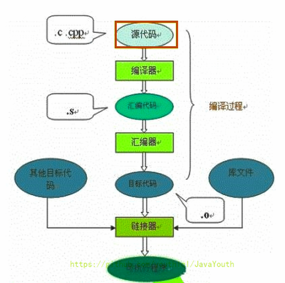


### 解释器

#### 为什么要有解释器

1.  JVM设计者们的初衷仅仅只是单纯地为了满足Java程序实现**跨平台**特性，因此避免采用静态编译的方式由高级语言直接生成本地机器指令，从而诞生了实现解释器在运行时采用逐行解释字节码执行程序的想法（也就是产生了一个中间产品**字节码**）。
  
2.  解释器真正意义上所承担的角色就是一个运行时“翻译者”，将字节码文件中的内容“翻译”为对应平台的本地机器指令执行。
  
3.  当一条字节码指令被解释执行完成后，接着再根据PC寄存器中记录的下一条需要被执行的字节码指令执行解释操作。

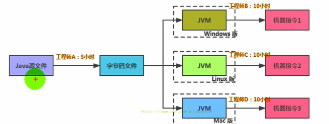


#### 解释器的分类

1.  在Java的发展历史里，一共有两套解释执行器，即古老的**字节码解释器**、现在普遍使用的**模板解释器**。
    *   字节码解释器在执行时通过纯软件代码模拟字节码的执行，效率非常低下。
    *   而模板解释器将**每一条字节码指令和一个模板函数相关联**，模板函数中直接产生这条字节码执行时的机器码，从而很大程度上提高了解释器的性能。
2.  在HotSpot VM中，解释器主要由Interpreter模块和Code模块构成。
    *   Interpreter模块：实现了解释器的核心功能
    *   Code模块：用于管理HotSpot VM在运行时生成的本地机器指令


### JIT编译器

#### JIT编译器相关概念

1.  Java 语言的“编译期”其实是一段“不确定”的操作过程，因为它可能是指一个前端编译器（其实叫“编译器的前端”更准确一些）把.java文件转变成.class文件的过程。
2.  也可能是指虚拟机的后端运行期编译器（JIT编译器，Just In Time Compiler）把字节码转变成机器码的过程。
3.  还可能是指使用静态提前编译器（AOT编译器，Ahead of Time Compiler）直接把.java文件编译成本地机器代码的过程。（可能是后续发展的趋势）


#### JIT编译器分类

在HotSpot VM中内嵌有两个JIT编译器，分别为**Client Compiler**和**Server Compiler**，但大多数情况下我们简称为**C1编译器** 和 **C2编译器**。开发人员可以通过如下命令显式指定Java虚拟机在运行时到底使用哪一种即时编译器。

##### C1编译器

指定Java虚拟机运行在Client模式下，并使用C1编译器；

C1编译器会对字节码进行**简单的优化**，**编译速度快，优化的代码执行效率低**

优化策略：

*   **方法内联**：将引用的函数代码编译到引用点处，这样可以减少栈帧的生成，减少参数传递以及跳转过程
*   **去虚拟化**：对唯一的实现方法进行内联
*   **冗余消除**：在运行期间把一些不会执行的代码折叠掉


##### C2编译器

指定Java虚拟机运行在server模式下，并使用C2编译器。

C2进行**复杂的优化**，**编译速度慢，优化的代码执行效率更高**。（使用C++）

优化策略：C2的优化主要是在全局层面，逃逸分析是优化的基础。**基于逃逸分析**在C2上有如下几种优化：

*   **栈上分配**：**若对象不会逃逸，可以在线程的栈上进行分配对象，不需要GC。对象的生命周期和方法相同，随着栈帧的出栈而销毁。**
*   **分离对象(标量替换)**：若对象不会逃逸，JIT编译器把这个对象拆解成其中包含的若干个成员变量来代替。
*   **同步省略(锁消除)**：如果同步块所使用的锁对象只能够被一个线程访问，JIT编译器在编译这个同步块的时候就会取消对这部分代码的同步。


### 解释器+JIT编译器

#### JVM的使用

HotSpot VM是目前市面上高性能虚拟机的代表作之一。**它采用解释器与即时编译器并存的架构**。在Java虚拟机运行时，解释器和即时编译器能够相互协作，各自取长补短，尽力去选择最合适的方式来权衡编译本地代码的时间和直接解释执行代码的时间。

**首先明确两点：**

1.  当程序启动后，解释器可以马上发挥作用，**响应速度快**，省去编译的时间，立即执行。
2.  编译器要想发挥作用，把代码编译成本地代码，**需要一定的执行时间**，但编译为本地代码后，执行效率高。

**所以：**

1.  尽管JRockit VM中程序的执行性能会非常高效，但程序在启动时必然需要花费更长的时间来进行编译。对于服务端应用来说，启动时间并非是关注重点，但对于那些看中启动时间的应用场景而言，或许就需要采用解释器与即时编译器并存的架构来换取一个平衡点。
2.  在此模式下，在Java虚拟器启动时，**解释器可以首先发挥作用，而不必等待即时编译器全部编译完成后再执行，这样可以省去许多不必要的编译时间。随着时间的推移，编译器发挥作用，根据热点代码探测功能，把字节码指令编译成本地代码，获得更高的执行效率。**
3.  同时，**解释执行在编译器进行激进优化不成立的时候，作为编译器的“逃生门**”（后备方案）。


1.  注意解释执行与编译执行在线上环境微妙的辩证关系。**机器在热机状态（已经运行了一段时间叫热机状态）可以承受的负载要大于冷机状态（刚启动的时候叫冷机状态）**。如果以热机状态时的流量进行切流，可能使处于冷机状态的服务器因无法承载流量而假死。
  
2.  在生产环境发布过程中，以 分批的方式进行发布，根据机器数量划分成多个批次，每个批次的机器数至多占到整个集群的1/8。曾经有这样的故障案例：某程序员在发布平台进行分批发布，在输入发布总批数时，误填写成分为两批发布。如果是热机状态，在正常情况下一半的机器可以勉强承载流量，但由于刚启动的JVM均是解释执行，还没有进行热点代码统计和JIT动态编译，导致机器启动之后，当前1/2发布成功的服务器马上全部宕机，此故障说明了JIT的存在。—**阿里团队**

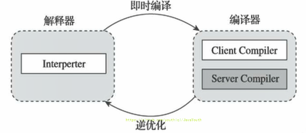


```java
public class JITTest {
    public static void main(String[] args) {
        ArrayList<String> list = new ArrayList<>();

        for (int i = 0; i < 1000; i++) {
            list.add("让天下没有难学的技术");

            try {
                Thread.sleep(1000);
            } catch (InterruptedException e) {
                e.printStackTrace();
            }
        }

    }
}
```


通过 JVisualVM 查看 JIT 编译器执行的编译次数

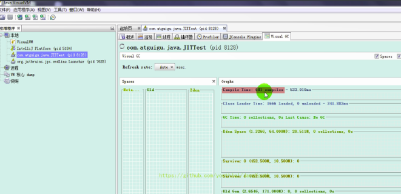


#### 热点代码及探测方式

1.  当然是否需要启动JIT编译器将字节码直接编译为对应平台的本地机器指令，则需要根据代码被调用**执行的频率**而定。
2.  关于那些需要被编译为本地代码的字节码，也被称之为**“热点代码”**，JIT编译器在运行时会针对那些频繁被调用的“热点代码”做出**深度优化**，将其直接编译为对应平台的本地机器指令，以此提升Java程序的执行性能。
3.  一个被多次调用的方法，或者是一-个方法体内部循环次数较多的循环体都可以被称之为“热点代码”，因此都可以通过JIT编译器编译为本地机器指令。由于这种编译方式发生在方法的执行过程中，因此也被称之为栈上替换，或简称为OSR (On StackReplacement)编译。
4.  一个方法究竟要被调用多少次，或者一个循环体究竟需要执行多少次循环才可以达到这个标准？必然需要一个明确的阈值，JIT编译器才会将这些“热点代码”编译为本地机器指令执行。这里主要依靠热点探测功能。
5.  **目前HotSpot VM所采用的热点探测方式是基于计数器的热点探测**。
6.  采用基于计数器的热点探测，HotSpot VM将会为每一个方法都建立2个不同类型的计数器，分别为方法**调用计数器**（Invocation Counter）和**回边计数器**（Back Edge Counter）。
    1.  **方法调用计数器用于统计方法的调用次数**
    2.  **回边计数器则用于统计循环体执行的循环次数**


##### 方法调用计数器

1.  这个计数器就用于统计方法被调用的次数，它的默认阀值在Client模式下是1500次，在Server模式下是10000次。超过这个阈值，就会触发JIT编译。
  
2.  这个阀值可以通过虚拟机参数 -XX:CompileThreshold 来人为设定。
  
3.  当一个方法被调用时，会先检查该方法是否存在被JIT编译过的版本
  
    *   如果存在，则优先使用编译后的本地代码来执行
    *   如果不存在已被编译过的版本，则将此方法的调用计数器值加1，然后判断方法调用计数器与回边计数器值之和是否超过方法调用计数器的阀值。 
        *   如果已超过阈值，那么将会向即时编译器提交一个该方法的代码编译请求。
        *   如果未超过阈值，则使用解释器对字节码文件解释执行

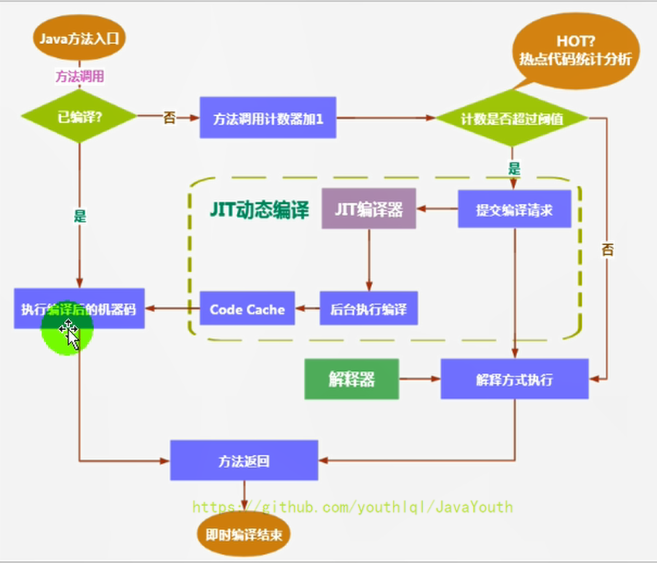


##### 热度衰减

1.  如果不做任何设置，方法调用计数器统计的并不是方法被调用的绝对次数，而是一个相对的执行频率，即**一段时间之内方法被调用的次数**。**当超过一定的时间限度，如果方法的调用次数仍然不足以让它提交给即时编译器编译，那这个方法的调用计数器就会被减少一半，**这个过程称为方法调用计数器热度的衰减（Counter Decay），而这段时间就称为此方法统计的半衰周期（Counter Half Life Time）（半衰周期是化学中的概念，比如出土的文物通过查看C60来获得文物的年龄） 
2.  进行热度衰减的动作是在虚拟机进行垃圾收集时顺便进行的，可以使用虚拟机参数 -XX:-UseCounterDecay 来关闭热度衰减，让方法计数器统计方法调用的绝对次数，这样的话，只要系统运行时间足够长，绝大部分方法都会被编译成本地代码。
6.  另外，可以使用-XX:CounterHalfLifeTime参数设置半衰周期的时间，单位是秒。


##### 回边计数器

它的作用是统计一个方法中循环体代码执行的次数，在字节码中遇到控制流 向后跳转的指令称为“回边”（Back Edge）。显然，建立回边计数器统计的目的就是为了触发**OSR编译**。

**OSR编译：只编译该循环代码，然后将其替换，下次循环时就执行编译好的代码**

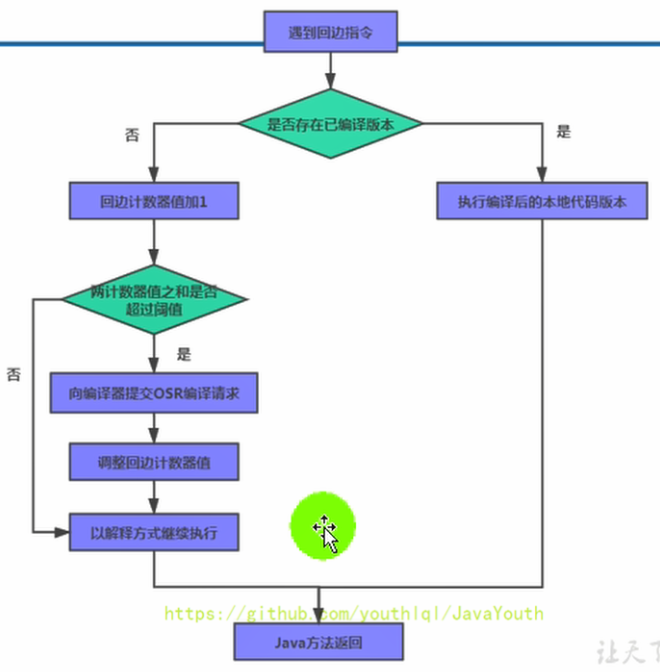


### HotSpotVM可以设置程序执行方法

缺省情况下HotSpot VM是采用解释器与即时编译器并存的架构，当然开发人员可以根据具体的应用场景，通过命令显式地为Java虚拟机指定在运行时到底是完全采用解释器执行，还是完全采用即时编译器执行。如下所示：

1.  -Xint：完全采用解释器模式执行程序；
2.  -Xcomp：完全采用即时编译器模式执行程序。如果即时编译出现问题，解释器会介入执行
3.  -Xmixed：采用解释器+即时编译器的混合模式共同执行程序。


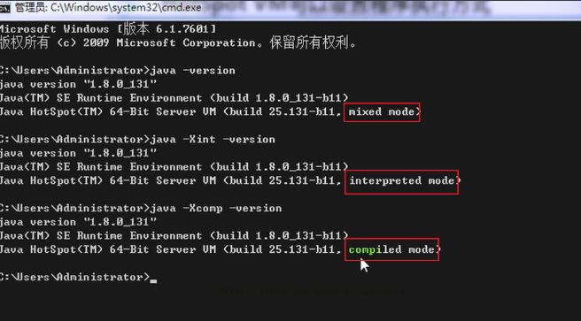


**代码测试**

```java
/**
 * 测试解释器模式和JIT编译模式
 *  -Xint  : 6520ms
 *  -Xcomp : 950ms
 *  -Xmixed : 936ms
 */
public class IntCompTest {
    public static void main(String[] args) {

        long start = System.currentTimeMillis();

        testPrimeNumber(1000000);

        long end = System.currentTimeMillis();

        System.out.println("花费的时间为：" + (end - start));

    }

    public static void testPrimeNumber(int count){
        for (int i = 0; i < count; i++) {
            //计算100以内的质数
            label:for(int j = 2;j <= 100;j++){
                for(int k = 2;k <= Math.sqrt(j);k++){
                    if(j % k == 0){
                        continue label;
                    }
                }
                //System.out.println(j);
            }

        }
    }
}

```

结论：只用解释器执行是真的慢

