垃圾回收相关概念
---------------

### System.gc() 的理解

1.  在默认情况下，通过System.gc()者Runtime.getRuntime().gc() 的调用，**会显式触发Full GC**，同时对老年代和新生代进行回收，尝试释放被丢弃对象占用的内存。
  
2.  然而System.gc()调用附带一个免责声明，无法保证对垃圾收集器的调用(不能确保立即生效)
  
3.  JVM实现者可以通过System.gc() 调用来决定JVM的GC行为。而一般情况下，垃圾回收应该是自动进行的，**无须手动触发，否则就太过于麻烦了。**在一些特殊情况下，如我们正在编写一个性能基准，我们可以在运行之间调用System.gc()


**代码示例：手动执行 GC 操作**

```java
public class SystemGCTest {
    public static void main(String[] args) {
        new SystemGCTest();
        System.gc();//提醒jvm的垃圾回收器执行gc,但是不确定是否马上执行gc
        //与Runtime.getRuntime().gc();的作用一样。

//        System.runFinalization();//强制调用使用引用的对象的finalize()方法
    }
    //如果发生了GC，这个finalize()一定会被调用
    @Override
    protected void finalize() throws Throwable {
        super.finalize();
        System.out.println("SystemGCTest 重写了finalize()");
    }
}
```

输出结果不确定：有时候会调用 finalize() 方法，有时候并不会调用


```java
//加上参数：  -XX:+PrintGCDetails
public class LocalVarGC {
    public void localvarGC1() {
        byte[] buffer = new byte[10 * 1024 * 1024];//10MB
        System.gc();
    }

    public void localvarGC2() {
        byte[] buffer = new byte[10 * 1024 * 1024];
        buffer = null;
        System.gc();
    }

    public void localvarGC3() {
        {
            byte[] buffer = new byte[10 * 1024 * 1024];
        }
        System.gc();
    }

    public void localvarGC4() {
        {
            byte[] buffer = new byte[10 * 1024 * 1024];
        }
        int value = 10;
        System.gc();
    }

    public void localvarGC5() {
        localvarGC1();
        System.gc();
    }

    public static void main(String[] args) {
        LocalVarGC local = new LocalVarGC();
        //通过在main方法调用这几个方法进行测试
        local.localvarGC1();
    }
}

```

JVM参数：

`-Xms256m -Xmx256m -XX:+PrintGCDetails -XX:PretenureSizeThreshold=15m`

1、第四个参数是设置大对象直接进入老年代的阈值，由于我的电脑8G和视频里老师的电脑16G不太一样。我测试的时候10M的数组都是直接进入到了老年代，为了保持一样的效果，我同时设置了堆内存和大对象阈值，尽量和宋红康老师保持一致

2、我也查过了大对象阈值的默认值

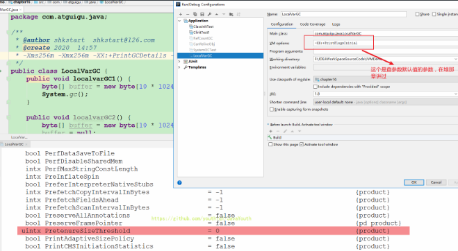

我不太懂这个默认值为啥是0，我猜测可能是代表什么比例，目前也没有搜到相关的东西。这个不太重要，暂时就没有太深究，希望读者有知道的可以告知我一声。


**1、调用 localvarGC1() 方法**

执行 System.gc() 仅仅是将年轻代的 buffer 数组对象放到了老年代，buffer对象仍然没有回收

```java
[GC (System.gc()) [PSYoungGen: 15492K->10728K(76288K)] 15492K->11000K(251392K), 0.0066473 secs] [Times: user=0.08 sys=0.02, real=0.01 secs] 
[Full GC (System.gc()) [PSYoungGen: 10728K->0K(76288K)] [ParOldGen: 272K->10911K(175104K)] 11000K->10911K(251392K), [Metaspace: 3492K->3492K(1056768K)], 0.0097940 secs] [Times: user=0.00 sys=0.00, real=0.01 secs] 
Heap
 PSYoungGen      total 76288K, used 655K [0x00000000fab00000, 0x0000000100000000, 0x0000000100000000)
  eden space 65536K, 1% used [0x00000000fab00000,0x00000000faba3ee8,0x00000000feb00000)
  from space 10752K, 0% used [0x00000000feb00000,0x00000000feb00000,0x00000000ff580000)
  to   space 10752K, 0% used [0x00000000ff580000,0x00000000ff580000,0x0000000100000000)
 ParOldGen       total 175104K, used 10911K [0x00000000f0000000, 0x00000000fab00000, 0x00000000fab00000)
  object space 175104K, 6% used [0x00000000f0000000,0x00000000f0aa7d08,0x00000000fab00000)
 Metaspace       used 3498K, capacity 4498K, committed 4864K, reserved 1056768K
  class space    used 387K, capacity 390K, committed 512K, reserved 1048576K
```


**2、调用 localvarGC2() 方法**

由于 buffer 数组对象没有引用指向它，执行 System.gc() 将被回收

```java
[GC (System.gc()) [PSYoungGen: 15492K->808K(76288K)] 15492K->816K(251392K), 0.0294475 secs] [Times: user=0.00 sys=0.00, real=0.04 secs] 
[Full GC (System.gc()) [PSYoungGen: 808K->0K(76288K)] [ParOldGen: 8K->640K(175104K)] 816K->640K(251392K), [Metaspace: 3385K->3385K(1056768K)], 0.0054210 secs] [Times: user=0.00 sys=0.00, real=0.01 secs] 
Heap
 PSYoungGen      total 76288K, used 1966K [0x00000000fab00000, 0x0000000100000000, 0x0000000100000000)
  eden space 65536K, 3% used [0x00000000fab00000,0x00000000faceb9e0,0x00000000feb00000)
  from space 10752K, 0% used [0x00000000feb00000,0x00000000feb00000,0x00000000ff580000)
  to   space 10752K, 0% used [0x00000000ff580000,0x00000000ff580000,0x0000000100000000)
 ParOldGen       total 175104K, used 640K [0x00000000f0000000, 0x00000000fab00000, 0x00000000fab00000)
  object space 175104K, 0% used [0x00000000f0000000,0x00000000f00a01a8,0x00000000fab00000)
 Metaspace       used 3392K, capacity 4496K, committed 4864K, reserved 1056768K
  class space    used 379K, capacity 388K, committed 512K, reserved 1048576K
```


**3、调用 localvarGC3() 方法**

虽然出了代码块的作用域，但是 buffer 数组对象并没有被回收

```java
[GC (System.gc()) [PSYoungGen: 15492K->840K(76288K)] 15492K->11088K(251392K), 0.0070281 secs] [Times: user=0.08 sys=0.00, real=0.01 secs] 
[Full GC (System.gc()) [PSYoungGen: 840K->0K(76288K)] [ParOldGen: 10248K->10900K(175104K)] 11088K->10900K(251392K), [Metaspace: 3386K->3386K(1056768K)], 0.0084464 secs] [Times: user=0.00 sys=0.00, real=0.01 secs] 
Heap
 PSYoungGen      total 76288K, used 1966K [0x00000000fab00000, 0x0000000100000000, 0x0000000100000000)
  eden space 65536K, 3% used [0x00000000fab00000,0x00000000faceb9e0,0x00000000feb00000)
  from space 10752K, 0% used [0x00000000feb00000,0x00000000feb00000,0x00000000ff580000)
  to   space 10752K, 0% used [0x00000000ff580000,0x00000000ff580000,0x0000000100000000)
 ParOldGen       total 175104K, used 10900K [0x00000000f0000000, 0x00000000fab00000, 0x00000000fab00000)
  object space 175104K, 6% used [0x00000000f0000000,0x00000000f0aa52e8,0x00000000fab00000)
 Metaspace       used 3393K, capacity 4496K, committed 4864K, reserved 1056768K
  class space    used 379K, capacity 388K, committed 512K, reserved 1048576K
```

**原因：**

1、来看看字节码：实例方法局部变量表第一个变量肯定是 this

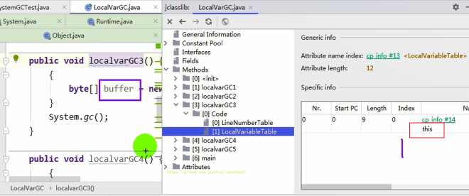

2、你有没有看到，局部变量表的大小是 2。但是局部变量表里只有一个索引为0的啊？那索引为1的是哪个局部变量呢？实际上索引为1的位置是buffer在占用着，执行 System.gc() 时，栈中还有 buffer 变量指向堆中的字节数组，所以没有进行GC

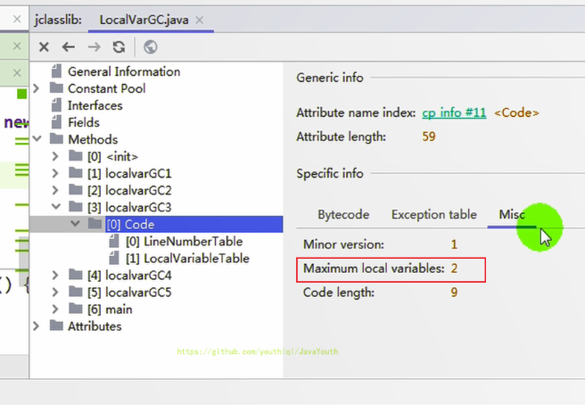

3、那么这种代码块的情况，什么时候会被GC呢？我们来看第四个方法

**4、调用 localvarGC4() 方法**


```
[GC (System.gc()) [PSYoungGen: 15492K->776K(76288K)] 15492K->784K(251392K), 0.0009430 secs] [Times: user=0.00 sys=0.00, real=0.00 secs] 
[Full GC (System.gc()) [PSYoungGen: 776K->0K(76288K)] [ParOldGen: 8K->646K(175104K)] 784K->646K(251392K), [Metaspace: 3485K->3485K(1056768K)], 0.0065829 secs] [Times: user=0.02 sys=0.00, real=0.01 secs] 
Heap
 PSYoungGen      total 76288K, used 1966K [0x00000000fab00000, 0x0000000100000000, 0x0000000100000000)
  eden space 65536K, 3% used [0x00000000fab00000,0x00000000faceb9f8,0x00000000feb00000)
  from space 10752K, 0% used [0x00000000feb00000,0x00000000feb00000,0x00000000ff580000)
  to   space 10752K, 0% used [0x00000000ff580000,0x00000000ff580000,0x0000000100000000)
 ParOldGen       total 175104K, used 646K [0x00000000f0000000, 0x00000000fab00000, 0x00000000fab00000)
  object space 175104K, 0% used [0x00000000f0000000,0x00000000f00a1b88,0x00000000fab00000)
 Metaspace       used 3498K, capacity 4498K, committed 4864K, reserved 1056768K
  class space    used 387K, capacity 390K, committed 512K, reserved 1048576K
```

Q：就多定义了一个局部变量 value ，就可以把字节数组回收了呢？

A：局部变量表长度为 2 ，这说明了出了代码块时，buffer 就出了其作用域范围，此时没有为 value 开启新的槽，value 变量直接占据了 buffer 变量的槽（Slot），导致堆中的字节数组没有引用再指向它，执行 System.gc() 时被回收。看，value 位于局部变量表中索引为 1 的位置。value这个局部变量把原本属于buffer的slot给占用了，这样栈上就没有buffer变量指向`new byte[10 * 1024 * 1024]`实例了。

> 这点看不懂的可以看我前面的文章：虚拟机栈 --> Slot的重复利用

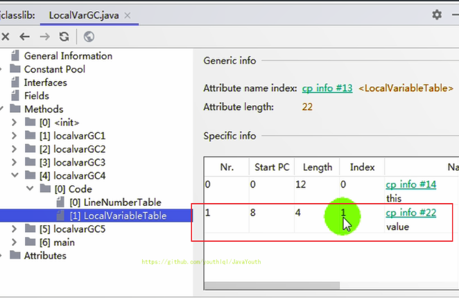


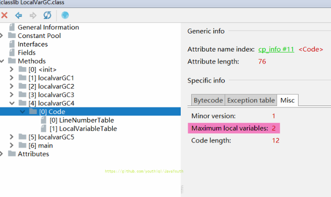


**调用 localvarGC5() 方法**

局部变量除了方法范围就是失效了，堆中的字节数组铁定被回收

```java
[GC (System.gc()) [PSYoungGen: 15492K->840K(76288K)] 15492K->11088K(251392K), 0.0070281 secs] [Times: user=0.00 sys=0.00, real=0.01 secs] 
[Full GC (System.gc()) [PSYoungGen: 840K->0K(76288K)] [ParOldGen: 10248K->10911K(175104K)] 11088K->10911K(251392K), [Metaspace: 3492K->3492K(1056768K)], 0.0082011 secs] [Times: user=0.03 sys=0.03, real=0.01 secs] 
[GC (System.gc()) [PSYoungGen: 0K->0K(76288K)] 10911K->10911K(251392K), 0.0004440 secs] [Times: user=0.00 sys=0.00, real=0.00 secs] 
[Full GC (System.gc()) [PSYoungGen: 0K->0K(76288K)] [ParOldGen: 10911K->671K(175104K)] 10911K->671K(251392K), [Metaspace: 3492K->3492K(1056768K)], 0.0108555 secs] [Times: user=0.08 sys=0.02, real=0.01 secs] 
Heap
 PSYoungGen      total 76288K, used 655K [0x00000000fab00000, 0x0000000100000000, 0x0000000100000000)
  eden space 65536K, 1% used [0x00000000fab00000,0x00000000faba3ee8,0x00000000feb00000)
  from space 10752K, 0% used [0x00000000ff580000,0x00000000ff580000,0x0000000100000000)
  to   space 10752K, 0% used [0x00000000feb00000,0x00000000feb00000,0x00000000ff580000)
 ParOldGen       total 175104K, used 671K [0x00000000f0000000, 0x00000000fab00000, 0x00000000fab00000)
  object space 175104K, 0% used [0x00000000f0000000,0x00000000f00a7cf8,0x00000000fab00000)
 Metaspace       used 3499K, capacity 4502K, committed 4864K, reserved 1056768K
  class space    used 387K, capacity 390K, committed 512K, reserved 1048576K
```


### 内存溢出与内存泄漏

#### 内存溢出

1.  内存溢出相对于内存泄漏来说，尽管更容易被理解，但是同样的，内存溢出也是引发程序崩溃的罪魁祸首之一。
2.  由于GC一直在发展，所有一般情况下，除非应用程序占用的内存增长速度非常快，造成垃圾回收已经跟不上内存消耗的速度，否则不太容易出现OOM的情况。
3.  大多数情况下，GC会进行各种年龄段的垃圾回收，实在不行了就放大招，来一次独占式的Full GC操作，这时候会回收大量的内存，供应用程序继续使用。
4.  Javadoc中对OutofMemoryError的解释是，**没有空闲内存，并且垃圾收集器也无法提供更多内存。**

**内存溢出（OOM）原因分析**

首先说没有空闲内存的情况：说明Java虚拟机的堆内存不够。原因有二：

1. **Java虚拟机的堆内存设置不够。**

   比如：可能存在内存泄漏问题；也很有可能就是堆的大小不合理，比如我们要处理比较可观的数据量，但是没有显式指定JVM堆大小或者指定数值偏小。我们可以通过参数-Xms 、-Xmx来调整。
2.  **代码中创建了大量大对象，并且长时间不能被垃圾收集器收集**（存在被引用）
    
    *   对于老版本的Oracle JDK，因为永久代的大小是有限的，并且JVM对永久代垃圾回收（如，常量池回收、卸载不再需要的类型）非常不积极，所以当我们不断添加新类型的时候，永久代出现OutOfMemoryError也非常多见。尤其是在运行时存在大量动态类型生成的场合；类似intern字符串缓存占用太多空间，也会导致OOM问题。对应的异常信息，会标记出来和永久代相关：“java.lang.OutOfMemoryError:PermGen space"。
    *   随着元数据区的引入，方法区内存已经不再那么窘迫，所以相应的OOM有所改观，出现OOM，异常信息则变成了：“java.lang.OutofMemoryError:Metaspace"。直接内存不足，也会导致OOM。


1.  这里面隐含着一层意思是，在抛出OutofMemoryError之前，通常垃圾收集器会被触发，尽其所能去清理出空间。
    *   例如：在引用机制分析中，涉及到JVM会去尝试**回收软引用指向的对象**等。
    *   在java.nio.Bits.reserveMemory()方法中，我们能清楚的看到，System.gc()会被调用，以清理空间。
2.  当然，也不是在任何情况下垃圾收集器都会被触发的
    *   比如，我们去分配一个超大对象，类似一个超大数组超过堆的最大值，JVM可以判断出垃圾收集并不能解决这个问题，所以直接抛出OutofMemoryError。


#### 内存泄漏

1.  也称作“存储渗漏”。严格来说，**只有对象不会再被程序用到了，但是GC又不能回收他们的情况，才叫内存泄漏。**
  
2.  但实际情况很多时候一些不太好的实践（或疏忽）会导致对象的生命周期变得很长甚至导致OOM，也可以叫做宽泛意义上的“内存泄漏”。
  
3.  尽管内存泄漏并不会立刻引起程序崩溃，但是一旦发生内存泄漏，程序中的可用内存就会被逐步蚕食，直至耗尽所有内存，最终出现OutofMemory异常，导致程序崩溃。
  
4.  注意，这里的存储空间并不是指物理内存，而是指虚拟内存大小，这个虚拟内存大小取决于磁盘交换区设定的大小。


**内存泄露官方例子**

左边的图：Java使用可达性分析算法，最上面的数据不可达，就是需要被回收的对象。

右边的图：后期有一些对象不用了，按道理应该断开引用，但是存在一些链没有断开（图示中的Forgotten Reference Memory Leak），从而导致没有办法被回收。

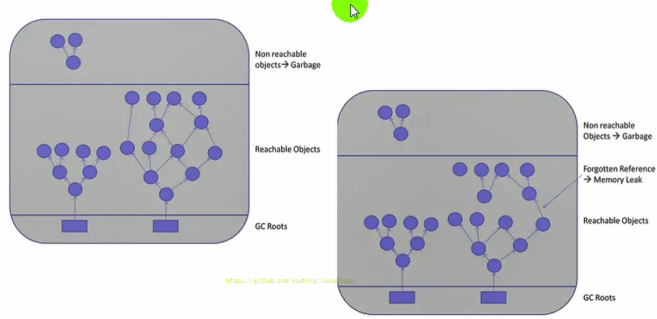


**常见例子**

>**不要举循环引用的例子！！！因为JAVA根本就不用引用计数算法。**

1. 一些对象如果持有对外部对象的引用，但是之后却不会用到，这个外部对象不能被回收的，则会导致内存泄漏的产生。
2. **一些提供close()的资源未关闭导致内存泄漏**

   数据库连接 dataSourse.getConnection()，网络连接socket和io连接必须手动close，否则是不能被回收的。


### Stop the World

1.  Stop-the-World，简称STW，指的是GC事件发生过程中，会产生应用程序的停顿。**停顿产生时整个应用程序线程都会被暂停，没有任何响应**，有点像卡死的感觉，这个停顿称为STW。
  
2.  可达性分析算法中枚举根节点（GC Roots）会导致所有Java执行线程停顿，为什么需要停顿所有 Java 执行线程呢？
  
    *   分析工作必须在一个能确保一致性的快照中进行
      
    *   一致性指整个分析期间整个执行系统看起来像被冻结在某个时间点上
      
    *   **如果出现分析过程中对象引用关系还在不断变化，则分析结果的准确性无法保证**
    
3.  被STW中断的应用程序线程会在完成GC之后恢复，频繁中断会让用户感觉像是网速不快造成电影卡带一样，所以我们需要减少STW的发生。


1.  STW事件和采用哪款GC无关，所有的GC都有这个事件。
  
2.  哪怕是G1也不能完全避免Stop-the-world情况发生，只能说垃圾回收器越来越优秀，回收效率越来越高，尽可能地缩短了暂停时间。
  
3.  STW是JVM在**后台自动发起和自动完成**的。在用户不可见的情况下，把用户正常的工作线程全部停掉。
  
4.  开发中不要用System.gc() ，这会导致Stop-the-World的发生。

**代码感受 Stop the World**

```java
public class StopTheWorldDemo {
    public static class WorkThread extends Thread {
        List<byte[]> list = new ArrayList<byte[]>();

        public void run() {
            try {
                while (true) {
                    for(int i = 0;i < 1000;i++){
                        byte[] buffer = new byte[1024];
                        list.add(buffer);
                    }

                    if(list.size() > 10000){
                        list.clear();
                        System.gc();//会触发full gc，进而会出现STW事件
                     
                    }
                }
            } catch (Exception ex) {
                ex.printStackTrace();
            }
        }
    }

    public static class PrintThread extends Thread {
        public final long startTime = System.currentTimeMillis();

        public void run() {
            try {
                while (true) {
                    // 每秒打印时间信息
                    long t = System.currentTimeMillis() - startTime;
                    System.out.println(t / 1000 + "." + t % 1000);
                    Thread.sleep(1000);
                }
            } catch (Exception ex) {
                ex.printStackTrace();
            }
        }
    }

    public static void main(String[] args) {
        WorkThread w = new WorkThread();
        PrintThread p = new PrintThread();
        w.start();
        p.start();
    }
}

```


关闭工作线程 w ，观察输出：当前时间间隔与上次时间间隔**基本**是每隔1秒打印一次

```java
0.1
1.1
2.2
3.2
4.3
5.3
6.3
7.3

Process finished with exit code -1
```


开启工作线程 w ，观察打印输出：当前时间间隔与上次时间间隔相差 1.3s ，可以明显感受到 Stop the World 的存在

```java
0.1
1.4
2.7
3.8
4.12
5.13

Process finished with exit code -1
```


### 垃圾回收的并行与并发

#### 并发的概念

1.  在操作系统中，是指**一个时间段**中有几个程序都处于已启动运行到运行完毕之间，且这几个程序都是在同一个处理器上运行
  
2.  并发不是真正意义上的“同时进行”，只是CPU把一个时间段划分成几个时间片段（时间区间），然后在这几个时间区间之间来回切换。由于CPU处理的速度非常快，只要时间间隔处理得当，即可让用户感觉是多个应用程序同时在进行

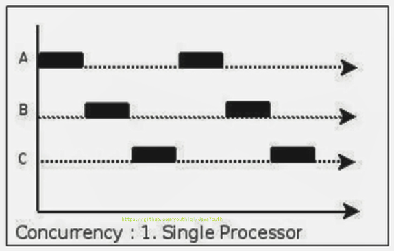


#### 并行的概念


1.  当系统有一个以上CPU时，当一个CPU执行一个进程时，另一个CPU可以执行另一个进程，两个进程互不抢占CPU资源，可以**同时**进行，我们称之为并行（Parallel）
  
2.  其实决定并行的因素不是CPU的数量，而是CPU的核心数量，比如一个CPU多个核也可以并行
  
3.  适合科学计算，后台处理等弱交互场景

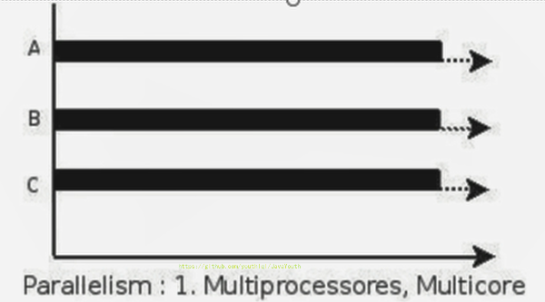

> **并发与并行的对比**

1.  并发，指的是多个事情，在同一时间段内同时发生了。
2.  并行，指的是多个事情，在同一时间点上（或者说同一时刻）同时发生了。
3.  并发的多个任务之间是互相抢占资源的。并行的多个任务之间是不互相抢占资源的。
4.  只有在多CPU或者一个CPU多核的情况中，才会发生并行。否则，看似同时发生的事情，其实都是并发执行的。


#### 垃圾回收的并发与并行

1.  并行（Parallel）：指多条垃圾收集线程并行工作，但此时用户线程仍处于等待状态。
    *   如ParNew、Parallel Scavenge、Parallel Old
2.  串行（Serial）
    *   相较于并行的概念，单线程执行。
    *   如果内存不够，则程序暂停，启动JVM垃圾回收器进行垃圾回收（单线程）

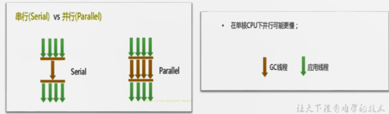


并发和并行，在谈论垃圾收集器的上下文语境中，它们可以解释如下：

1.  并发（Concurrent）：指**用户线程与垃圾收集线程同时执行**（但不一定是并行的，可能会交替执行），垃圾回收线程在执行时不会停顿用户程序的运行。
    - 比如用户程序在继续运行，而垃圾收集程序线程运行于另一个CPU上；
2.  典型垃圾回收器：CMS、G1

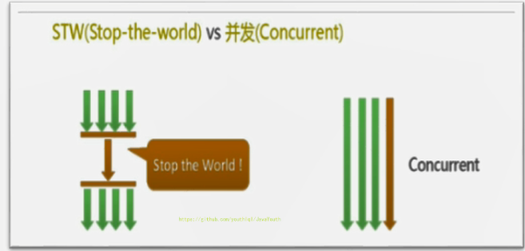


### HotSpot的算法实现细节

#### 根节点枚举(OoPMap)

OopMap 记录了栈上本地变量到堆上对象的引用关系。其作用是：垃圾收集时，收集线程会对栈上的内存进行扫描，看看哪些位置存储了 Reference 类型。如果发现某个位置确实存的是 Reference 类型，就意味着它所引用的对象这一次不能被回收。但问题是，栈上的本地变量表里面只有一部分数据是 Reference 类型的（它们是我们所需要的），那些非 Reference 类型的数据对我们而言毫无用处，但我们还是不得不对整个栈全部扫描一遍，这是对时间和资源的一种浪费。

一个很自然的想法是，能不能用空间换时间，在某个时候把栈上代表引用的位置全部记录下来，这样到真正 gc 的时候就可以直接读取，而不用再一点一点的扫描了。事实上，大部分主流的虚拟机也正是这么做的，比如 HotSpot ，它使用一种叫做 OopMap 的数据结构来记录这类信息。

我们知道，一个线程意味着一个栈，一个栈由多个栈帧组成，一个栈帧对应着一个方法，一个方法里面可能有多个安全点。 **gc 发生时，程序首先运行到最近的一个安全点停下来，然后更新自己的 OopMap ，记下栈上哪些位置代表着引用。枚举根节点时，递归遍历每个栈帧的 OopMap ，通过记录的引用地址信息，依次搜索可触及对象**（ GC Roots ）。

可以把oopMap简单理解成是调试信息。在源代码里面每个变量都是有类型的，但是编译之后的代码就只有变量在栈上的位置了。**oopMap就是一个附加的信息，告诉你栈上哪个位置本来是个什么东西。 这个信息是在JIT编译时跟机器码一起产生的。因为只有编译器知道源代码跟产生的代码的对应关系。 每个方法可能会有好几个oopMap，就是根据safepoint把一个方法的代码分成几段，每一段代码一个oopMap，作用域自然也仅限于这一段代码。 循环中引用多个对象，肯定会有多个变量，编译后占据栈上的多个位置。那这段代码的oopMap就会包含多条记录。**

通过上面的解释，我们可以很清楚的看到使用 OopMap 可以避免全栈扫描，加快枚举根节点的速度。但这并不是它的全部用意。它的另外一个更根本的作用是，**可以帮助 HotSpot 实现准确式 GC 。**

下面的代码清单 是 HotSpot Client VM 生成的一段 String.hashCode() 方法的本地代码，可以看到在 0x026eb7a9 处的 call 指令有 OopMap 记录，它指明了 EBX 寄存器和栈中偏移量为 16 的内存区域中各有一个普通对象指针（Ordinary Object Pointer）的引用，有效范围为从 call 指令开始直到 0x026eb730（指令流的起始位置）+142（OopMap 记录的偏移量）=0x026eb7be，即 hlt 指令为止。

```java
[Verified Entry Point]
0x026eb730: mov %eax,-0x8000(%esp)
…………
;; ImplicitNullCheckStub slow case
0x026eb7a9: call 0x026e83e0 ; OopMap{ebx=Oop [16]=Oop off=142}
;*caload
; - java.lang.String::hashCode@48 (line 1489)
; {runtime_call}
0x026eb7ae: push $0x83c5c18 ; {external_word}
0x026eb7b3: call 0x026eb7b8
0x026eb7b8: pusha
0x026eb7b9: call 0x0822bec0 ; {runtime_call}
0x026eb7be: hlt

```

OopMap记录输出的日志的构成是：

> OopMap{零到多个“数据位置=内容类型”的记录 off=该OopMap关联的指令的位置}


例：

1. OopMap{[0]=Oop off=88}
   [0]表示栈顶指针+偏移量0，这里就是[rsp + 0]，也就是栈顶；右边的"=Oop"说明这个位置存着一个普通对象指针（ordinary object pointer，HotSpot将指向GC堆中对象开头位置的指针称为Oop）。

2. OopMap{off=228}

   它说明在该方法的指令流中，有一个OopMap与偏移量228的位置上的指令关联在一起。
   该OopMap显示这个位置上没有任何活着的引用。

3. OopMap{rbp=Oop off=144}

   在偏移量为144的指令上关联了一个OopMap的记录，有一个活跃的引用在寄存器RBP里。

4. OopMap{rbp=NarrowOop off=248}

   在偏移量为248的指令上关联了一个OopMap的记录，有一个活跃的引用在寄存器RBP里，并且这个引用是压缩过的（NarrowOop）。

5. OopMap{[296]=Callers_eax [292]=Callers_ecx [288]=Callers_edx [284]=Callers_ebx [272]=Callers_esi [268]=Callers_edi [28]=Callers_xmm0 [32]=Callers_xmm0 [36]=Callers_xmm1 [40]=Callers_xmm1 [44]=Callers_xmm2 [48]=Callers_xmm2 [52]=Callers_xmm3 [56]=Callers_xmm3 [60]=Callers_xmm4 [64]=Callers_xmm4 [68]=Callers_xmm5 [72]=Callers_xmm5 [76]=Callers_xmm6 [80]=Callers_xmm6 [84]=Callers_xmm7 [88]=Callers_xmm7 off=674}

   这个OopMap记录看起来比较壮观。其实是它关联的指令位置上正好所有的callee-save的寄存器都保存到栈上了而已。例如说，在[栈顶+296]位置上保存的是调用方的eax；至于它到底是不是一个Oop就得看调用方对应的OopMap是怎么说的了。

6. OopMap{[24]=Oop [28]=Derived_oop\_[24] [32]=Derived_oop_[24] off=192}

   这里可以看到derived oop类型的数据，在栈上[28]位置的是由栈上[24]开始的一个对象的派生引用。


#### 安全点与安全区域

**安全点（Safepoint）**

1.  **程序执行时并非在所有地方都能停顿下来开始GC，只有在特定的位置才能停顿下来开始GC，这些位置称为“安全点（Safepoint）”每个安全点都会记录一个OopMap信息。**
  
2.  Safe Point的选择很重要，**如果太少可能导致GC等待的时间太长，如果太频繁可能导致运行时的性能问题**。大部分指令的执行时间都非常短暂，通常会根据“**是否具有让程序长时间执行的特征**”为标准。比如：**选择一些执行时间较长的指令作为Safe Point**，**如方法调用、循环跳转和异常跳转等**。


**如何在GC发生时，检查所有线程都跑到最近的安全点停顿下来呢？**

1.  抢先式中断：（目前没有虚拟机采用了）首先中断所有线程。如果还有线程不在安全点，就恢复线程，让线程跑到安全点。
2.  主动式中断：设置一个中断标志，各个线程运行到Safe Point的时候**主动轮询**这个标志，如果中断标志为真，则将自己进行中断挂起。


**安全区域（Safe Region）**

1.  Safepoint 机制保证了程序执行时，在不太长的时间内就会遇到可进入GC的Safepoint。但是，程序“不执行”的时候呢？
2.  例如线程处于WAITING状态或BLOCKED状态，这时候线程无法响应JVM的中断请求，“走”到安全点去中断挂起，JVM也不太可能等待线程被唤醒。对于这种情况，就需要安全区域（Safe Region）来解决。
4.  **安全区域是指在一段代码片段中，对象的引用关系不会发生变化，在这个区域中的任何位置开始GC都是安全的**。我们也可以把Safe Region看做是被扩展了的Safepoint。


**安全区域的执行流程**

1.  **当线程运行到Safe Region的代码时，首先标识已经进入了Safe Region，如果这段时间内发生GC，JVM会忽略标识为Safe Region状态的线程**
2.  **当线程即将离开Safe Region时，会检查JVM是否已经完成枚举GCRoots，如果完成了，则继续运行，否则线程必须等待直到收到可以安全离开Safe Region的信号为止；**


#### 跨代引用

##### 什么是跨代引用？

1、一般的垃圾回收算法至少会划分出两个年代，年轻代和老年代。但是单纯的分代理论在垃圾回收的时候存在一个巨大的缺陷：为了找到年轻代中的存活对象，却不得不遍历整个老年代，反过来也是一样的。

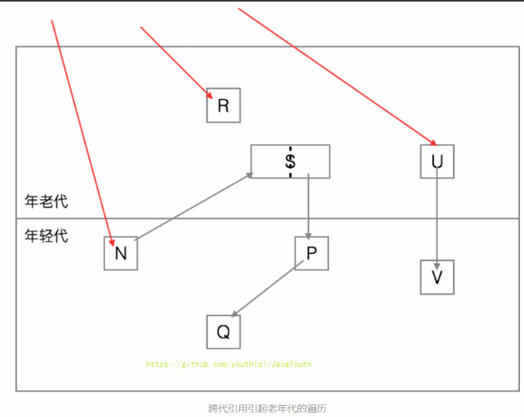

2、如果我们从年轻代开始遍历，那么可以断定N, S, P, Q都是存活对象。但是，V却不会被认为是存活对象，其占据的内存会被回收了。这就是一个惊天的大漏洞！因为U本身是老年代对象，而且有外部引用指向它，也就是说U是存活对象，而U指向了V，也就是说V也应该是存活对象才是！而这都是因为我们只遍历年轻代对象！

3、所以，为了解决这种跨代引用的问题，最笨的办法就是遍历老年代的对象，找出这些跨代引用来。这种方案存在极大的性能浪费。因为从两个分代假说里面，其实隐含了一个推论：跨代引用是极少的。也就是为了找出那么一点点跨代引用，我们却得遍历整个老年代！从上图来说，很显然的是，我们根本不必遍历R。

4、因此，为了避免这种遍历老年代的性能开销，通常的分代垃圾回收器会引入一种称为**记忆集**的技术。**简单来说，记忆集就是用来记录跨代引用的表。**


> 因为这是第二遍看JVM，所以看到这个跨代引用就有一些疑惑：
>
> Q：从GCRoots依次搜索可触及对象，就能从老年代对象找到新生代对象，跨代引用从何谈起？
>
> 周志明书上也没有写的很清楚，网上资料也很少，但也总算找到了一个合理的解释：
>
> A：运用了剪枝的原理。如果遍历所有指向Old的root，大部分情况其实是
>
> GC Roots -> Old ->Old->Old->Old。**因此指向Old就不继续遍历了**。


##### 记忆集与卡表

1、为解决对象跨代引用所带来的问题，垃圾收集器在新生代中建 立了名为**记忆集（Remembered Set）的数据结构**，用以避免把整个老年代加进GC Roots扫描范围。事实上并不只是新生代、老年代之间才有跨代引用的问题，所有涉及部分区域收集（Partial GC）行为的 垃圾收集器，典型的如G1、ZGC和Shenandoah收集器，都会面临相同的问题，因此我们有必要进一步 理清记忆集的原理和实现方式，以便在后续章节里介绍几款最新的收集器相关知识时能更好地理解。

2、记忆集是一种用于记录**从非收集区域指向收集区域的指针集合的抽象数据结构**。如果我们不考虑效率和成本的话，最简单的实现可以用非收集区域中所有含跨代引用的对象数组来实现这个数据结构。

> 比如说我们有老年代（非收集区域）和年轻代（收集区域）的对象之间有一条引用链

3、这种记录全部含跨代引用对象的实现方案，无论是空间占用还是维护成本都相当高昂。而在垃圾 收集的场景中，收集器只需要通过记忆集判断出某一块非收集区域是否存在有指向了收集区域的指针 就可以了，并不需要了解这些跨代指针的全部细节。那设计者在实现记忆集的时候，便可以选择更为 粗犷的记录粒度来节省记忆集的存储和维护成本，下面列举了一些可供选择（当然也可以选择这个范 围以外的）的记录精度：

- 字长精度：每个记录精确到一个机器字长（就是处理器的寻址位数，如常见的32位或64位，这个 精度决定了机器访问物理内存地址的指针长度），该字包含跨代指针。 
- 对象精度：每个记录精确到一个对象，该对象里有字段含有跨代指针。 
- 卡精度：每个记录精确到一块内存区域，该区域内有对象含有跨代指针。

4、其中，第三种“卡精度”所指的是用一种称为“卡表”（Card Table）的方式去实现记忆集，这也是 目前最常用的一种记忆集实现形式，一些资料中甚至直接把它和记忆集混为一谈。前面定义中提到记 忆集其实是一种“抽象”的数据结构，抽象的意思是只定义了记忆集的行为意图，并没有定义其行为的 具体实现。**卡表就是记忆集的一种具体实现**。

卡表：**每一个区域都有一个卡表，卡表中的每一位代表一个卡页，当对象进行引用的写操作时，产生一个写屏障暂停中断操作，若为跨带引用，则将该卡页对象的卡表位设为1。当Minor GC时，只需要扫描为1的卡页。**

G1中的记忆集：**G1垃圾回收器的记忆集的实现实际上是基于哈希表的，key代表的是其他region的起始地址，value是一集合，里面存放了对应区域的卡表的索引，因此G1的region能够通过记忆集知道，当前是哪个region有引用指向了它，并且能知道是哪块区域存在指针指向。**


### 引用

1.  我们希望能描述这样一类对象：当内存空间还足够时，则能保留在内存中；如果内存空间在进行垃圾收集后还是很紧张，则可以抛弃这些对象。
  
2.  既偏门又非常高频的面试题：强引用、软引用、弱引用、虚引用有什么区别？具体使用场景是什么？
  
3.  在JDK1.2版之后，Java对引用的概念进行了扩充，将引用分为：
  
    *   强引用（Strong Reference）
    *   软引用（Soft Reference）
    *   弱引用（Weak Reference）
    *   虚引用（Phantom Reference）
4.  这4种引用强度依次逐渐减弱。除强引用外，其他3种引用均可以在java.lang.ref包中找到它们的身影。如下图，显示了这3种引用类型对应的类，开发人员可以在应用程序中直接使用它们。

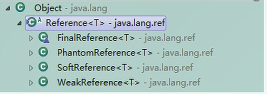


Reference子类中只有终结器引用是包内可见的，其他3种引用类型均为public，可以在应用程序中直接使用

1.  强引用（StrongReference）：最传统的“引用”的定义，是指在程序代码之中普遍存在的引用赋值，即类似“`object obj=new Object()`”这种引用关系。无论任何情况下，只要强引用关系还存在，垃圾收集器就**永远不会回收掉被引用的对象**。宁可报OOM，也不会GC强引用
2.  软引用（SoftReference）：**软引用是用来描述一些还有用，但非必需的对象。内存不足就回收，即在系统将要发生内存溢出之前，将会把这些对象列入回收范围之中进行第二次回收。**如果这次回收后还没有足够的内存，才会抛出内存溢出异常。
3.  弱引用（WeakReference）：**软引用是用来描述一些还有用，但非必需的对象。发现即回收。当垃圾收集器工作时，无论内存空间是否足够，都会回收掉被弱引用关联的对象。**
4.  虚引用（PhantomReference）：一个对象是否有虚引用的存在，完全不会对其生存时间构成影响，也无法通过虚引用来获得一个对象的实例。**为一个对象设置虚引用关联的唯一目的就是能在这个对象被收集器回收时收到一个系统通知。**


#### 强引用-不会被回收

1.  在Java程序中，最常见的引用类型是强引用（普通系统99%以上都是强引用），也就是我们最常见的普通对象引用，**也是默认的引用类型**。
  
2.  当在Java语言中使用new操作符创建一 个新的对象，并将其赋值给一个变量的时候，这个变量就成为指向该对象的一个强引用。
  
3.  **只要强引用的对象是可触及的，垃圾收集器就永远不会回收掉被引用的对象。**只要强引用的对象是可达的，jvm宁可报OOM，也不会回收强引用。
  
4.  对于一个普通的对象，如果没有其他的引用关系，只要超过了引用的作用域或者显式地将相应（强）引用赋值为null，就是可以当做垃圾被收集了，当然具体回收时机还是要看垃圾收集策略。
  
5.  相对的，软引用、弱引用和虚引用的对象是软可触及、弱可触及和虚可触及的，在一定条件下，都是可以被回收的。所以，强引用是造成Java内存泄漏的主要原因之一。


**强引用代码举例**

```java
public class StrongReferenceTest {
    public static void main(String[] args) {
        StringBuffer str = new StringBuffer ("Hello,尚硅谷");
        StringBuffer str1 = str;

        str = null;
        System.gc();

        try {
            Thread.sleep(3000);
        } catch (InterruptedException e) {
            e.printStackTrace();
        }

        System.out.println(str1);
    }
}
```

输出

```java
Hello,尚硅谷
```


局部变量str指向stringBuffer实例所在堆空间，通过str可以操作该实例，那么str就是stringBuffer实例的强引用对应内存结构：

`StringBuffer str = new StringBuffer("hello,尚硅谷");`

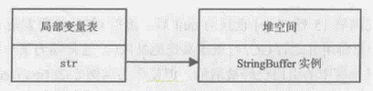


**总结**

本例中的两个引用，都是强引用，强引用具备以下特点：

1.  强引用可以直接访问目标对象。
2.  强引用所指向的对象在任何时候都不会被系统回收，虚拟机宁愿抛出OOM异常，也不会回收强引用所指向对象。
3.  强引用可能导致内存泄漏。


#### 软引用-内存不足就回收

1.  **软引用是用来描述一些还有用，但非必需的对象。**只被软引用关联着的对象，在系统将要发生内存溢出异常前，会把这些对象列进回收范围之中进行第二次回收，如果这次回收还没有足够的内存，才会抛出内存溢出异常。注意，这里的第一次回收是不可达的对象
  
2.  软引用通常用来实现内存敏感的缓存。比如：高速缓存就有用到软引用。如果还有空闲内存，就可以暂时保留缓存，当内存不足时清理掉，这样就保证了使用缓存的同时，不会耗尽内存。
  
3.  垃圾回收器在某个时刻决定回收软可达的对象的时候，会清理软引用，并可选地把引用存放到一个引用队列（Reference Queue）。
  
4.  类似弱引用，只不过Java虚拟机会尽量让软引用的存活时间长一些，迫不得已才清理。
  
5.  一句话概括：当内存足够时，不会回收软引用可达的对象。内存不够时，会回收软引用的可达对象


在JDK1.2版之后提供了SoftReference类来实现软引用

```java
Object obj = new Object();// 声明强引用
SoftReference<Object> sf = new SoftReference<>(obj); 
obj = null; //销毁强引用
```


**软引用代码举例**

代码

```java
public class SoftReferenceTest {
    public static class User {
        public User(int id, String name) {
            this.id = id;
            this.name = name;
        }

        public int id;
        public String name;

        @Override
        public String toString() {
            return "[id=" + id + ", name=" + name + "] ";
        }
    }

    public static void main(String[] args) {
        //创建对象，建立软引用
//        SoftReference<User> userSoftRef = new SoftReference<User>(new User(1, "songhk"));
        //上面的一行代码，等价于如下的三行代码
        User u1 = new User(1,"songhk");
        SoftReference<User> userSoftRef = new SoftReference<User>(u1);
        u1 = null;//取消强引用


        //从软引用中重新获得强引用对象
        System.out.println(userSoftRef.get());

        System.out.println("---目前内存还不紧张---");
        System.gc();
        System.out.println("After GC:");
//        //垃圾回收之后获得软引用中的对象
        System.out.println(userSoftRef.get());//由于堆空间内存足够，所有不会回收软引用的可达对象。
        System.out.println("---下面开始内存紧张了---");
        try {
            //让系统认为内存资源紧张、不够
//            byte[] b = new byte[1024 * 1024 * 7];
            byte[] b = new byte[1024 * 7168 - 635 * 1024];
        } catch (Throwable e) {
            e.printStackTrace();
        } finally {
            //再次从软引用中获取数据
            System.out.println(userSoftRef.get());//在报OOM之前，垃圾回收器会回收软引用的可达对象。
        }
    }
}


```

JVM参数

`-Xms10m -Xmx10m`

在 JVM 内存不足时，会清理软引用对象

输出结果：

```java
[id=1, name=songhk] 
---目前内存还不紧张---
After GC:
[id=1, name=songhk] 
---下面开始内存紧张了---
null
java.lang.OutOfMemoryError: Java heap space
	at com.atguigu.java1.SoftReferenceTest.main(SoftReferenceTest.java:48)

Process finished with exit code 0
```


#### 弱引用-发现即回收

1. **弱引用也是用来描述那些非必需对象**，**只被弱引用关联的对象只能生存到下一次垃圾收集发生为止。在系统GC时，只要发现弱引用，不管系统堆空间使用是否充足，都会回收掉只被弱引用关联的对象**。

2. 但是，由于垃圾回收器的线程通常优先级很低，因此，并不一定能很快地发现持有弱引用的对象。在这种情况下，弱引用对象可以存在较长的时间。

3. 弱引用和软引用一样，在构造弱引用时，也可以指定一个引用队列，当弱引用对象被回收时，就会加入指定的引用队列，通过这个队列可以跟踪对象的回收情况。

4. 软引用、弱引用都非常适合来保存那些可有可无的缓存数据。如果这么做，当系统内存不足时，这些缓存数据会被回收，不会导致内存溢出。而当内存资源充足时，这些缓存数据又可以存在相当长的时间，从而起到加速系统的作用。

   

在JDK1.2版之后提供了WeakReference类来实现弱引用

```java
// 声明强引用
Object obj = new Object();
WeakReference<Object> sf = new WeakReference<>(obj);
obj = null; //销毁强引用
```

弱引用对象与软引用对象的最大不同就在于，当GC在进行回收时，需要通过算法检查是否回收软引用对象，而对于弱引用对象，GC总是进行回收。弱引用对象更容易、更快被GC回收。


**面试题：你开发中使用过WeakHashMap吗？**


**弱引用代码举例**

```java
public class WeakReferenceTest {
    public static class User {
        public User(int id, String name) {
            this.id = id;
            this.name = name;
        }

        public int id;
        public String name;

        @Override
        public String toString() {
            return "[id=" + id + ", name=" + name + "] ";
        }
    }

    public static void main(String[] args) {
        //构造了弱引用
        WeakReference<User> userWeakRef = new WeakReference<User>(new User(1, "songhk"));
        //从弱引用中重新获取对象
        System.out.println(userWeakRef.get());

        System.gc();
        // 不管当前内存空间足够与否，都会回收它的内存
        System.out.println("After GC:");
        //重新尝试从弱引用中获取对象
        System.out.println(userWeakRef.get());
    }
}

```


执行垃圾回收后，软引用对象必定被清除

```java
[id=1, name=songhk] 
After GC:
null

Process finished with exit code 0
```


#### 虚引用-对象回收跟踪

1.  也称为“幽灵引用”或者“幻影引用”，是所有引用类型中最弱的一个
  
2.  一个对象是否有虚引用的存在，完全不会决定对象的生命周期。**如果一个对象仅持有虚引用，那么它和没有引用几乎是一样的，随时都可能被垃圾回收器回收。**
  
3.  它不能单独使用，也无法通过虚引用来获取被引用的对象。当试图通过虚引用的**get()方法取得对象时，返回null** 。**即通过虚引用无法获取到我们的数据**
  
4.  为一个对象设置虚引用关联的唯一目的在于跟踪垃圾回收过程。比如：能在这个对象被收集器回收时收到一个系统通知。
  
5.  **虚引用必须和引用队列一起使用。虚引用在创建时必须提供一个引用队列作为参数。**当垃圾回收器准备回收一个对象时，如果发现它还有虚引用，就会**在回收对象后，将这个虚引用加入引用队列，以通知应用程序对象的回收情况。**
  
6.  由于虚引用可以跟踪对象的回收时间，因此，也可以将一些资源释放操作放置在虚引用中执行和记录。


在JDK1.2版之后提供了PhantomReference类来实现虚引用。

```java
// 声明强引用
Object obj = new Object();
// 声明引用队列
ReferenceQueue phantomQueue = new ReferenceQueue();
// 声明虚引用（还需要传入引用队列）
PhantomReference<Object> sf = new PhantomReference<>(obj, phantomQueue);
obj = null; 
```


**虚引用代码示例**

```java
public class PhantomReferenceTest {
    public static PhantomReferenceTest obj;//当前类对象的声明
    static ReferenceQueue<PhantomReferenceTest> phantomQueue = null;//引用队列

    public static class CheckRefQueue extends Thread {
        @Override
        public void run() {
            while (true) {
                if (phantomQueue != null) {
                    PhantomReference<PhantomReferenceTest> objt = null;
                    try {
                        objt = (PhantomReference<PhantomReferenceTest>) phantomQueue.remove();
                    } catch (InterruptedException e) {
                        e.printStackTrace();
                    }
                    if (objt != null) {
                        System.out.println("追踪垃圾回收过程：PhantomReferenceTest实例被GC了");
                    }
                }
            }
        }
    }

    @Override
    protected void finalize() throws Throwable { //finalize()方法只能被调用一次！
        super.finalize();
        System.out.println("调用当前类的finalize()方法");
        obj = this;
    }

    public static void main(String[] args) {
        Thread t = new CheckRefQueue();
        t.setDaemon(true);//设置为守护线程：当程序中没有非守护线程时，守护线程也就执行结束。
        t.start();

        phantomQueue = new ReferenceQueue<PhantomReferenceTest>();
        obj = new PhantomReferenceTest();
        //构造了 PhantomReferenceTest 对象的虚引用，并指定了引用队列
        PhantomReference<PhantomReferenceTest> phantomRef = new PhantomReference<PhantomReferenceTest>(obj, phantomQueue);

        try {
            //不可获取虚引用中的对象
            System.out.println(phantomRef.get());
            System.out.println("第 1 次 gc");
            //将强引用去除
            obj = null;
            //第一次进行GC,由于对象可复活，GC无法回收该对象
            System.gc();
            Thread.sleep(1000);
            if (obj == null) {
                System.out.println("obj 是 null");
            } else {
                System.out.println("obj 可用");
            }
            System.out.println("第 2 次 gc");
            obj = null;
            System.gc(); //一旦将obj对象回收，就会将此虚引用存放到引用队列中。
            Thread.sleep(1000);
            if (obj == null) {
                System.out.println("obj 是 null");
            } else {
                System.out.println("obj 可用");
            }
        } catch (InterruptedException e) {
            e.printStackTrace();
        }
    }
}
```


1、第一次尝试获取虚引用的值，发现无法获取的，这是因为虚引用是无法直接获取对象的值，然后进行第一次GC，因为会调用finalize方法，将对象复活了，所以对象没有被回收

2、但是调用第二次GC操作的时候，因为finalize方法只能执行一次，所以就触发了GC操作，将对象回收了，同时将会触发第二个操作就是将待回收的对象存入到引用队列中。

输出结果：

```java
null
第 1 次 gc
调用当前类的finalize()方法
obj 可用
第 2 次 gc
追踪垃圾回收过程：PhantomReferenceTest实例被GC了
obj 是 null

Process finished with exit code 0
```


垃圾回收器
------------

### 垃圾回收器概述

1.  垃圾收集器没有在规范中进行过多的规定，可以由不同的厂商、不同版本的JVM来实现。
  
2.  由于JDK的版本处于高速迭代过程中，因此Java发展至今已经衍生了众多的GC版本。
  
3.  从不同角度分析垃圾收集器，可以将GC分为不同的类型。


**Java不同版本新特性**

1.  语法层面：Lambda表达式、switch、自动拆箱装箱、enum、泛型
2.  API层面：Stream API、新的日期时间、Optional、String、集合框架
3.  底层优化：JVM优化、GC的变化、元空间、静态域、字符串常量池等

### 垃圾回收器分类

**按线程数分（垃圾回收线程数），可以分为串行垃圾回收器和并行垃圾回收器。**

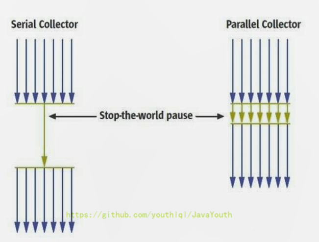

1.  **串行回收**指的是在同一时间段内只允许有一个CPU用于执行垃圾回收操作，此时工作线程被暂停，直至垃圾收集工作结束。
    1.  在诸如单CPU处理器或者较小的应用内存等硬件平台不是特别优越的场合，串行回收器的性能表现可以超过并行回收器和并发回收器。所以，串行回收默认被应用在客户端的Client模式下的JVM中
    2.  在并发能力比较强的CPU上，并行回收器产生的停顿时间要短于串行回收器
2.  和串行回收相反，**并行收集**可以运用多个CPU同时执行垃圾回收，因此提升了应用的吞吐量，不过并行回收仍然与串行回收一样，**采用独占式**，使用了“Stop-the-World”机制。


**按照工作模式分，可以分为并发式垃圾回收器和独占式垃圾回收器。**

1.  并发式垃圾回收器与应用程序线程交替工作，以尽可能减少应用程序的停顿时间。
2.  独占式垃圾回收器（Stop the World）一旦运行，就停止应用程序中的所有用户线程，直到垃圾回收过程完全结束。

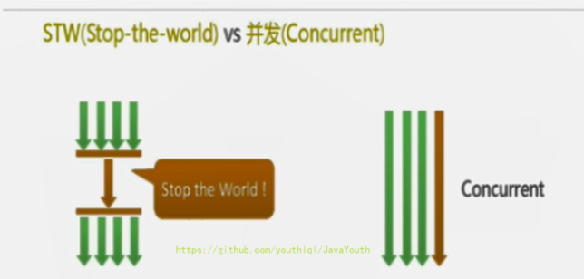


**按碎片处理方式分，可分为压缩式垃圾回收器和非压缩式垃圾回收器。**

1.  压缩式垃圾回收器会在回收完成后，对存活对象进行压缩整理，消除回收后的碎片。再分配对象空间使用指针碰撞
2.  非压缩式的垃圾回收器不进行这步操作，分配对象空间使用空闲列表


**按工作的内存区间分，又可分为年轻代垃圾回收器和老年代垃圾回收器。**


### 评估 GC 的性能指标

**指标**

1.  **吞吐量**：运行用户代码的时间占总运行时间的比例（总运行时间 = 程序的运行时间 \+ 内存回收的时间）
2.  **垃圾收集开销**：吞吐量的补数，垃圾收集所用时间与总运行时间的比例。
3.  **暂停时间**：执行垃圾收集时，程序的工作线程被暂停的时间。
4.  **收集频率**：相对于应用程序的执行，收集操作发生的频率。
5.  **内存占用**：Java堆区所占的内存大小。
6.  **快速**：一个对象从诞生到被回收所经历的时间。


1.  吞吐量、暂停时间、内存占用这三者共同构成一个“不可能三角”。三者总体的表现会随着技术进步而越来越好。一款优秀的收集器通常最多同时满足其中的两项。
2.  这三项里，暂停时间的重要性日益凸显。因为随着硬件发展，内存占用多些越来越能容忍，硬件性能的提升也有助于降低收集器运行时对应用程序的影响，即提高了吞吐量。而内存的扩大，对延迟反而带来负面效果。
3.  简单来说，主要抓住两点：
    *   吞吐量
    *   暂停时间
    
    

**吞吐量（throughput）**

1. 吞吐量就是CPU用于运行用户代码的时间与CPU总消耗时间的比值，即吞吐量=运行用户代码时间 /（运行用户代码时间+垃圾收集时间）

   比如：虚拟机总共运行了100分钟，其中垃圾收集花掉1分钟，那吞吐量就是99%。

2. 这种情况下，应用程序能容忍较高的暂停时间，因此，高吞吐量的应用程序有更长的时间基准，快速响应是不必考虑的

3. 吞吐量优先，意味着在单位时间内，STW的时间最短：0.2+0.2=0.4

4. **高吞吐量gc主要适合在后台运算而不需要太多交互的任务**


**暂停时间（pause time）**

1. “暂停时间”是指一个时间段内应用程序线程暂停，让GC线程执行的状态。

   例如，GC期间100毫秒的暂停时间意味着在这100毫秒期间内没有应用程序线程是活动的
2.  暂停时间优先，意味着尽可能让单次STW的时间最短：0.1+0.1 + 0.1+ 0.1+ 0.1=0.5，但是总的GC时间可能会长

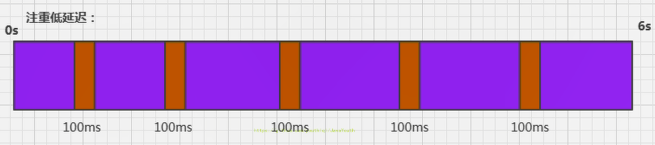


**吞吐量 vs 暂停时间**

1.  **高吞吐量较好**因为这会让应用程序的最终用户感觉只有应用程序线程在做“生产性”工作。直觉上，吞吐量越高程序运行越快。
  
2.  低暂停时间（低延迟）较好，是从最终用户的角度来看，不管是GC还是其他原因导致一个应用被挂起始终是不好的。这取决于应用程序的类型，有时候甚至短暂的200毫秒暂停都可能打断终端用户体验。因此，具有较低的暂停时间是非常重要的，特别是对于一个交互式应用程序（就是和用户交互比较多的场景）。
  
3.  不幸的是”高吞吐量”和”低暂停时间”是一对相互竞争的目标（矛盾）。
  
    *   因为如果选择以吞吐量优先，那么**必然需要降低内存回收的执行频率，总的暂停时间会减少，但是会导致GC需要更长的暂停时间来执行内存回收。**
    *   相反的，如果选择以低延迟优先为原则，那么为了**减少每次GC时的暂停时间，也只能频繁地执行内存回收，但这又引起了年轻代内存的缩减和导致程序吞吐量的下降。**
4.  在设计（或使用）GC算法时，我们必须确定我们的目标：一个GC算法只可能针对两个目标之一（即只专注于较大吞吐量或最小暂停时间），或尝试找到一个二者的折衷。
  
5.  现在标准：**在最大吞吐量优先的情况下，降低停顿时间**


### 垃圾回收器概述

1.  垃圾收集机制是Java的招牌能力，极大地提高了开发效率。这当然也是面试的热点。
3.  那么，Java常见的垃圾收集器有哪些？

#### 垃圾收集器发展史

有了虚拟机，就一定需要收集垃圾的机制，这就是Garbage Collection，对应的产品我们称为Garbage Collector。

1.  1999年随JDK1.3.1一起来的是串行方式的Serial GC，它是第一款GC。ParNew垃圾收集器是Serial收集器的多线程版本
2.  2002年2月26日，Parallel GC和Concurrent Mark Sweep GC跟随JDK1.4.2一起发布·
3.  Parallel GC在JDK6之后成为HotSpot默认GC。
4.  2012年，在JDK1.7u4版本中，G1可用。
5.  2017年，JDK9中G1变成默认的垃圾收集器，以替代CMS。
6.  2018年3月，JDK10中G1垃圾回收器的并行完整垃圾回收，实现并行性来改善最坏情况下的延迟。
7.  2018年9月，JDK11发布。引入Epsilon 垃圾回收器，又被称为 "No-Op(无操作)“ 回收器。同时，引入ZGC：可伸缩的低延迟垃圾回收器（Experimental）
8.  2019年3月，JDK12发布。增强G1，自动返回未用堆内存给操作系统。同时，引入Shenandoah GC：低停顿时间的GC（Experimental）。
9.  2019年9月，JDK13发布。增强ZGC，自动返回未用堆内存给操作系统。
10.  2020年3月，JDK14发布。删除CMS垃圾回收器。扩展ZGC在macOS和Windows上的应用


#### 7款经典的垃圾收集器

1.  串行回收器：Serial、Serial old
2.  并行回收器：ParNew、Parallel Scavenge、Parallel old （会有STW）
3.  并发回收器：CMS、G1  (几乎没有STW)

**7款经典回收器与垃圾分代之间的关系**

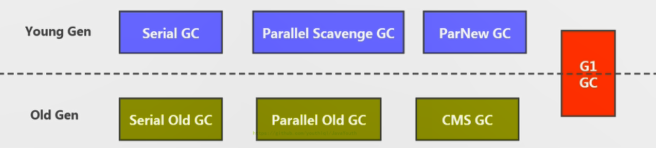

1.  新生代收集器：Serial、ParNew、Parallel Scavenge；
  
2.  老年代收集器：Serial old、Parallel old、CMS；
  
3.  整堆收集器：G1；


#### 垃圾收集器的组合关系

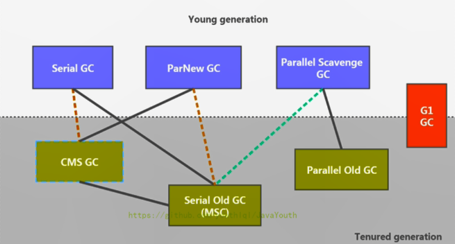


1.  两个收集器间有连线，表明它们可以搭配使用：
    *   **Serial-Serial old**
    *   Serial-CMS    （JDK9废弃）
    *   ParNew-Serial Old （JDK9废弃）
    *   **ParNew-CMS**
    *   Parallel Scavenge-Serial Old  （预计废弃）
    *   **Parallel Scavenge-Parallel Old**
    *   **G1**
2.  其中Serial Old作为CMS出现"Concurrent Mode Failure"失败的后备预案。
3.  （红色虚线）由于维护和兼容性测试的成本，在JDK 8时将Serial+CMS、ParNew+Serial Old这两个组合声明为废弃（JEP173），并在JDK9中完全取消了这些组合的支持（JEP214），即：移除。
4.  （绿色虚线）JDK14中：弃用Parallel Scavenge和Serial Old GC组合（JEP366）
5.  （青色虚线）JDK14中：删除CMS垃圾回收器（JEP363）


#### 默认垃圾收集器

1.  -XX:+PrintCommandLineFlags：查看命令行相关参数（包含使用的垃圾收集器）
2.  使用命令行指令：jinfo -flag 相关垃圾回收器参数 进程ID

**在 JDK 8 下，设置 JVM 参数**

-XX:+PrintCommandLineFlags

程序打印输出：-XX:+UseParallelGC 表示使用使用 **ParallelGC** ，ParallelGC 默认和 **Parallel Old** 绑定使用

```java
-XX:InitialHeapSize=266620736 -XX:MaxHeapSize=4265931776 -XX:+PrintCommandLineFlags -XX:+UseCompressedClassPointers -XX:+UseCompressedOops -XX:-UseLargePagesIndividualAllocation -XX:+UseParallelGC 
```


**通过命令行指令查看**

命令行命令

```java
jps
jinfo -flag UseParallelGC 进程id
jinfo -flag UseParallelOldGC 进程id
```


JDK 8 中默认使用 ParallelGC 和 ParallelOldGC 的组合

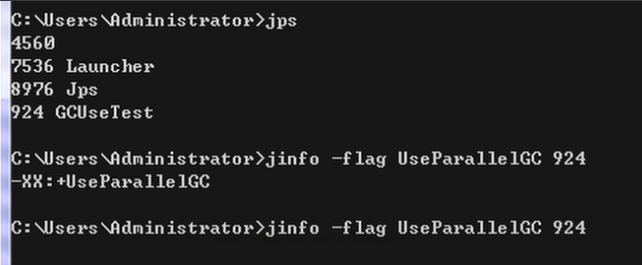

**JDK9**

**G1**

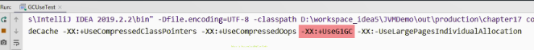


### Serial 回收器：串行回收

**Serial 回收器：串行回收**

1.  Serial收集器是最基本、历史最悠久的垃圾收集器了。JDK1.3之前回收新生代唯一的选择。
  
2.  Serial收集器作为HotSpot中Client模式下的默认新生代垃圾收集器。**在单核CPU下效率更高。**
  
3.  **Serial收集器采用复制算法、串行回收和"Stop-the-World"机制的方式执行内存回收。**
  
4.  除了年轻代之外，Serial收集器还提供用于执行老年代垃圾收集的Serial Old收集器。**Serial old收集器同样也采用了串行回收和"Stop the World"机制，只不过内存回收算法使用的是标记-压缩算法。** 
  
5.  Serial Old是运行在Client模式下默认的老年代的垃圾回收器，Serial Old在Server模式下主要有两个用途：①与新生代的Parallel Scavenge配合使用②作为老年代CMS收集器的后备垃圾收集方案


这个收集器是一个单线程的收集器，“单线程”的意义：它只会使用一个CPU（串行）或一条收集线程去完成垃圾收集工作。更重要的是在它进行垃圾收集时，**必须暂停其他所有的工作线程，直到它收集结束**（Stop The World）

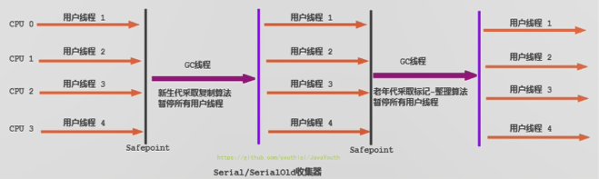


**Serial 回收器的优势**

1.  优势：**简单而高效**（与其他收集器的单线程比），对于限定单个CPU的环境来说，Serial收集器由于没有线程交互的开销，专心做垃圾收集自然可以获得最高的单线程收集效率。运行在Client模式下的虚拟机是个不错的选择。
3.  在用户的桌面应用场景中，可用内存一般不大（几十MB至一两百MB），可以在较短时间内完成垃圾收集（几十ms至一百多ms），只要不频繁发生，使用串行回收器是可以接受的。
3. 在HotSpot虚拟机中，使用-XX:+UseSerialGC参数可以指定年轻代和老年代都使用串行收集器。

   等价于新生代用Serial GC，且老年代用Serial Old GC


### ParNew 回收器：并行回收

1. **与CMS垃圾回收器组合使用。**

2. 如果说Serial GC是年轻代中的单线程垃圾收集器，那么**ParNew收集器则是Serial收集器的多线程版本。**

   Par是Parallel的缩写，New：只能处理新生代

3. ParNew 收集器除了采用**并行回收**的方式执行内存回收外，两款垃圾收集器之间几乎没有任何区别。ParNew收集器在年轻代中同样也是采用**复制算法、"Stop-the-World"机制**。

4. ParNew 是很多JVM运行在Server模式下新生代的默认垃圾收集器。

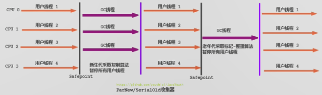

1.  对于新生代，回收次数频繁，使用并行方式高效。
2.  对于老年代，回收次数少，使用串行方式节省资源。（CPU并行需要切换线程，串行可以省去切换线程的资源）


**ParNew 回收器与 Serial 回收器比较**

Q：由于ParNew收集器基于并行回收，那么是否可以断定ParNew收集器的回收效率在任何场景下都会比Serial收集器更高效？

A：**不能**

1.  ParNew收集器运行在多CPU的环境下，由于可以充分利用多CPU、多核心等物理硬件资源优势，可以更快速地完成垃圾收集，提升程序的吞吐量。
2.  但是在单个CPU的环境下，ParNew收集器不比Serial收集器更高效。虽然Serial收集器是基于串行回收，但是由于CPU不需要频繁地做任务切换，因此可以有效避免多线程交互过程中产生的一些额外开销。
3.  除Serial外，目前只有ParNew GC能与CMS收集器配合工作


**设置 ParNew 垃圾回收器**

1.  在程序中，开发人员可以通过选项"-XX:+UseParNewGC"手动指定使用ParNew收集器执行内存回收任务。它表示年轻代使用并行收集器，不影响老年代。
  
2.  -XX:ParallelGCThreads限制线程数量，默认开启和CPU数据相同的线程数。


### Parallel 回收器：吞吐量优先

**Parallel Scavenge 回收器：吞吐量优先**

1.  HotSpot的年轻代中除了拥有ParNew收集器是基于并行回收的以外，**Parallel Scavenge收集器同样也采用了复制算法、并行回收和"Stop the World"机制。**
  
2.  那么Parallel收集器的出现是否多此一举？
  
    *   和ParNew收集器不同，Parallel Scavenge收集器的目标则是达到一个**可控制的吞吐量**（Throughput），它也被称为吞吐量优先的垃圾收集器。
    *   自适应调节策略也是Parallel Scavenge与ParNew一个重要区别。（动态调整内存分配情况，以达到一个最优的吞吐量或低延迟）
3.  高吞吐量则可以高效率地利用CPU时间，尽快完成程序的运算任务，**适合多CPU，又吞吐量优先，适合在后台运算而不需要太多交互的任务**。因此，常见在服务器环境中使用。例如，那些执行批量处理、订单处理、工资支付、科学计算的应用程序。
  
4.  Parallel收集器在JDK1.6时提供了用于执行老年代垃圾收集的Parallel Old收集器，用来代替老年代的Serial Old收集器。
  
5.  **Parallel Old收集器采用了标记-压缩算法，但同样也是基于并行回收和"Stop-the-World"机制。**

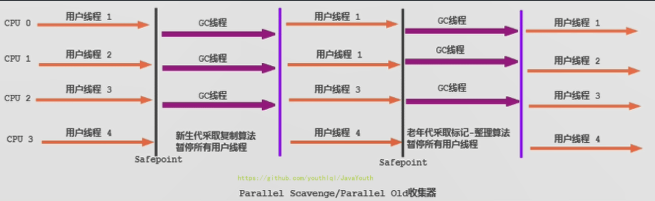

1.  在程序吞吐量优先的应用场景中，Parallel收集器和Parallel Old收集器的组合，在server模式下的内存回收性能很不错。
2.  **在Java8中，默认是此垃圾收集器。**


**Parallel Scavenge 回收器参数设置**

1. -XX:+UseParallelGC 手动指定年轻代使用Parallel并行收集器执行内存回收任务。

2. -XX:+UseParallelOldGC：手动指定老年代都是使用并行回收收集器。
- 分别适用于新生代和老年代
  
- 上面两个参数分别适用于新生代和老年代。默认jdk8是开启的。默认开启一个，另一个也会被开启。（互相激活）
  
3. -XX:ParallelGCThreads：设置年轻代并行收集器的线程数。一般地，最好与CPU数量相等，以避免过多的线程数影响垃圾收集性能。

   1.  在默认情况下，当CPU数量小于8个，ParallelGCThreads的值等于CPU数量。
     
   2. 当CPU数量大于8个，ParallelGCThreads的值等于3+\[5*CPU_Count\]/8\]

4. -XX:MaxGCPauseMillis 设置垃圾收集器最大停顿时间（即STW的时间）。单位是毫秒。
   1. 为了尽可能地把停顿时间控制在XX:MaxGCPauseMillis 以内，收集器在工作时会调整Java堆大小或者其他一些参数。
   2. 对于用户来讲，停顿时间越短体验越好。但是在服务器端，我们注重高并发，整体的吞吐量。所以服务器端适合Parallel，进行控制。
   3. 该参数使用需谨慎。

5. -XX:GCTimeRatio垃圾收集时间占总时间的比例，即等于 1 / (N+1) ，用于衡量吞吐量的大小。
   1. 取值范围(0, 100)。默认值99，也就是垃圾回收时间占比不超过1。

   2. 与前一个-XX:MaxGCPauseMillis参数有一定矛盾性，STW暂停时间越长，Radio参数就容易超过设定的比例。


6. -XX:+UseAdaptiveSizePolicy 设置Parallel Scavenge收集器具有**自适应调节策略**
   1. 在这种模式下，年轻代的大小、Eden和Survivor的比例、晋升老年代的对象年龄等参数会被自动调整，已达到在堆大小、吞吐量和停顿时间之间的平衡点。

   2. 在手动调优比较困难的场合，可以直接使用这种自适应的方式，仅指定虚拟机的最大堆、目标的吞吐量（GCTimeRatio）和停顿时间（MaxGCPauseMillis），让虚拟机自己完成调优工作。


### CMS 回收器：低延迟

#### 概述

1.  在JDK1.5时期，Hotspot推出了一款在**强交互应用中（就是和用户打交道的引用）**几乎可认为有划时代意义的垃圾收集器：CMS（Concurrent-Mark-Sweep）收集器，**这款收集器是HotSpot虚拟机中第一款真正意义上的并发收集器，它第一次实现了让垃圾收集线程与用户线程同时工作。**
2. CMS收集器的关注点是尽可能缩短垃圾收集时用户线程的停顿时间。**停顿时间越短（低延迟）就越适合与用户交互的程序**，良好的响应速度能提升用户体验。

   目前很大一部分的Java应用集中在互联网站或者B/S系统的服务端上，这类应用尤其重视服务的响应速度，希望系统停顿时间最短，以给用户带来较好的体验。CMS收集器就非常符合这类应用的需求。
4.  CMS的垃圾收集算法采用**标记-清除算法**，并且也会**"Stop-the-World"**
5.  不幸的是，CMS作为老年代的收集器，却无法与JDK1.4.0中已经存在的新生代收集器Parallel Scavenge配合工作（因为实现的框架不一样，没办法兼容使用），所以在JDK1.5中使用CMS来收集老年代的时候，新生代只能选择ParNew或者Serial收集器中的一个。
6.  在G1出现之前，CMS使用还是非常广泛的。一直到今天，仍然有很多系统使用CMS GC。

#### 工作原理

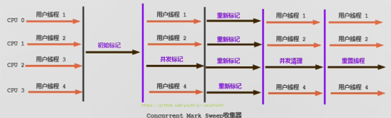

CMS整个过程比之前的收集器要复杂，整个过程分为4个主要阶段，即初始标记阶段、并发标记阶段、重新标记阶段和并发清除阶段。(涉及STW的阶段主要是：初始标记 和 重新标记)

1.  **初始标记（Initial-Mark）阶段**：在这个阶段中，程序中所有的工作线程都将会因为“Stop-the-World”机制而出现短暂的暂停，**这个阶段的主要任务仅仅只是标记出GC Roots能直接关联到的对象**。一旦标记完成之后就会恢复之前被暂停的所有应用线程。由于直接关联对象比较小，所以这里的**速度非常快**。
2.  **并发标记（Concurrent-Mark）阶段**：**使用三色标记算法从直接可达对象进行搜索并标记，，这个过程耗时较长但是**不需要停顿用户线程**，**可以与垃圾收集线程一起并发运行**。
3.  **重新标记（Remark）阶段**：由于在并发标记阶段中，程序的工作线程会和垃圾收集线程同时运行或者交叉运行，**因此为了修正并发标记期间，因用户程序继续运作而导致标记产生变动的那一部分对象的标记记录，**这个阶段的停顿时间通常会比初始标记阶段稍长一些，并且也会导致**“Stop-the-World”**的发生，但也远比并发标记 阶段的时间短。
4.  **并发清除（Concurrent-Sweep）阶段**：此阶段清理删除掉标记阶段判断的已经死亡的对象，释放内存空间。**由于不需要移动存活对象，所以这个阶段也是可以与用户线程同时并发的**


#### 三色标记算法

黑色：已经搜索完成
灰色：当前或准备搜索
白色：未被标记的对象（垃圾）

思想：**首先会把GCRoots关联的对象标记为灰色，然后搜索可触及对象，变为灰色，原先对象搜索完了，就为黑色，同理再搜索灰色对象。**

**漏标问题**：同时满足：①黑色对象指向了白色对象 ②.灰色对象取消对这个白色对象的引用

**解决漏标(重新标记阶段)：**

- CMS的解决：`增量更新`

  增量更新破坏的是第一个条件,我们在这个**黑色对象增加了对白色对象的引用之后,将它的这个引用,记录下来,在最后标记的时候,再以这个黑色对象为根,对它的引用进行重新扫描.**

   这样有一个缺点,就是**会重新扫描这个黑色对象的所有引用,比较浪费时间**

- G1的解决：`原始快照`(Snapshot-At-The-Beginning(SATB))

  原始快照破坏的是第二个条件,我们在这个**灰色对象取消对白色对象的引用之前,将这个引用记录下来,在最重新标记的时候,再以这个引用指向的白色对象为根,对它的引用进行扫描**

  这样做的缺点就是,**这个白色对象有可能并没有黑色对象去引用它,但是它还是被变灰了,就会导致它和它的引用,本来应该被垃圾回收掉,但是此次GC存活了下来,就是所谓的浮动垃圾**.其实这样是比较可以忍受的,只是让它多存活了一次GC而已,浪费一点点空间,但是会比增量更新更省时间.
  

#### 分析

1.  尽管CMS收集器采用的是并发回收（非独占式），**但是在其初始化标记和再次标记这两个阶段中仍然需要执行“Stop-the-World”机制**暂停程序中的工作线程，不过暂停时间并不会太长，因此可以说明目前所有的垃圾收集器都做不到完全不需要“Stop-the-World”，只是尽可能地缩短暂停时间。
2.  **由于最耗费时间的并发标记与并发清除阶段都不需要暂停工作，所以整体的回收是低停顿的**。
3.  另外，由于在垃圾收集阶段用户线程没有中断，所以在CMS回收过程中，还应该确保应用程序用户线程有足够的内存可用。因此，CMS收集器不能像其他收集器那样等到老年代几乎完全被填满了再进行收集，**而是当堆内存使用率达到某一阈值时，便开始进行回收**，以确保应用程序在CMS工作过程中依然有足够的空间支持应用程序运行。**要是CMS运行期间预留的内存无法满足程序需要，就会出现一次“Concurrent Mode Failure” 失败，**这时虚拟机将启动后备预案：**临时启用Serial old GC来重新进行Full GC**，这样停顿时间就很长了。
4.  CMS收集器的垃圾收集算法采用的是**标记清除算法**，这意味着每次执行完内存回收后，由于被执行内存回收的无用对象所占用的内存空间极有可能是不连续的一些内存块，**不可避免地将会产生一些内存碎片**。那么CMS在为新对象分配内存空间时，将无法使用指针碰撞（Bump the Pointer）技术，而只能够选择空闲列表（Free List）执行内存分配。

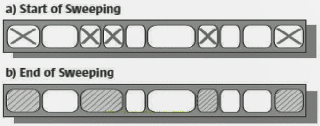


**为什么 CMS 不采用标记-压缩算法呢？**

答案其实很简答，因为当**并发清除**的时候，用Compact整理内存的话，原来的用户线程使用的内存还怎么用呢？要保证用户线程能继续执行，前提的它运行的资源不受影响嘛。Mark Compact更适合“stop the world”这种场景下使用


#### 优点与缺点

**优点：**

1.  并发收集
2.  低延迟

**缺点：**

1.  **会产生内存碎片**，导致并发清除后，用户线程可用的空间不足。在无法分配大对象的情况下，不得不提前触发Full GC。
2.  **CMS收集器对CPU资源非常敏感**。在并发阶段，它虽然不会导致用户停顿，但是会因为占用了一部分线程而导致应用程序变慢，总吞吐量会降低。
3.  **CMS收集器无法处理浮动垃圾**。可能出现“Concurrent Mode Failure"失败而导致另一次Full GC的产生。在并发标记阶段由于程序的工作线程和垃圾收集线程是同时运行或者交叉运行的，**那么在并发标记阶段如果产生新的垃圾对象，CMS在之前已经进行了标记，最终会导致这些新产生的垃圾对象没有被及时回收，**从而只能在下一次执行GC时释放这些之前未被回收的内存空间。


#### 参数配置

- **-XX:+UseConcMarkSweepGC**：手动指定使用CMS收集器执行内存回收任务。

  开启该参数后会自动将-XX:+UseParNewGC打开。即：ParNew（Young区）+CMS（Old区）+Serial Old（Old区备选方案）的组合。

- **-XX:CMSInitiatingOccupanyFraction**：设置堆内存使用率的阈值，一旦达到该阈值，便开始进行回收。
  - JDK5及以前版本的默认值为68，即当老年代的空间使用率达到68%时，会执行一次CMS回收。JDK6及以上版本默认值为92%
  - 如果内存增长缓慢，则可以设置一个稍大的值，大的阀值可以有效降低CMS的触发频率，减少老年代回收的次数可以较为明显地改善应用程序性能。反之，如果应用程序内存使用率增长很快，则应该降低这个阈值，以避免频繁触发老年代串行收集器。因此通过该选项便可以有效降低Full GC的执行次数。


- **-XX:+UseCMSCompactAtFullCollection**：用于指定在执行完Full GC后对内存空间进行压缩整理，以此避免内存碎片的产生。不过由于内存压缩整理过程无法并发执行，所带来的问题就是停顿时间变得更长了。

- **-XX:CMSFullGCsBeforeCompaction**：设置在执行多少次Full GC后对内存空间进行压缩整理。

- **-XX:ParallelCMSThreads**：设置CMS的线程数量。

  CMS默认启动的线程数是 (ParallelGCThreads + 3) / 4，ParallelGCThreads是年轻代并行收集器的线程数，可以当做是 CPU 最大支持的线程数。当CPU资源比较紧张时，受到CMS收集器线程的影响，应用程序的性能在垃圾回收阶段可能会非常糟糕。


#### 小结

HotSpot有这么多的垃圾回收器，那么如果有人问，Serial GC、Parallel GC、Concurrent Mark Sweep GC这三个GC有什么不同呢？

1.  如果你想要最小化地使用内存和并行开销，请选Serial GC；
2.  如果你想要最大化应用程序的吞吐量，请选Parallel GC；
3.  如果你想要最小化GC的中断或停顿时间，请选CMS GC。


### G1 回收器：低延迟

#### 概述

**既然我们已经有了前面几个强大的 GC ，为什么还要发布 Garbage First（G1）GC？**

1.  原因就在于应用程序所应对的业务越来越庞大、复杂，用户越来越多，没有GC就不能保证应用程序正常进行，而经常造成STW 的GC又跟不上实际的需求，所以才会不断地尝试对GC进行优化。
2.  G1（Garbage-First）垃圾回收器是在Java7 update4之后引入的一个新的垃圾回收器，是当今收集器技术发展的最前沿成果之一。
3.  与此同时，**为了适应现在不断扩大的内存和不断增加的处理器数量**，**进一步降低暂停时间（pause time），同时兼顾良好的吞吐量。**
4.  官方给G1设定的目标是在延迟可控的情况下获得尽可能高的吞 吐量，所以才担当起“全功能收集器”的重任与期望。


**为什么名字叫Garbage First(G1)呢？**

1.  因为G1是一个并行回收器，它把堆内存分割为很多不相关的区域（Region）（物理上不连续的）。使用不同的Region来表示Eden、幸存者0区，幸存者1区，老年代等。
2.  G1 GC有计划地避免在整个Java堆中进行全区域的垃圾收集。G1跟踪各个Region里面的垃圾堆积的价值大小（回收所获得的空间大小以及回收所需时间的经验值），在后台维护一个优先列表，**每次根据允许的收集时间，优先回收价值最大的Region。**
3.  由于这种方式的侧重点在于回收垃圾最大量的区间（Region），所以我们给G1一个名字：垃圾优先（Garbage First）。
4.  G1（Garbage-First）是一款面向服务端应用的垃圾收集器，主要针对配备多核CPU及大容量内存的机器，以极高概率满足GC停顿时间的同时，还兼具高吞吐量的性能特征。
5.  在JDK1.7版本正式启用，移除了Experimental的标识，**是JDK9以后的默认垃圾回收器**，取代了CMS回收器以及Parallel+Parallel Old组合。被Oracle官方称为**“全功能的垃圾收集器”**。
6.  与此同时，CMS已经在JDK9中被标记为废弃（deprecated）。**G1在JDK8中还不是默认的垃圾回收器**，需要使用-XX:+UseG1GC来启用。


#### 优点

与其他GC收集器相比，G1使用了全新的分区算法，其特点如下所示：

1.  **并行与并发兼备**
    *   并行性：G1在回收期间，可以有多个GC线程同时工作，有效利用多核计算能力。此时用户线程STW
    *   并发性：G1拥有与应用程序交替执行的能力，部分工作可以和应用程序同时执行，因此，一般来说，不会在整个回收阶段发生完全阻塞应用程序的情况
2.  **分代收集**
    *   从分代上看，G1依然属于分代型垃圾回收器，它会区分年轻代和老年代，年轻代依然有Eden区和Survivor区。但从堆的结构上看，它不要求整个Eden区、年轻代或者老年代都是连续的，也不再坚持固定大小和固定数量。
    *   **将堆空间分为若干个区域（Region），这些区域中包含了逻辑上的年轻代和老年代。**
    *   和之前的各类回收器不同，它同时兼顾年轻代和老年代。对比其他回收器，或者工作在年轻代，或者工作在老年代；
3.  **空间整合**
    - CMS：“标记-清除”算法、内存碎片、若干次GC后进行一次碎片整理
    - G1将内存划分为一个个的region。内存的回收是以region作为基本单位的。**Region之间是复制算法，但整体上实际可看作是标记-压缩（Mark-Compact）算法**，两种算法都可以避免内存碎片。这种特性有利于程序长时间运行，分配大对象时不会因为无法找到连续内存空间而提前触发下一次GC。尤其是当**Java堆非常大的时候，G1的优势更加明显。**


G1的分代，已经不是下面这样的了

<center>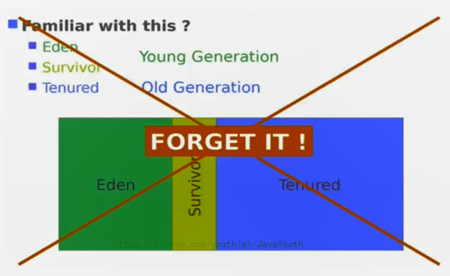</center>

G1的分区是这样的一个区域

<center>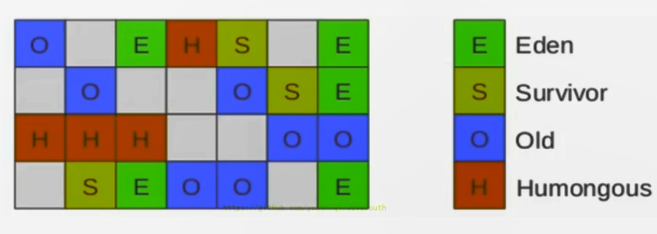</center>


#### 可预测的停顿时间模型(软实时soft real-time)

这是G1相对于CMS的另一大优势，G1除了追求低停顿外，还能建立可预测的停顿时间模型，**能让使用者明确指定最大GC停顿时间指标，以及在一个长度为M毫秒的时间片段内，消耗在垃圾收集上的时间不得超过N毫秒。**

1.  由于分区的原因，G1可以只选取部分区域进行内存回收，这样缩小了回收的范围，因此对于全局停顿情况的发生也能得到较好的控制。
2.  G1跟踪各个Region里面的垃圾堆积的价值大小（回收所获得的空间大小以及回收所需时间的经验值），在后台维护一个优先列表，**每次根据允许的收集时间，优先回收价值最大的Region**。保证了G1收集器在有限的时间内可以获取尽可能高的收集效率。
3.  相比于CMS GC，G1未必能做到CMS
4.  在最好情况下的延时停顿，但是最差情况要好很多。


#### 缺点

1.  相较于CMS，G1还不具备全方位、压倒性优势。比如在用户程序运行过程中，G1无论是为了垃圾收集产生的内存占用（Footprint）还是程序运行时的额外执行负载（overload）都要比CMS要高。
2.  从经验上来说，在小内存应用上CMS的表现大概率会优于G1，而G1在**大内存**应用上则发挥其优势。平衡点在6-8GB之间。


#### 适用场景

1.  面向服务端应用，针对具有**大内存、多处理器**的机器。（在普通大小的堆里表现并不惊喜）
2.  最主要的应用是需要低GC延迟，并具有大堆的应用程序提供解决方案；
3.  如：在堆大小约6GB或更大时，可预测的暂停时间可以低于0.5秒；（G1通过每次只清理一部分而不是全部的Region的增量式清理来保证每次GC停顿时间不会过长）。
4.  用来替换掉JDK1.5中的CMS收集器；在下面的情况时，使用G1可能比CMS好：
    *   **超过50%的Java堆被活动数据占用；**
    *   **对象分配频率或年代提升频率变化很大；**
    *   **GC停顿时间过长（长于0.5至1秒）**
5.  HotSpot垃圾收集器里，除了G1以外，其他的垃圾收集器均使用内置的JVM线程执行GC的多线程操作，而G1 GC可以采用应用线程承担后台运行的GC工作，即当JVM的GC线程处理速度慢时，系统会调用应用程序线程帮助加速垃圾回收过程。


#### Region介绍

1.  使用G1收集器时，它将整个Java堆划分成约2048个大小相同的独立Region块，每个Region块大小根据堆空间的实际大小而定，整体被控制在1MB到32MB之间，且为2的N次幂，即1MB，2MB，4MB，8MB，16MB，32MB。可以通过
  
2.  XX:G1HeapRegionSize设定。**所有的Region大小相同，且在JVM生命周期内不会被改变。**
  
3.  虽然还保留有新生代和老年代的概念，但新生代和老年代不再是物理隔离的了，它们都是一部分Region（不需要连续）的集合。通过Region的动态分配方式实现逻辑上的连续。
  
4.  **一个Region有可能属于Eden，Survivor或者Old/Tenured内存区域。**但是一个Region只可能属于一个角色。图中的E表示该Region属于Eden内存区域，S表示属于Survivor内存区域，O表示属于Old内存区域。图中空白的表示未使用的内存空间。
  
5.  G1垃圾收集器还增加了一种新的内存区域，叫做Humongous内存区域，如图中的H块。**主要用于存储大对象，如果超过0.5个Region，就放到H。**

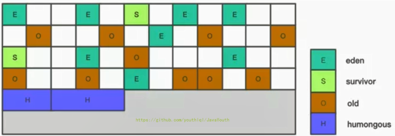


**设置 H 的原因**

对于堆中的大对象，默认直接会被分配到老年代，但是如果**它是一个短期存在的大对象**就会对垃圾收集器造成负面影响。为了解决这个问题，G1划分了一个Humongous区，它用来专门存放大对象。如**果一个H区装不下一个大对象，那么G1会寻找连续的H区来存储**。为了能找到连续的H区，有时候不得不启动Full GC。G1的大多数行为都把H区作为老年代的一部分来看待。


**Region的结构**

Region结构: 每一个Region 包含了5个指针，分别是bottom、previous TAMS(**Top at Mark Start**)、next TAMS、top和end, 其中previous TAMS、next TAMS是前后两次发生并发标记时的位置. 在prevTAMS和nextTAMS以上的对象就是新分配的。

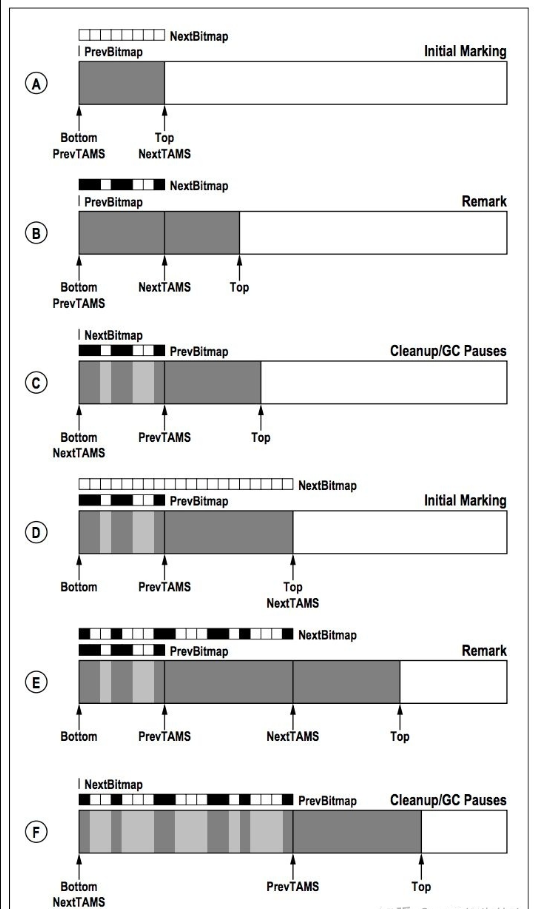

A是初始标记阶段。next TAMS尚未标记任何存活对象，而此时的previous TAMS被初始化为region内存地址起始值，next TAMS被初始化为top。top实际上就是一个region未分配区域和已分配区域的分界点；

B是并发标记之后，进入了再次标记阶段。此时存活对象的扫描已经完成了，因此next bitmap构造好了，代表的是当下状态中region中的内存使用情况。注意的是，此时top已经不再与next TAMS重合了，top和next TAMS之间的就是在前面标记阶段之时，新分配的对象

C代表的是clean up阶段。C和B比起来，next bitmap变成了previous bitmap，而在bitmap中标记为垃圾（也就是白色区域的）的对应的region的区域也被染成了浅灰色。这并不是指垃圾对象已经被清扫了，仅仅是标记出来了。

D代表的是下一个初始标记阶段，该阶段和A类似，next TAMS重新被初始化为top的值；

EF就是BC的重复；


#### G1 垃圾回收流程

G1 GC的垃圾回收过程主要包括如下三个环节：

*   年轻代GC（Minor GC）
*   老年代并发标记过程（Concurrent Marking）
*   混合回收（Mixed GC）
*   （如果需要，单线程、独占式、高强度的Full GC还是继续存在的。它针对GC的评估失败提供了一种失败保护机制，即强力回收。）

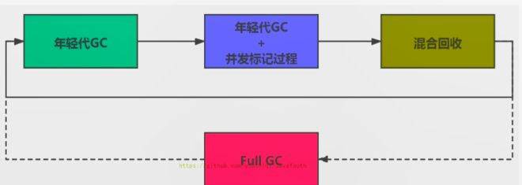

顺时针，Young GC --> Young GC+Concurrent Marking --> Mixed GC顺序，进行垃圾回收


**回收流程**

1.  **当年轻代的Eden区用尽时开始年轻代回收过程；G1的年轻代收集阶段是一个并行的独占式收集器。**在年轻代回收期，G1 GC暂停所有应用程序线程，启动多线程执行年轻代回收。然后从年轻代区间移动存活对象到Survivor区间或者老年区间，也有可能是两个区间都会涉及。
3.  **当堆内存使用达到一定值（默认45%,XX:InitiatingHeapOccupancyPercent）时，开始老年代并发标记过程。**
3.  **标记完成马上开始混合回收过程。**对于一个混合回收期，G1 GC从老年区间移动存活对象到空闲区间，这些空闲区间也就成为了老年代的一部分。和年轻代不同，老年代的G1回收器和其他GC不同，**G1的老年代回收器不需要整个老年代被回收，一次只需要扫描/回收一小部分老年代的Region就可以了**。同时，这个老年代Region是和年轻代一起被回收的。
4.  举个例子：一个Web服务器，Java进程最大堆内存为4G，每分钟响应1500个请求，每45秒钟会新分配大约2G的内存。G1会每45秒钟进行一次年轻代回收，每31个小时整个堆的使用率会达到45%，会开始老年代并发标记过程，标记完成后开始四到五次的混合回收。


##### Remembered Set（记忆集）

解决跨带引用问题：

<center></center>

卡表：**每一个区域都有一个卡表，卡表中的每一位代表一个卡页，当对象进行引用的写操作时，产生一个写屏障暂停中断操作，若为跨带引用，则将该卡页对象的卡表位设为1。当Minor GC时，只需要扫描为1的卡页。**

因为G1垃圾回收器是基于分区模型的，所以每一个Region需要知道有哪些region的引用指向了它，并且这些region是不是本次垃圾回收区域的一部分。因此G1垃圾回收器不能简单的只维护一个卡表(卡表只能简单的知道某块内存区域有没有引用收集区域的对象，但是不能知道到底是谁引用了自己)，所以还要维护一个记忆集。**G1垃圾回收器的记忆集的实现实际上是基于哈希表的，key代表的是其他region的起始地址，value是一集合，里面存放了对应区域的卡表的索引，因此G1的region能够通过记忆集知道，当前是哪个region有引用指向了它，并且能知道是哪块区域存在指针指向。**


##### Minor GC

**当年轻代的Eden区用尽时开始年轻代回收过程；G1的年轻代收集阶段是一个并行的独占式收集器。**在年轻代回收期，G1 GC暂停所有应用程序线程，启动多线程执行年轻代回收。然后从年轻代区间移动存活对象到Survivor区间或者老年区间，也有可能是两个区间都会涉及。

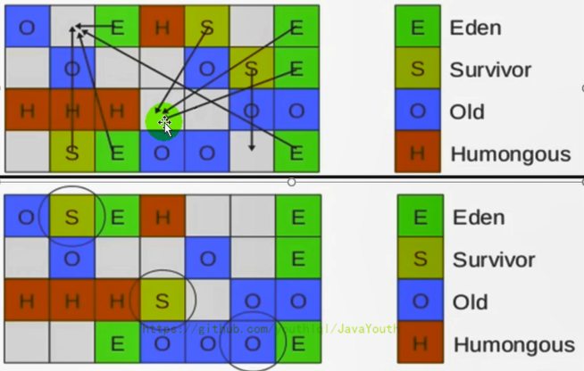

图的大致意思就是：

1. 回收完E和S区，剩余存活的对象会复制到新的S区
2. S区达到一定的阈值可以晋升为O区


**细致过程：**

**然后开始如下回收过程：**

1. 第一阶段，扫描根

    根是指GC Roots，根引用连同RSet记录的外部引用作为扫描存活对象的入口。
2. 第二阶段，更新RSet
3. 第三阶段，处理RSet

    识别被老年代对象指向的Eden中的对象，这些被指向的Eden中的对象被认为是存活的对象。
4.  第四阶段，复制对象。
    *   此阶段，对象树被遍历，Eden区内存段中存活的对象会被复制到Survivor区中空的内存分段，Survivor区内存段中存活的对象
    *   如果年龄未达阈值，年龄会加1，达到阀值会被会被复制到Old区中空的内存分段。
    *   如果Survivor空间不够，Eden空间的部分数据会直接晋升到老年代空间。
5. 第五阶段，处理引用

    **处理Soft，Weak，Phantom，Final，JNI Weak 等引用**。最终Eden空间的数据为空，GC停止工作，而目标内存中的对象都是连续存储的，没有碎片，所以复制过程可以达到内存整理的效果，减少碎片。


**备注：**

1.  对于应用程序的引用赋值语句 oldObject.field（这个是老年代）=object（这个是新生代），JVM会在之前和之后执行特殊的操作以在dirty card queue中入队一个保存了对象引用信息的card。在年轻代回收的时候，G1会对Dirty Card Queue中所有的card进行处理，以更新RSet，保证RSet实时准确的反映引用关系。
3.  **那为什么不在引用赋值语句处直接更新RSet呢？**这是为了性能的需要，RSet的处理需要线程同步，开销会很大，使用队列性能会好很多。


##### 并发标记过程

**当堆内存使用达到一定值（默认45%）时，开始老年代并发标记过程。**

1.  **初始标记阶段**：**标记从根节点直接可达的对象。**这个阶段是STW的，并且会触发一次年轻代GC。正是由于该阶段时STW的，所以我们只扫描根节点可达的对象，以节省时间。
2.  **根区域扫描**（Root Region Scanning）：**标记从Survivor区直接可达的老年代区域对象。**这一过程必须在Young GC之前完成，因为Young GC会使用复制算法对Survivor区进行GC。
3. **并发标记**（Concurrent Marking）：

   **使用三色标记算法从直接可达对象进行搜索并标记，会计算每个区域的对象活性，若发现区域中的所有对象都是垃圾，那这个区域会被立即回收。**
4.  **再次标记**（Remark）：**修正并发标记期间，因用户程序继续运作而导致标记产生变动的那一部分对象的标记记录**。是STW的。**G1中采用了比CMS更快的原始快照算法：Snapshot-At-The-Beginning（SATB）。**（见三色标记算法处）
5.  **独占清理**（cleanup，STW）：计**算各个区域的GC回收和存活对象比例，并进行排序，识别可以混合回收的区域。**为下阶段做铺垫。是STW的。这个阶段**并不会实际上去做垃圾的收集**
6.  **并发清理阶段**：**识别并清理完全为垃圾的区域。**


##### Mixed GC

**标记完成马上开始混合回收过程。**

当越来越多的对象晋升到老年代Old Region时，为了避免堆内存被耗尽，虚拟机会触发一个混合的垃圾收集器，即Mixed GC，该算法并不是一个Old GC，除了回收整个Young Region，还会回收一部分的Old Region。这里需要注意：是一部分老年代，而不是全部老年代。可以选择哪些Old Region进行收集，从而可以对垃圾回收的耗时时间进行控制。也要注意的是Mixed GC并不是Full GC。

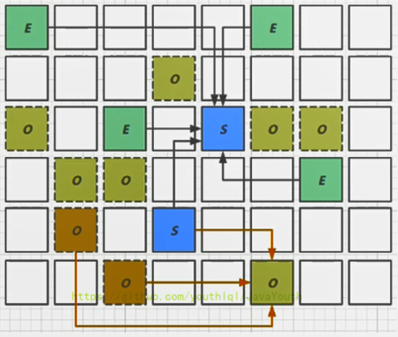


**混合回收的细节**

1.  并发标记结束以后，老年代中百分百为垃圾的内存分段被回收了，部分为垃圾的内存分段被计算了出来。默认情况下，这些**老年代的内存分段会分8次（可以通过-XX:G1MixedGCCountTarget设置）被回收。**【意思就是一个Region会被分为8个内存段】
3.  混合回收的回收集（Collection Set）包括八分之一的老年代内存分段，Eden区内存分段，Survivor区内存分段。**混合回收的算法和年轻代回收的算法完全一样**，只是回收集多了老年代的内存分段。具体过程请参考上面的年轻代回收过程。
4.  由于老年代中的内存分段默认分8次回收，G1会优先回收垃圾多的内存分段。**垃圾占内存分段比例要超过65%，却越高的，越会被先回收。**有一个阈值会决定内存分段是否被回收。XX:G1MixedGCLiveThresholdPercent，默认为65%，意思是垃圾占内存分段比例要达到65%才会被回收。如果垃圾占比太低，意味着存活的对象占比高，在复制的时候会花费更多的时间。
6.  **混合回收并不一定要进行8次。**有一个阈值-XX:G1HeapWastePercent，默认值为10%，意思是允许整个堆内存中有10%的空间被浪费，意味着**如果发现可以回收的垃圾占堆内存的比例低于10%，则不再进行混合回收。**因为GC会花费很多的时间但是回收到的内存却很少。


##### Full GC

1.  G1的初衷就是要避免Full GC的出现。但是如果上述方式不能正常工作，G1会停止应用程序的执行（Stop-The-World），使用**单线程**的内存回收算法进行垃圾回收，性能会非常差，应用程序停顿时间会很长。
  
2.  要避免Full GC的发生，一旦发生Full GC，需要对JVM参数进行调整。什么时候会发生Ful1GC呢？比如**堆内存太小，当G1在复制存活对象的时候没有空的内存分段可用**，则会回退到Full GC，这种情况可以通过增大内存解决。


#### 参数配置

- -XX:+UseG1GC：手动指定使用G1垃圾收集器执行内存回收任务
- -XX:G1HeapRegionSize：设置每个Region的大小。值是2的幂，范围是1MB到32MB之间，目标是根据最小的Java堆大小划分出约2048个区域。默认是堆内存的1/2000。
- -XX:MaxGCPauseMillis：设置期望达到的最大GC停顿时间指标，JVM会尽力实现，但不保证达到。默认值是200ms
- -XX:+ParallelGCThread：设置STW工作线程数的值。最多设置为8
- -XX:ConcGCThreads：设置并发标记的线程数。将n设置为并行垃圾回收线程数（ParallelGcThreads）的1/4左右。
- -XX:InitiatingHeapOccupancyPercent：设置触发并发GC周期的Java堆占用率阈值。超过此值，就触发GC。默认值是45。


#### 常见操作步骤

G1的设计原则就是简化JVM性能调优，开发人员只需要简单的三步即可完成调优：

1.  第一步：开启G1垃圾收集器
2.  第二步：设置堆的最大内存
3.  第三步：设置最大的停顿时间

G1中提供了三种垃圾回收模式：YoungGC、Mixed GC和Full GC，在不同的条件下被触发。


### 垃圾回收器总结

#### 7 种垃圾回收器的比较

截止JDK1.8，一共有7款不同的垃圾收集器。每一款的垃圾收集器都有不同的特点，在具体使用的时候，需要根据具体的情况选用不同的垃圾收集器。

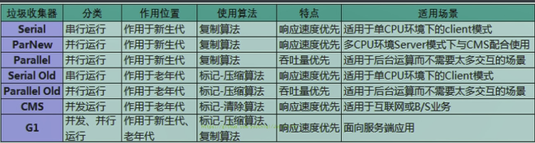


#### 怎么选择垃圾回收器

Java垃圾收集器的配置对于JVM优化来说是一个很重要的选择，选择合适的垃圾收集器可以让JVM的性能有一个很大的提升。怎么选择垃圾收集器？

1.  优先调整堆的大小让JVM自适应完成。
2.  如果内存小于100M，使用串行收集器
3.  如果是单核、单机程序，并且没有停顿时间的要求，串行收集器
4.  如果是多CPU、需要高吞吐量、允许停顿时间超过1秒，选择并行或者JVM自己选择
5.  如果是多CPU、追求低停顿时间，需快速响应（比如延迟不能超过1秒，如互联网应用），使用并发收集器
6.  官方推荐G1，性能高。现在互联网的项目，基本都是使用G1。


最后需要明确一个观点：

1.  没有最好的收集器，更没有万能的收集算法
2.  调优永远是针对特定场景、特定需求，不存在一劳永逸的收集器


### GC 日志分析

#### 常用参数配置

> **GC 日志参数设置**

**通过阅读GC日志，我们可以了解Java虚拟机内存分配与回收策略。**

内存分配与垃圾回收的参数列表

1.  -XX:+PrintGC ：输出GC日志。类似：-verbose:gc
2.  -XX:+PrintGCDetails ：输出GC的详细日志
3.  -XX:+PrintGCTimestamps ：输出GC的时间戳（以基准时间的形式）
4.  -XX:+PrintGCDatestamps ：输出GC的时间戳（以日期的形式，如2013-05-04T21: 53: 59.234 +0800）
5.  -XX:+PrintHeapAtGC ：在进行GC的前后打印出堆的信息
6.  -Xloggc:…/logs/gc.log ：日志文件的输出路径


#### GC 日志说明

1.  “\[GC"和”\[Full GC"说明了这次垃圾收集的停顿类型，如果有"Full"则说明GC发生了"Stop The World"
  
2.  使用Serial收集器在新生代的名字是Default New Generation，因此显示的是"\[DefNew"
  
3.  使用ParNew收集器在新生代的名字会变成"\[ParNew"，意思是"Parallel New Generation"
  
4.  使用Parallel scavenge收集器在新生代的名字是”\[PSYoungGen"
  
5.  老年代的收集和新生代道理一样，名字也是收集器决定的
  
6.  使用G1收集器的话，会显示为"garbage-first heap"
  
7.  Allocation Failure表明本次引起GC的原因是因为在年轻代中没有足够的空间能够存储新的数据了。
  
8.  \[ PSYoungGen: 5986K->696K(8704K) \] 5986K->704K (9216K)
  
    *   中括号内：GC回收前年轻代大小，回收后大小，（年轻代总大小）
    *   括号外：GC回收前年轻代和老年代大小，回收后大小，（年轻代和老年代总大小）
9.  user代表用户态回收耗时，sys内核态回收耗时，real实际耗时。由于多核线程切换的原因，时间总和可能会超过real时间


**Young GC **

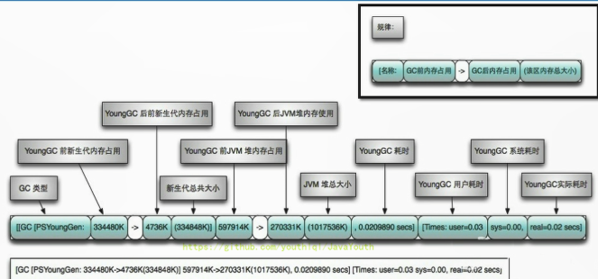


**Full GC **

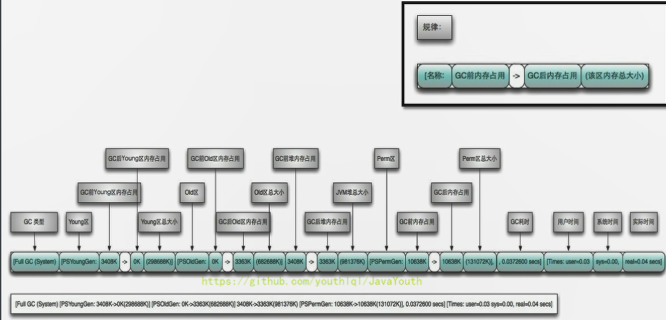


**举例**

```java
/**
 * 在jdk7 和 jdk8中分别执行
 * -verbose:gc -Xms20M -Xmx20M -Xmn10M -XX:+PrintGCDetails -XX:SurvivorRatio=8 -XX:+UseSerialGC
 */
public class GCLogTest1 {
    private static final int _1MB = 1024 * 1024;

    public static void testAllocation() {
        byte[] allocation1, allocation2, allocation3, allocation4;
        allocation1 = new byte[2 * _1MB];
        allocation2 = new byte[2 * _1MB];
        allocation3 = new byte[2 * _1MB];
        allocation4 = new byte[4 * _1MB];
    }

    public static void main(String[] agrs) {
        testAllocation();
    }
}
```


**JDK7 中的情况**

1、首先我们会将3个2M的数组存放到Eden区，然后后面4M的数组来了后，将无法存储，因为Eden区只剩下2M的剩余空间了，那么将会进行一次Young GC操作，将原来Eden区的内容，存放到Survivor区，但是Survivor区也存放不下，那么就会直接晋级存入Old 区

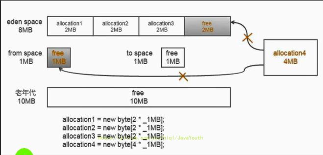

2、然后我们将4M对象存入到Eden区中

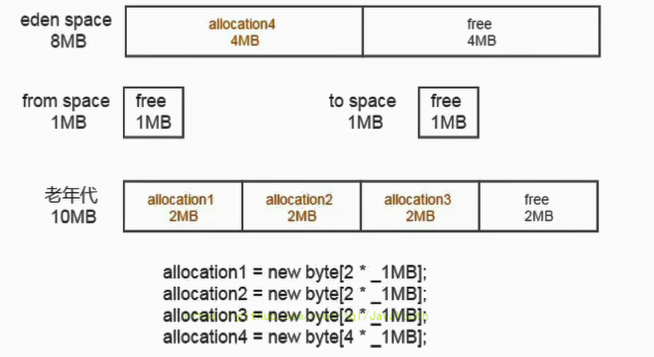

老年代图画的有问题，free应该是4M

**JDK8 中的情况**

```java
com.atguigu.java.GCLogTest1
[GC (Allocation Failure) [DefNew: 6322K->668K(9216K), 0.0034812 secs] 6322K->4764K(19456K), 0.0035169 secs] [Times: user=0.00 sys=0.00, real=0.00 secs] 
Heap
 def new generation   total 9216K, used 7050K [0x00000000fec00000, 0x00000000ff600000, 0x00000000ff600000)
  eden space 8192K,  77% used [0x00000000fec00000, 0x00000000ff23b668, 0x00000000ff400000)
  from space 1024K,  65% used [0x00000000ff500000, 0x00000000ff5a71d8, 0x00000000ff600000)
  to   space 1024K,   0% used [0x00000000ff400000, 0x00000000ff400000, 0x00000000ff500000)
 tenured generation   total 10240K, used 4096K [0x00000000ff600000, 0x0000000100000000, 0x0000000100000000)
   the space 10240K,  40% used [0x00000000ff600000, 0x00000000ffa00020, 0x00000000ffa00200, 0x0000000100000000)
 Metaspace       used 3469K, capacity 4496K, committed 4864K, reserved 1056768K
  class space    used 381K, capacity 388K, committed 512K, reserved 1048576K

Process finished with exit code 0

```

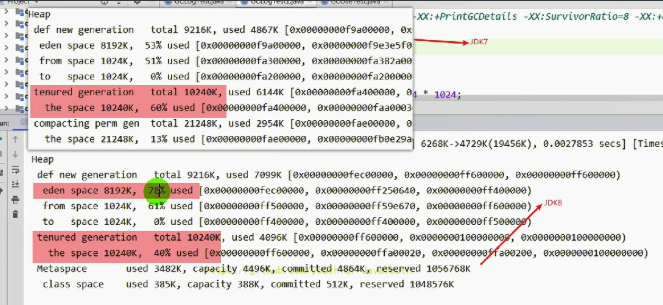

与 JDK7 不同的是，JDK8 直接判定 4M 的数组为大对象，直接怼到老年区去了


#### 常用日志分析工具

**保存日志文件**

**JVM参数**：`-XLoggc:./logs/gc.log`，  ./ 表示当前目录，在 IDEA中程序运行的当前目录是工程的根目录，而不是模块的根目录


可以用一些工具去分析这些GC日志，常用的日志分析工具有：

GCViewer、GCEasy、GCHisto、GCLogViewer、Hpjmeter、garbagecat等


**推荐：GCeasy**

在线分析网址：gceasy.io

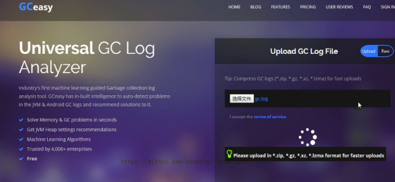


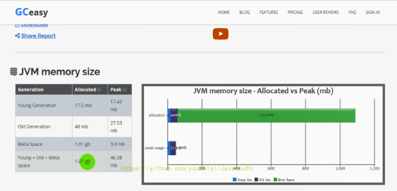


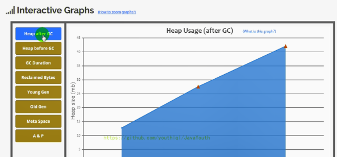


### 垃圾回收器的新发展

#### 垃圾回收器的发展过程

1.  GC仍然处于飞速发展之中，目前的默认选项G1 GC在不断的进行改进，很多我们原来认为的缺点，例如串行的Full GC、Card Table扫描的低效等，都已经被大幅改进，例如，JDK10以后，Fu11GC已经是并行运行，在很多场景下，其表现还略优于ParallelGC的并行Ful1GC实现。
2.  即使是SerialGC，虽然比较古老，但是简单的设计和实现未必就是过时的，它本身的开销，不管是GC相关数据结构的开销，还是线程的开销，都是非常小的，所以随着云计算的兴起，在serverless等新的应用场景下，Serial Gc找到了新的舞台。
3.  比较不幸的是CMS GC，因为其算法的理论缺陷等原因，虽然现在还有非常大的用户群体，但在JDK9中已经被标记为废弃，并在JDK14版本中移除
4.  现在G1回收器已成为默认回收器好几年了。我们还看到了引入了两个新的收集器：ZGC（JDK11出现）和Shenandoah（Open JDK12），其特点：主打低停顿时间


#### Shenandoah GC

**Open JDK12的Shenandoash GC：低停顿时间的GC（实验性）**

1.  Shenandoah无疑是众多GC中最孤独的一个。是**第一款不由Oracle公司团队领导开发的Hotspot垃圾收集器。**不可避免的受到官方的排挤。比如号称openJDK和OracleJDK没有区别的Oracle公司仍拒绝在OracleJDK12中支持Shenandoah。
  
2.  Shenandoah垃圾回收器最初由RedHat进行的一项垃圾收集器研究项目Pauseless GC的实现，旨在针对JVM上的内存回收实现低停顿的需求。在2014年贡献给OpenJDK。
  
3.  Red Hat研发Shenandoah团队对外宣称，**Shenandoah垃圾回收器的暂停时间与堆大小无关，这意味着无论将堆设置为200MB还是200GB，99.9%的目标都可以把垃圾收集的停顿时间限制在十毫秒以内。**不过实际使用性能将取决于实际工作堆的大小和工作负载。


这是RedHat在2016年发表的论文数据，测试内容是使用ES对200GB的维基百科数据进行索引。从结果看：

1.  停顿时间比其他几款收集器确实有了质的飞跃，但也未实现最大停顿时间控制在十毫秒以内的目标。
2.  而吞吐量方面出现了明显的下降，总运行时间是所有测试收集器里最长的。

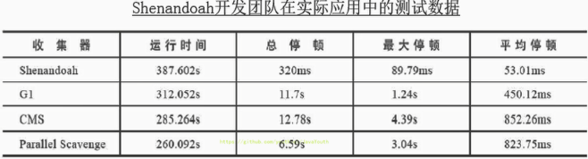


总结

1.  Shenandoah GC的弱项：**高运行负担下的吞吐量下降。**
2.  Shenandoah GC的强项：低延迟时间。


#### 令人震惊、革命性的 ZGC

1.  官方文档：https://docs.oracle.com/en/java/javase/12/gctuning/
  
2.  ZGC与Shenandoah目标高度相似，在尽可能对吞吐量影响不大的前提下，实现在任意堆内存大小下都可以把垃圾收集的停颇时间限制在十毫秒以内的低延迟。
  
3.  《深入理解Java虚拟机》一书中这样定义ZGC：**ZGC收集器是一款基于Region内存布局的，（暂时）不设分代的，使用了读屏障、染色指针和内存多重映射等技术来实现可并发的标记-压缩算法的，以低延迟为首要目标的一款垃圾收集器。**
  
4.  ZGC的工作过程可以分为4个阶段：**并发标记 - 并发预备重分配 - 并发重分配 - 并发重映射 等。**
  
5.  **ZGC几乎在所有地方并发执行的，除了初始标记的是STW的。**所以停顿时间几乎就耗费在初始标记上，这部分的实际时间是非常少的。


**吞吐量**

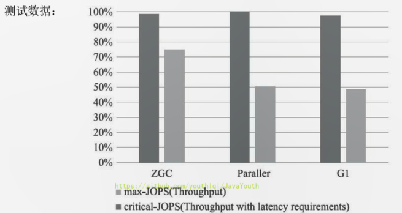

max-JOPS：以低延迟为首要前提下的数据

critical-JOPS：不考虑低延迟下的数据


**低延迟**

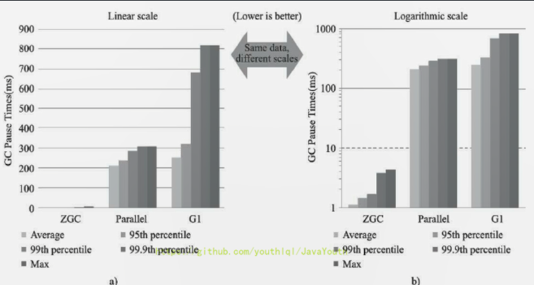

在ZGC的强项停顿时间测试上，它毫不留情的将Parallel、G1拉开了两个数量级的差距。无论平均停顿、95%停顿、998停顿、99. 98停顿，还是最大停顿时间，ZGC都能毫不费劲控制在10毫秒以内。

虽然ZGC还在试验状态，没有完成所有特性，但此时性能已经相当亮眼，用“令人震惊、革命性”来形容，不为过。未来将在服务端、大内存、低延迟应用的首选垃圾收集器。

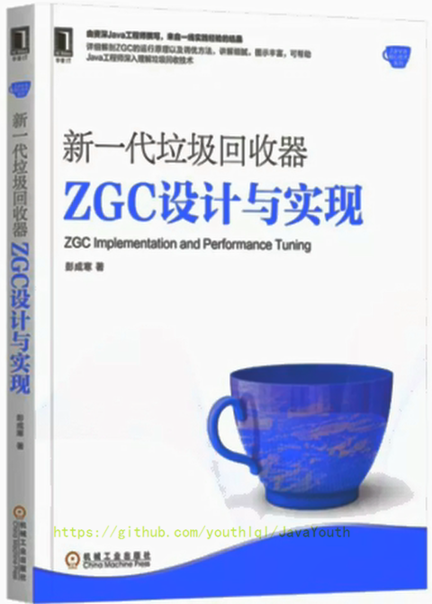


1.  JDK14之前，ZGC仅Linux才支持。
  
2.  尽管许多使用ZGC的用户都使用类Linux的环境，但在Windows和macOS上，人们也需要ZGC进行开发部署和测试。许多桌面应用也可以从ZGC中受益。因此，ZGC特性被移植到了Windows和macOS上。
  
3.  现在mac或Windows上也能使用ZGC了，示例如下：


    -XX:+UnlockExperimentalVMOptions-XX：+UseZGC


#### 面向大堆的 AliGC

AliGC是阿里巴巴JVM团队基于G1算法，面向大堆（LargeHeap）应用场景。指定场景下的对比：

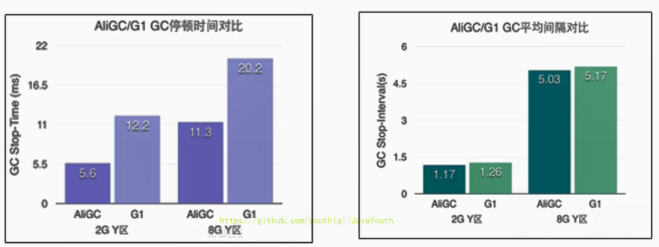